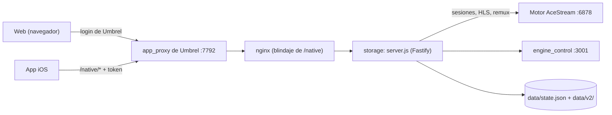

# Ace Player Neo v2 (0.7.0)

Reproductor de AceStream autoalojado en el Umbrel de casa. Recoge los canales
de las listas que le das, los comprueba, arma una agenda de fútbol con dónde
se emite cada partido y los reproduce en el navegador o en el iPhone sin
instalar nada más. El motor AceStream corre en el propio Umbrel; los clientes
nunca hablan con él directamente.

Este monorepo es la **reescritura v2**: un backend nuevo (Node 24 + Fastify +
TypeScript), una web nueva (React 19 + Vite) y una **app iOS nativa**
(SwiftUI + AVPlayer). La app de Umbrel que se instala sigue viviendo en
[`../ismaeloul-ace-player-neo/`](../ismaeloul-ace-player-neo/): este monorepo
genera su `releases/<versión>/` y el Compose y el hook que la acompañan.

- Todas las rutas de la 0.6.59 siguen respondiendo igual; lo nuevo va bajo
  `/api/v1`.
- Tus datos (`state.json`) conservan su forma y se pueden leer desde la 0.6.59
  si hubiera que volver atrás.

## Arquitectura

El documento completo es [`docs/arquitectura.md`](docs/arquitectura.md). En
corto:



- **Un solo backend** (`storage`) es dueño de las sesiones del motor: los
  clientes piden el canal al backend y este comparte una sesión por contenido
  entre todos los que lo ven. Se acabaron los 403 cruzados y las sesiones
  zombi.
- **La app iOS entra por el mismo puerto 7792** gracias a
  `PROXY_AUTH_WHITELIST: "/native/*"`. Esa ruta no pasa por el login de
  Umbrel, así que va blindada en tres capas: nginx rechaza rutas trucadas y
  calcula el origen sobre la URI cruda, y el backend exige el token del
  dispositivo en todo lo que llega con origen `native`.
- **Tiempo real por SSE** (`/api/v1/events`) en vez de sondeos.
- **Contratos compartidos** en `packages/shared` (zod + OpenAPI generado); la
  app iOS genera su catálogo de errores desde ahí.
- En Umbrel se usa la **imagen oficial de Node** fijada por digest y un
  `server.js` empaquetado con esbuild: no hace falta publicar imágenes propias.

Las decisiones que se tomaron por el camino están en
[`docs/decisiones.md`](docs/decisiones.md).

## Estructura

```text
ace-player-neo/
├── apps/
│   ├── server/        backend (Fastify + TypeScript); test/fake-engine = motor AceStream falso
│   ├── web/           web (React 19 + Vite + TanStack Query); e2e/ = Playwright
│   └── ios/           app iOS (SwiftUI, XcodeGen); se compila en GitHub Actions
├── packages/
│   └── shared/        contratos zod, errores, OpenAPI y ejemplos (fixtures)
├── deploy/
│   ├── umbrel/        Compose, hook pre-start y nginx.conf de la release 0.7.0
│   ├── local/         pila local con Docker (motor falso o real) y pasarela falsa
│   └── test/          tests del Compose, nginx, pasarela y hook
├── scripts/           release, prueba de humo, nginx y shellcheck en Docker, contraste con la 0.6.59
└── docs/              arquitectura, API, decisiones, comportamientos, verificaciones…
```

## Requisitos

- **Node 24** (con corepack, que ya viene con Node 24).
- **pnpm 10.18.2**, siempre a través de corepack: `corepack pnpm@10.18.2 <orden>`
  (o `corepack enable` una vez y luego `pnpm`, que toma la versión de
  `packageManager`).
- **Docker** solo para las pruebas de nginx, shellcheck y la pila local.
- La app iOS no necesita Mac: se compila en GitHub Actions.

Todo se lanza desde esta carpeta (`ace-player-neo/`):

```bash
corepack pnpm@10.18.2 install
```

## Desarrollar en local con el motor falso

Tres procesos: el **motor AceStream falso**, el **backend** y la **web**
(Vite). No sale nada a internet y no hace falta el motor de verdad.

| Pieza | Puerto | Notas |
|---|---|---|
| Motor falso | 6878 | el backend siempre busca el motor en el 6878, como en la 0.6.59 |
| Backend | 3000 | `PORT` lo cambia |
| Web (Vite) | 5173 | reenvía `/api` al backend de `VITE_BACKEND` (por defecto `http://[::1]:3000`) |

**Terminal 1, el motor falso** (ocho canales de prueba):

```bash
corepack pnpm@10.18.2 exec tsx apps/server/test/fake-engine/cli.ts --port 6878 --host 127.0.0.1
```

**Terminal 2, backend y web a la vez** (`pnpm dev` los lanza en paralelo):

Linux / macOS:

```bash
DATA_DIR=.data ACESTREAM_HOST=127.0.0.1 AUTO_SYNC=false FOOTBALL_DEMO_ONLY=true \
  VITE_BACKEND=http://127.0.0.1:3000 corepack pnpm@10.18.2 dev
```

Windows (PowerShell):

```powershell
$env:DATA_DIR = '.data'; $env:ACESTREAM_HOST = '127.0.0.1'
$env:AUTO_SYNC = 'false'; $env:FOOTBALL_DEMO_ONLY = 'true'
$env:VITE_BACKEND = 'http://127.0.0.1:3000'
corepack pnpm@10.18.2 dev
```

Abre <http://localhost:5173>.

- `DATA_DIR=.data` deja los datos en `apps/server/.data/` (ignorada por git).
  Para probar con tus datos, copia ahí un `state.json` de la 0.6.59: se migra
  al arrancar sin quitar nada.
- `AUTO_SYNC=false` no descarga las listas de canales; `FOOTBALL_DEMO_ONLY=true`
  usa la agenda de demostración en vez de TheSportsDB.
- Sin `ACE_SEED` (16 caracteres o más) el backend avisa y usa claves
  aleatorias en cada arranque: al reiniciarlo dejan de valer las URLs de vídeo
  firmadas y el código de emparejamiento que hubiera vivo (los dispositivos ya
  emparejados siguen valiendo). En Umbrel, `ACE_SEED` es el `APP_SEED` de la
  app. En local basta con `ACE_SEED=una-frase-larga-cualquiera`.
- `VITE_BACKEND`: el backend escucha en `0.0.0.0` (solo IPv4) y el valor por
  defecto de Vite es `http://[::1]:3000` (IPv6, pensado para el PC de Isma,
  donde el filtro de red corta a veces las conexiones a 127.0.0.1); por eso
  aquí se fija a `127.0.0.1`. Si el backend está en otra máquina o puerto,
  ponle esa dirección (`http://192.168.x.y:3000`).
- Sin backend, la web entra sola en **modo demo** (o con `?demo=1`).
- Cada pieza por separado: `corepack pnpm@10.18.2 --filter @ace/server dev` y
  `corepack pnpm@10.18.2 --filter @ace/web dev`.

## Tests

| Batería | Orden (desde `ace-player-neo/`) |
|---|---|
| Lint (ESLint + Prettier) | `corepack pnpm@10.18.2 lint` |
| Typecheck de todo | `corepack pnpm@10.18.2 typecheck` y `corepack pnpm@10.18.2 typecheck:deploy` |
| Contratos (`packages/shared`) | `corepack pnpm@10.18.2 --filter @ace/shared test` |
| Backend (unidad + integración) | `corepack pnpm@10.18.2 --filter @ace/server test` |
| Motor falso | `corepack pnpm@10.18.2 --filter @ace/server exec vitest run --config test/fake-engine/vitest.config.ts` |
| Empaquetado (Compose, nginx, hook, release) | `corepack pnpm@10.18.2 test:deploy` |
| Web (Vitest + Testing Library) | `corepack pnpm@10.18.2 --filter @ace/web test` |
| Web: build y presupuesto de tamaño | `corepack pnpm@10.18.2 --filter @ace/web build` y `… --filter @ace/web size` (JS inicial ≤ 150 KB gzip) |
| Prueba de humo del `server.js` empaquetado | `node scripts/smoke-bundle.mjs` |
| E2E (Playwright, Chrome + WebKit) | `corepack pnpm@10.18.2 --filter @ace/web e2e` ([`apps/web/e2e/README.md`](apps/web/e2e/README.md)) |
| nginx real en Docker | `corepack pnpm@10.18.2 test:nginx` |
| shellcheck del hook (Docker) | `corepack pnpm@10.18.2 test:shellcheck` |
| Rutas antiguas contra la 0.6.59 | `corepack pnpm@10.18.2 test:contraste` |
| Pila local de punta a punta (Docker) | `corepack pnpm@10.18.2 test:compose` |
| SwiftLint de la app iOS (Docker) | `docker run --rm -v "$PWD:/work:ro" -w /work ghcr.io/realm/swiftlint:0.65.1 swiftlint lint --no-cache --config .swiftlint.yml` |
| App iOS (XCTest + XCUITest) | en GitHub Actions ([`ios.yml`](../.github/workflows/ios.yml)) |

La CI ([`../.github/workflows/ci.yml`](../.github/workflows/ci.yml)) corre
todo lo anterior salvo el contraste y la pila local, más el `docker build` de
`apps/server/Dockerfile`, en cada push y PR que toque `ace-player-neo/`. Los
tests de la 0.6.59 siguen en
[`ace-player-neo.yml`](../.github/workflows/ace-player-neo.yml).

## Probar con Docker (pila local)

Imita el Umbrel sin tocarlo: una pasarela falsa hace de `app_proxy` (con su
login), nginx con la configuración de la release y el motor falso o el real.

```bash
node deploy/local/prepare.mjs                                          # monta la release en deploy/local/.work
docker compose -f deploy/local/compose.local.yml --profile falso up    # con el motor falso
docker compose -f deploy/local/compose.local.yml --profile real up     # con el motor AceStream real
docker compose -f deploy/local/compose.local.yml --profile test up --build servidor_imagen   # la imagen del Dockerfile
```

Puertos (solo en `127.0.0.1`): **17792** la pasarela falsa (login en
`/__pasarela/login`), **17793** nginx directo y **17794** la imagen del
Dockerfile. Hace falta siempre uno de los perfiles `falso` o `real`. Más
detalle en [`deploy/README.md`](deploy/README.md).

## Desplegar en Umbrel

La app se instala desde la tienda comunitaria de este repositorio
(`umbrel-app-store`, rama `main`). Umbrel **no** construye imágenes: usa la
imagen oficial de Node y el `server.js` de `releases/0.7.0/`.

**Cortar la release 0.7.0** (con el OK de Isma; pasos exactos en
[`deploy/README.md`](deploy/README.md#cortar-la-release-fase-4-con-ok-de-isma)):

1. `corepack pnpm@10.18.2 --filter @ace/web build` y
   `corepack pnpm@10.18.2 release` → `../ismaeloul-ace-player-neo/releases/0.7.0/`
   (`server.js`, `engine-control.js`, `nginx.conf`, `web/`, `SHA256SUMS` y
   `RELEASE.json`; reproducible).
2. Copiar `deploy/umbrel/docker-compose.yml` y `deploy/umbrel/hooks/pre-start`
   a la carpeta de la app (el hook, ejecutable en git:
   `git add --chmod=+x ismaeloul-ace-player-neo/hooks/pre-start`).
3. `umbrel-app.yml` con `version: "0.7.0"` (entre comillas) y las notas.
4. Merge a `main` y, a la vez, la etiqueta `ace-player-neo-v0.7.0`.

**El hook `pre-start`** corre antes de cada arranque: si falta
`releases/0.7.0` en los datos de la app, la restaura desde el checkout de la
tienda que tiene el Umbrel (o, si no, desde la etiqueta o `main`), comprueba
cada fichero con `sha256sum --check`, la deja en su sitio de forma atómica y
solo avisa (sin abortar) si manifiesto y Compose no casan.

**Actualizar**: push a `main` → en Umbrel, la tienda ofrece la versión nueva →
**Actualizar**. Los contenedores de los motores no se tocan. El primer arranque
de la 0.7.0 guarda una copia intocable `data/state.pre-0.7.0.json` y migra
`state.json` sin quitar nada.

**Volver atrás**: Umbrel no baja de versión, así que se vuelve **avanzando** a
una 0.7.1 que es la 0.6.59 con otro número (rama `rollback/0.7.1`, preparada
antes de publicar la 0.7.0): merge y Actualizar. La 0.6.59 lee el
`state.json` que deja la 0.7.0 (hay un test que lo comprueba) e ignora
`data/v2/`. Tras volver atrás, la web vieja funciona pero **la app iOS no**
(la 0.6.59 no tiene `/native/`). Detalle en
[`docs/arquitectura.md` §11.3](docs/arquitectura.md#113-actualización-y-vuelta-atrás).

## Emparejar el iPhone

1. En la web: **Ajustes → Dispositivos → Emparejar un dispositivo**. Sale un código de
   6 dígitos y un QR (`aceneo://pair?u=<dirección>&c=<código>`) que valen
   **5 minutos** y una sola vez.
2. En la app: escanea el QR con la cámara, o escribe la dirección del Umbrel y
   el código. La dirección puede ser la de Tailscale y la de casa a la vez; la
   app elige sola la que responde.
3. La app guarda su token en el **Llavero** del iPhone. Desde ese momento todo
   va por `/native/api/v1/…` con `Authorization: Bearer <token>`.
4. Para quitarle el acceso: **Ajustes → Dispositivos → Revocar el acceso** en la web.

Qué dirección usar (Tailscale o la LAN), qué protege el token y por qué el
vídeo no debe ir por Cloudflare Tunnel: [`docs/acceso-remoto.md`](docs/acceso-remoto.md).

## Generar la IPA

No hace falta un Mac.

- **GitHub Actions** ([`ios.yml`](../.github/workflows/ios.yml)): cada push a
  `rewrite-v2` o `main` que toque `apps/ios`, los ejemplos o el catálogo de
  errores genera el proyecto con XcodeGen, pasa los tests en un simulador y
  archiva en Release **sin firmar**. La IPA sale como artefacto
  `AceNeo-unsigned-<versión>` de la ejecución (Actions → la ejecución →
  Artifacts). También se puede lanzar a mano (*Run workflow*).
- **Con una etiqueta `ios-v*`** (por ejemplo `ios-v0.7.1`), la IPA se adjunta
  además a la Release de GitHub de esa etiqueta:
  `git tag ios-v0.7.1 && git push origin ios-v0.7.1`.
- **En un Mac**: `brew install xcodegen` y `apps/ios/scripts/build-ipa.sh`
  (el mismo script que usa la CI). Otro bundle id:
  `apps/ios/scripts/build-ipa.sh ACE_BUNDLE_ID=com.otro.aceneo`.

La IPA va sin firmar: se instala firmándola con un Apple ID (por ejemplo, con
la app IPA Station del propio Umbrel). Más en
[`apps/ios/README.md`](apps/ios/README.md).

## Documentación

| Documento | Qué cuenta |
|---|---|
| [`docs/arquitectura.md`](docs/arquitectura.md) | servicios, módulos del backend, flujos, nginx y la ruta nativa, empaquetado |
| [`docs/decisiones.md`](docs/decisiones.md) | decisiones tomadas y por qué |
| [`docs/api.md`](docs/api.md), [`docs/openapi-v2.yaml`](docs/openapi-v2.yaml), [`docs/contratos.md`](docs/contratos.md) | la API (rutas antiguas y `/api/v1`) |
| [`docs/comportamientos.md`](docs/comportamientos.md) | todo lo que hacía la 0.6.59 y el test que lo cubre |
| [`docs/compat.md`](docs/compat.md) | diferencias aceptadas con la 0.6.59 |
| [`docs/seguridad.md`](docs/seguridad.md) | modelo de amenazas y blindaje |
| [`docs/acceso-remoto.md`](docs/acceso-remoto.md) | la app iOS por Tailscale o por la LAN |
| [`docs/rendimiento.md`](docs/rendimiento.md) | objetivos de rendimiento y medidas |
| [`docs/verificacion-backend.md`](docs/verificacion-backend.md), [`docs/verificacion-web.md`](docs/verificacion-web.md) | verificaciones independientes |
| [`docs/diseno/`](docs/diseno/) | sistema de diseño de la web («Luz de focos») |
| [`docs/plan.md`](docs/plan.md), [`docs/PROGRESO.md`](docs/PROGRESO.md), [`docs/pendiente.md`](docs/pendiente.md) | plan, diario de la reescritura y lo que queda |
| [`deploy/README.md`](deploy/README.md) | empaquetado, pila local y cómo cortar la release |
| [`apps/web/README.md`](apps/web/README.md), [`apps/ios/README.md`](apps/ios/README.md), [`apps/server/test/fake-engine/README.md`](apps/server/test/fake-engine/README.md) | cada pieza por dentro |
