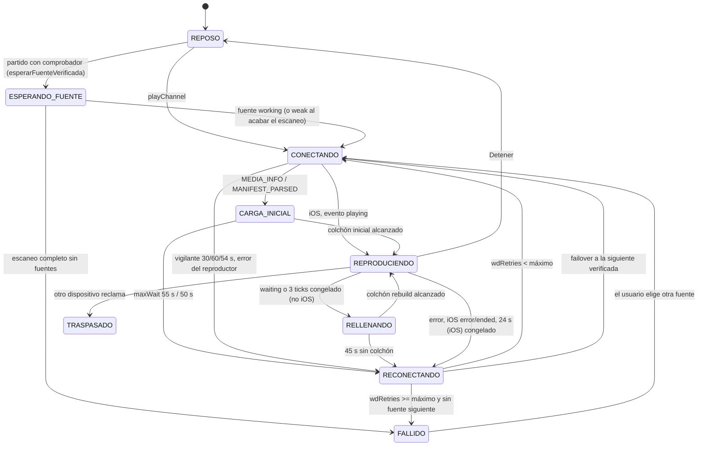

# Análisis del reproductor de la 0.6.59

> FASE 0 de la v2. Documenta cómo reproduce hoy Ace Player Neo para portarlo
> a una máquina de estados en la web (React) y en iOS (AVPlayer). Solo
> describe la 0.6.59; no propone código.

**Cómo leer las citas.** Salvo que se diga otra cosa, las rutas son relativas
a `ismaeloul-ace-player-neo/releases/0.6.59/`:

- `index.html:N` es la línea N del cliente (el JS va de la 2290 a la 6171).
- `player-controller.js:N` es el controlador `NeoPlayerCore`.
- `server.js:N`, `nginx.conf:N`, `sw.js:N`.
- `tests/…` es relativo a `ismaeloul-ace-player-neo/`.

Todo lo que aquí se afirma sale de leer el código. Lo que **no** he podido
comprobar sin ejecutar (comportamiento del motor AceStream o de Safari) va
marcado como *sin verificar*.

---

## 1. Rutas de reproducción por plataforma

### 1.1 Cómo se decide la ruta

| Paso | Qué pasa | Cita |
|---|---|---|
| Detección de iOS | `IS_IOS` = UA con iPad/iPhone/iPod **o** `platform==='MacIntel' && maxTouchPoints>1` (iPadOS en modo escritorio). | `index.html:2342-2343` |
| Entrada única | Todo pasa por `playChannel()` → `playMpegts(id, ih)`. | `index.html:4866`, `index.html:4940` |
| Desvío | `playMpegts` salta a `playHls` si `IS_IOS`, si no hay `window.mpegts` o si `mpegts.isSupported()` es falso. | `index.html:4643` |
| iOS | En `playHls`, si `IS_IOS` va **siempre** por el remux del servidor y retorna. | `index.html:4701-4731` |
| hls.js | Si no es iOS y `Hls.isSupported()`. | `index.html:4747-4791` |
| HLS nativo | Si no hay hls.js pero `canPlayType('application/vnd.apple.mpegurl')`, con plan B de remux. | `index.html:4792-4828` |
| Nada | "Este navegador no soporta HLS." | `index.html:4829-4830` |

`id` vs `infohash`: el parámetro que se manda al motor es `infohash` si el
elemento conocido lleva `ih===true` (resultados del buscador del motor) y `id`
en cualquier otro caso (`index.html:4645`, `index.html:4695`,
`index.html:4906-4907`). Un hash pegado a mano lleva `ih:null`
(`index.html:3926`) y se trata como `id`.

### 1.2 Escritorio (Chrome, Edge, Firefox, Safari de macOS)

- **Reproductor**: mpegts.js sobre MSE. En la práctica todos los navegadores
  de escritorio soportan MSE, así que hls.js y el HLS nativo quedan como
  respaldo casi muerto (ver P20).
- **URL del motor**:
  1. Meta de sesión: `GET /ace/getstream?{id|infohash}=<hash>&format=json&_=<ts>`
     con 12 s de tope (`index.html:4599-4611`). De la respuesta se toman
     `playback_url`, `stat_url` y `command_url` (`index.html:4612-4618`).
  2. El reproductor abre `playback_url` (la MISMA sesión) convertida a URL
     absoluta, porque mpegts.js carga desde un Worker `blob:` que no resuelve
     rutas relativas (`index.html:4590-4595`, `index.html:4650-4651`).
  3. Si la meta falla, se abre a pelo `/ace/getstream?{param}=<hash>&_=<ts>`
     (`index.html:4646`, `index.html:4653`): sesión sin `command_url` ni
     estadísticas (P7).
- **Configuración de mpegts.js** (`index.html:4656-4661`): `type:'mpegts'`,
  `isLive:true`, `enableStashBuffer:true`, `stashInitialSize` según modo,
  `lazyLoad:false`, `enableWorkerForMSE:true`, `fixAudioTimestampGap:true`,
  `autoCleanupSourceBuffer:true`, `autoCleanupMaxBackwardDuration:60`,
  `autoCleanupMinBackwardDuration:30`, más el bloque `mpegts` del modo.
- **Controles**: propios ("NEO") solo si
  `(hover:hover) and (pointer:fine) and (min-width:901px)`
  (`index.html:5168-5175`); se quitan los nativos y un `MutationObserver`
  impide que vuelvan (`index.html:5137-5143`, `index.html:6041`). Los
  controles NEO están ocultos por CSS fuera de ese modo
  (`index.html:1660-1668`).

### 1.3 iPhone / iPad: HLS nativo desde el remux fMP4 del servidor

**Por qué**:

- mpegts.js "cree" que funciona en iOS pero no reproduce: iOS no tiene MSE
  completo (`index.html:2340-2341`).
- hls.js sobre ManagedMediaSource provoca ciclos de pausa/reanudar
  (`index.html:4745-4746`).
- El HLS del propio motor (segmentos TS) da problemas al reproductor de Apple
  incluso con H.264+AAC, y Apple rechaza HEVC dentro de TS (exige fMP4)
  (`index.html:4697-4700`, `server.js:174-177`).
- Audio MP2/AC-3 que iOS no decodifica y ADTS roto en los TS: ffmpeg recodifica
  siempre el audio a AAC (`server.js:275-277`).

**Flujo** (`index.html:4701-4731`):

1. `S.remuxId=id`, `S.remuxToken=''`.
2. `GET /api/remux?{id|infohash}=<hash>&dev=<DEV_ID>` con 55 s de tope en el
   cliente (`index.html:4711-4713`).
3. El servidor arranca (o reutiliza) un ffmpeg que lee
   `http://<ACESTREAM_HOST>:6878/ace/getstream?{param}=<hash>` (progresivo,
   sin `format=json`) y escribe HLS fMP4 (`server.js:259-318`). Detalle en §7.
4. Respuesta `{url:'/remux/<hash>/index.m3u8', token}` (`server.js:4925`).
   El cliente guarda el `token`, engancha un `playing` de una sola vez que
   pasa a "reproduciendo", pone `video.src=url` y llama a `tryPlay()`
   (`index.html:4716-4721`).
5. Si falla (HTTP no OK, sin `url`, excepción o aborto): "No se pudo preparar
   el canal para este dispositivo…" (`index.html:4723-4728`). No distingue
   `503 remux_busy`, `504 remux_timeout` ni `502 remux_died` (P10).

En iOS **no se pide la meta de sesión**: no hay `stat_url` (sin pares ni
velocidades) ni `command_url` (P8). Los controles son los nativos del
`<video playsinline controlslist="nodownload noplaybackrate">`
(`index.html:1945`, `index.html:5142`).

### 1.4 Android

No hay rama específica. `IS_IOS` es falso y Chrome/Firefox de Android tienen
MSE, así que va por **mpegts.js exactamente igual que el escritorio**
(`index.html:4643`), con estas diferencias:

- Controles nativos (no cumple `pointer:fine`), `index.html:5169`, `index.html:5142`.
- La fila de acciones (favorito, PiP, pantalla completa) se coloca debajo del
  vídeo en táctiles (`index.html:6048-6055`).
- Toda la lógica de rebuffer y del vigilante aplica como en escritorio.

### 1.5 hls.js y HLS nativo fuera de iOS (respaldo)

- hls.js: meta `GET /ace/manifest.m3u8?{param}=<hash>&format=json&_=<ts>`
  (pedirla por `getstream` registraría la sesión como progresiva y el motor
  dejaría de servir HLS, `index.html:4596-4602`); si falla,
  `/ace/manifest.m3u8?{param}=<hash>&_=<ts>` (`index.html:4736-4743`).
  Config: `manifestLoadingTimeOut:20000`, `fragLoadingTimeOut:20000` más el
  bloque `hls` del modo (`index.html:4750`).
- HLS nativo (`index.html:4792-4828`): `video.src` = manifiesto del motor. Si
  el vídeo emite `error`, o a los 15 s no está reproduciendo, se prueba una vez
  el remux (`stopEngineSession()` y `GET /api/remux`), sin tope de tiempo en
  el fetch (`index.html:4802-4824`).

### 1.6 Proxy y service worker

- nginx publica el motor en `/ace/` y `/content/` sin buffer, con 3600 s de
  lectura, y reescribe las URL absolutas del motor dentro de las listas m3u8
  (`sub_filter`) y en las redirecciones (`nginx.conf:83-120`).
- `/api/` tiene `proxy_read_timeout 60s` porque `/api/remux` espera al
  manifiesto (`nginx.conf:61-66`). `/remux/` sin buffer y 120 s
  (`nginx.conf:68-81`).
- El service worker nunca toca `/api`, `/ace`, `/content` ni `/remux`
  (`sw.js:38`, `sw.js:45`).

---

## 2. La máquina de estados real

Hoy hay **dos capas** que se pisan entre sí:

- **Capa A, la app** (`index.html`): variables sueltas de `S`
  (`currentId`, `connecting`, `playing`, `rebuilding`, `playToken`,
  `autoPlayVerified`…) y los contadores globales del vigilante
  `wdLastPos, wdStuck, wdRetries, wdHold, wdConn` (`index.html:5208`).
- **Capa B, el controlador** (`player-controller.js`): intención del usuario
  (`desiredPlaying`, `followingLiveEdge`), retenciones (`holds`) y la fase
  derivada.

`S.playToken` se incrementa en cada `destroyPlayers()`
(`index.html:4394`); todo callback asíncrono compara su `token` y el
`currentId` para no actuar sobre una sesión vieja (p. ej. `index.html:4649`,
`index.html:4665`, `index.html:4715`).

### 2.1 Capa B: `NeoPlayerController`

**Estado interno** (`player-controller.js:86-98`): `sessionKey`, `command`
(contador que serializa órdenes), `holds:Set`, y `state` =
`{desiredPlaying, followingLiveEdge, busy, waiting, seeking, blocked, error, origin}`.

**Fase derivada** `snapshot().phase` (`player-controller.js:169-193`), por
prioridad:

| Prioridad | Fase | Condición |
|---|---|---|
| — | `idle` | sesión inactiva (`isActive()` falso: sin `sessionKey` o distinta de `S.currentId`, `index.html:5998`) |
| 1 | `blocked` | `state.blocked` (autoplay denegado) |
| 2 | `seeking` | `state.seeking` |
| 3 | `buffering` | `desiredPlaying && (holds.size>0 \|\| waiting)` |
| 4 | `starting` | `busy && desiredPlaying` |
| 5 | `playing` | `!media.paused && !media.ended` (o `desiredPlaying` en demo) |
| 6 | `paused` | resto |

La UI añade encima `PREPARANDO` mientras `S.connecting` (`index.html:5075-5081`).

**Órdenes** (cada una incrementa `command`; una promesa de `play()` antigua que
resuelve tarde ve `command` cambiado y se descarta):

| Orden | Efecto | Cita |
|---|---|---|
| `setSession(key)` | `command++`, vacía holds, `desiredPlaying=false`, **`followingLiveEdge=true`** si hay clave, `origin='session'`. | `player-controller.js:199-214` |
| `reset()` | Igual pero sin sesión y pausa el medio. | `player-controller.js:216-232` |
| `requestPlay(origin)` | `desiredPlaying=true`; si hay holds, se queda en `held` sin llamar a `play()`; si no, `playForCommand`. | `player-controller.js:289-302` |
| `playForCommand` | `busy=true` → `media.play()`. `NotAllowedError` → `blocked=true`, `desiredPlaying=false`, `onAutoplayBlocked`. `AbortError` se ignora. Otro error → `state.error`. Si al resolver ya no es la orden vigente → pausa y `superseded`. | `player-controller.js:239-287` |
| `requestPause(origin)` | `desiredPlaying=false`, `followingLiveEdge=false`, pausa. | `player-controller.js:304-316` |
| `toggle` | Pausa si `desiredPlaying && (busy \|\| held \|\| actuallyPlaying)`; si no, play. | `player-controller.js:318-323` |
| `setHold(reason,true)` | Añade hold, `waiting=desiredPlaying`, pausa el medio. | `player-controller.js:328-334` |
| `setHold(reason,false,{resume})` | Quita hold; si no quedan y `desiredPlaying` y `resume!==false` → `requestPlay('resume-<reason>')`. | `player-controller.js:336-340` |
| `seekTo(t,{playAfter,origin,followLive,timeoutMs})` | Limita a `readSeekWindow`; `followingLiveEdge = origin==='live' \|\| followLive`; espera `seeked`/`canplay` hasta `timeoutMs` (1800 ms por defecto) si el salto no quedó a <0,2 s; luego play o pausa. | `player-controller.js:343-379` |
| `goLive(targetInfo)` | Ver §5. | `player-controller.js:381-400` |

**Eventos del `<video>`** (`player-controller.js:113-167`):

| Evento | Efecto |
|---|---|
| `playing` | limpia `busy`, `waiting`, `blocked`, `error` |
| `play` | solo repinta (**no** pone `desiredPlaying=true`, ver P1) |
| `pause` | si NO es "técnica" (menos de **600 ms** desde una pausa interna, `player-controller.js:127`) y no hay `busy`, `seeking` ni holds → `desiredPlaying=false`, `followingLiveEdge=false`, `origin='native-pause'` |
| `waiting` | `waiting=true` si `desiredPlaying` |
| `canplay` | `waiting=false` si no está buscando |
| `seeking` / `seeked` | `seeking` true/false |
| `ended` | `desiredPlaying=false`, `followingLiveEdge=false` |
| `error` | `error='media-error'` |

Opciones con las que se crea (`index.html:5996-6002`): `isDemo`, `isActive`,
`liveTolerance:1.25`, `onState:scheduleNeoControls`,
`onAutoplayBlocked` → muestra la capa "Toca para reproducir"
(`index.html:2008`), que llama a `requestPlay('tap')` (`index.html:6003`).

### 2.2 Capa A: estados de la app

Estados que conviene nombrar en la v2 (derivados de `S`):

| Estado | Cómo se reconoce hoy | Pantalla |
|---|---|---|
| `REPOSO` | `!S.currentId` | "Elige un partido…" / "Reproducción detenida" |
| `ESPERANDO_FUENTE` | `S.autoPlayVerified && !S.playing && !S.connecting` | "Comprobando N fuentes…" (`index.html:3610`, `index.html:3642`) |
| `CONECTANDO` | `S.connecting && !S.playing` | "Conectando con AceStream…" (`index.html:4925`) |
| `CARGA_INICIAL` | dentro de `CONECTANDO`, tras `MEDIA_INFO`/`MANIFEST_PARSED` | "Señal encontrada: cargando los primeros segundos…" (`index.html:4368`) |
| `REPRODUCIENDO` | `S.playing && !S.rebuilding` | vídeo; subfases del controlador |
| `RELLENANDO` | `S.rebuilding` (hold `rebuffer`) | chip "rellenando · X s" (`index.html:4572-4573`) |
| `RECONECTANDO` | transitorio: `retryCurrentPlayback` → `playChannel(...,recovery=true)` | aviso "… (n/3)…" (`index.html:5228`) |
| `FALLIDO` | `failCurrentSourcePlayback` sin fuente siguiente | idle en rojo (`index.html:4973`) |
| `TRASPASADO` | `pollPlaybackHandoff` → `stopPlayback(false)` | aviso "ha pasado a otro dispositivo" |



### 2.3 Transiciones de la capa A con umbrales

**Entrada (`playChannel`, `index.html:4866-4946`)**

1. Si no es recuperación, pone a cero los cinco contadores del vigilante
   (`index.html:4867`).
2. Si el id no está en `S.fuentes`, recalcula la lista (hermanas de la
   biblioteca) y, si había partido, lo cierra (`index.html:4884-4901`).
3. Marca la fuente como `checking/player_check` (`index.html:4913-4917`).
4. `destroyPlayers()` (`index.html:4918`): `playToken++`, suelta el colchón,
   `controller.reset()`, **para la sesión del motor** (`command_url`),
   **para el remux**, destruye hls/mpegts, estadísticas y deja el `<video>`
   sin `src` (`index.html:4393-4408`).
5. `currentId`, `currentTitle`, `connecting=true`, **nuevo intento de fuente**
   (`index.html:4919-4920`), `controller.setSession(id)` (`index.html:4921`).
6. Si **no** es recuperación: reclama el mando y apunta el historial
   (`index.html:4929-4938`).
7. `playMpegts(id, ih)`; si la promesa rechaza, prueba como infohash
   (`reintentarComoInfohash`) y si no, falla la fuente (`index.html:4940-4944`).

**Colchón inicial (`waitForBuffer`, `index.html:4363-4392`)**

- Se arranca en `MEDIA_INFO` de mpegts (`index.html:4674-4689`) o en
  `MANIFEST_PARSED` de hls.js (`index.html:4753-4769`), con `initial:true`.
- Comprobación cada **250 ms** (`index.html:4390`). Listo si
  `bufferAhead >= PB[modo].initial` **o** (han pasado **20 s** y hay
  **≥1,5 s**) (`index.html:4379-4380`).
- Tope `maxWait`: **55 000 ms** mpegts (`index.html:4678`), **50 000 ms**
  hls.js (`index.html:4758`). Al agotarse → `retryCurrentPlayback`.
- Al estar listo: `connecting=false`, oculta el idle, `setPlayingUI(true)` y
  `tryPlay()` → `controller.requestPlay('startup')` (`index.html:4679-4683`,
  `index.html:4515-4516`). Ojo: se da por "arrancado" antes del primer
  fotograma (P14).
- `bufferAhead` mide lo cargado por delante del cabezal en el rango que lo
  contiene (tolerancia −0,2/+0,05 s); si el cabezal está antes del primer
  rango, cuenta ese rango entero (`index.html:4352-4362`).

**Rebuffer (`startRebuffer`, `index.html:5177-5206`)** — solo no-iOS

- Disparadores: evento `waiting` del vídeo (`index.html:5321`) o 3 ticks
  congelado del vigilante (`index.html:5256-5259`).
- Guardas: no iOS, `S.playing`, no demo, no `rebuilding`, no `connecting`, y
  `controller.desiredPlaying` (`index.html:5182-5183`).
- Acción: `rebuilding=true`, `wdStuck=0`, hold `rebuffer` (pausa el vídeo) y
  espera a `PB[modo].rebuild` segundos por delante, o a **2 s** tras **20 s**
  (`index.html:4379-4380`); `maxWait` **45 000 ms** → reconexión
  (`index.html:5194-5204`).
- Al llenarse, `clearBufferWait(true)` quita el hold con `resume:true`
  (`index.html:4344-4351`) → `requestPlay('resume-rebuffer')`.
- **Nunca salta al directo** tras un rebuffer (`index.html:5177-5179`).
- Aviso "Señal irregular…" una vez por canal y luego silencio 60 s
  (`REBUFFER_AVISO_MS`, `index.html:5180`, `index.html:5190-5193`).

**Vigilante (`setInterval` de 1500 ms, `index.html:5231-5266`)**

| Rama | Condición | Acción |
|---|---|---|
| Demo | `S.demo` | pone a cero y sale |
| Conectando | `connecting && !playing && currentId` | `wdConn++`; límite **36 ticks (54 s) en iOS**, **40 (60 s) si baja >50 KB/s**, **20 (30 s)** en otro caso → `retryCurrentPlayback('Sin señal suficiente: reintentando')` (`index.html:5233-5244`) |
| No reproduce | `!playing` | `wdStuck=0` |
| Pausado o rellenando | `v.paused \|\| rebuilding` | `wdStuck=0` |
| Gracia | `wdHold>0` | `wdHold--` (tras cada reconexión `wdHold=4`, 6 s, `index.html:5227`) |
| Avanza | `|currentTime−wdLastPos|>0,2` | `wdStuck=0`, **`wdRetries=0`**, `avisarQueSigue()` (`index.html:5250-5254`) |
| Congelado | si no avanza | `wdStuck++` |
| — no iOS | `wdStuck===3` (4,5 s) | `startRebuffer()` |
| — iOS | `wdStuck===4` (6 s) | `empujarAlDirectoIos()` si va ≥6 s por detrás (`index.html:5261`, `index.html:5286-5292`) |
| — todos | `wdStuck>=16` iOS (24 s) / `>=20` resto (30 s) | reconexión "La imagen se ha quedado parada" (`index.html:5262-5265`) |

**Reconexión (`retryCurrentPlayback`, `index.html:5209-5230`)**: ver §4.

**Cortes explícitos**

- mpegts `ERROR` con `connecting || playing` → reconexión "La señal se ha
  cortado" (`index.html:4664-4669`). Sin eso (caso raro) muestra error y, si
  el motor no está en línea, guarda `pendingResume` (`index.html:4670-4672`).
- hls.js `ERROR` fatal → ver §4.2.
- iOS: `error` o `ended` del vídeo con `remuxId` y `playing||connecting` →
  reconexión inmediata (`index.html:5275-5281`).

---

## 3. Modos Baja latencia / Equilibrado / Estable

Definidos en `PB` (`index.html:2387-2402`). Por defecto `balanced`; se guarda
en `localStorage['aceneo-pb']` (`index.html:2360`, `index.html:5941`).

| Parámetro | Estable (`stable`) | Equilibrado (`balanced`) | Baja latencia (`low`) |
|---|---|---|---|
| `stash` (mpegts `stashInitialSize`) | 2 MiB | 1 MiB | 512 KiB |
| `initial` (colchón para arrancar) | 10 s | 6 s | 3 s |
| `rebuild` (colchón tras un parón) | 12 s | 8 s | 4 s |
| mpegts `liveBufferLatencyChasing` | false | false | false |
| mpegts `liveSync` | **false** | true | true |
| mpegts `liveSyncMaxLatency` | — | 14 s | 7 s |
| mpegts `liveSyncTargetLatency` | — | 6 s | 3 s |
| mpegts `liveSyncPlaybackRate` | — | 1,03 | 1,05 |
| hls.js `liveSyncDurationCount` | 7 | 5 | 3 |
| hls.js `liveMaxLatencyDurationCount` | 14 | 10 | 7 |
| hls.js `maxBufferLength` | 90 s | 60 s | 30 s |
| hls.js `maxLiveSyncPlaybackRate` | 1 | 1,03 | 1,05 |

- Se evita `liveBufferLatencyChasing` porque corrige saltando `currentTime`,
  lo que en P2P vacía el colchón; la latencia se recupera acelerando un poco
  la velocidad (`index.html:2384-2386`). `destroyPlayers` devuelve
  `playbackRate=1` (`index.html:4406`).
- **Distancia al directo** usada por "Ir al directo":
  `bufferSafety = min(PB[modo].rebuild || 4, max(1,2, duración_ventana × 0,25))`
  (`index.html:5030`). Es decir, 12/8/4 s como máximo según modo, nunca menos
  de 1,2 s.
- Cambiar de modo con algo sonando pone a cero el vigilante y reengancha el
  canal (`playChannel(id,t,true)`), que abre una sesión nueva
  (`index.html:5938-5949`).
- **En iOS los modos casi no hacen nada**: el remux tiene valores fijos
  (6 s de arranque, segmentos de 2 s, `server.js:49`, `server.js:313`),
  `startRebuffer` no corre en iOS (`index.html:5182`) y solo se usa `rebuild`
  para el cálculo del directo. Aun así, cambiar de modo reconecta (P11).

---

## 4. Reconexión, cambio de fuente, congelado y primer plano

### 4.1 Reconexiones (`retryCurrentPlayback`, `index.html:5209-5230`)

- Máximo: **1** si estamos en arranque automático de verificadas y la fuente
  aún no ha arrancado (`S.autoPlayVerified && !S.intentoFuente?.arranco`);
  **3** en cualquier otro caso (`index.html:5217`).
- Cada reconexión: `wdRetries++`, `wdHold=4` (6 s de gracia para el
  congelado), aviso "motivo (n/máx)…", y `playChannel(id,title,true)`
  (recuperación: **no** reclama el mando ni toca el historial,
  `index.html:4927-4929`). Destruye y rehace la sesión del motor entera.
- **No hay backoff** entre reconexiones de este nivel: la siguiente empieza
  en cuanto se detecta el fallo (P4).
- `wdRetries` vuelve a 0 en cuanto el vídeo avanza más de 0,2 s
  (`index.html:5251`) o al entrar en un canal nuevo (`index.html:4867`), o al
  volver a primer plano en iOS (`index.html:5303`).
- Agotadas: `wdRetries=0` y `failCurrentSourcePlayback` con "Esta señal no
  responde. Tienes N fuentes…" o "Este canal no tiene pares ahora mismo…"
  (`index.html:5218-5225`).

### 4.2 Recuperación dentro de hls.js (sin reiniciar el canal)

`index.html:4770-4789`, solo errores `fatal`:

- `NETWORK_ERROR`: hasta **3** reintentos con `startLoad()` y espera
  **750 ms × 2^n** (750, 1500, 3000 ms). El contador vuelve a 0 con cada
  `FRAG_LOADED` (`index.html:4752`).
- `MEDIA_ERROR`: hasta **2** `recoverMediaError()`; el segundo, además,
  `swapAudioCodec()`.
- Cualquier otro caso → `retryCurrentPlayback('HLS no pudo recuperarse (…)')`.

### 4.3 Fallo de una fuente (`failCurrentSourcePlayback`, `index.html:4947-4974`)

1. Anota el resultado: `cayo` si el intento había arrancado, `fallo` si no,
   con los segundos vistos (`index.html:4950-4951`).
2. Marca la fuente: si arrancó y aguantó **≥60 s** queda `weak` /
   `player_dropped` (visible); si no, `failed` / `player_failed`. Guarda
   `playerVerdict` con marca de tiempo (`index.html:4953-4964`).
3. Cancela la reclamación en vuelo, `destroyPlayers()`, **libera el mando**,
   `connecting=false`, `setPlayingUI(false)` (`index.html:4965-4970`).
4. Intenta seguir sola: `arrancarPrimeraVerificada()` y luego
   `maybeAutoPlayFirstVerifiedSource()`; si ninguna arranca, idle en rojo con
   el mensaje (`index.html:4971-4973`).

### 4.4 Cuándo salta sola a otra fuente y cuál elige

Solo hay salto automático en partidos de la agenda con comprobador (segundo
motor). En la biblioteca **nunca**: allí la lista son las "hermanas" con el
mismo nombre (`channelMatchScore >= 92`, `index.html:3494-3500`) y se avisa
para que el usuario elija (`index.html:5221-5223`).

| Mecanismo | Se arma | Elige | Se desarma | Cita |
|---|---|---|---|---|
| **Arranque por verificadas** (`autoPlayVerified`) | Entrar a un partido con escaneo (`resolveFootballMatch` → `esperarFuenteVerificada`) | La primera de `S.fuentes`, en el orden que da el servidor, con `probeState==='working'`, no reportada y no probada ya (`autoTried`); si el escaneo terminó (`complete`, `waiting` o sin escaneo), la primera `weak` | Elegir una fuente a mano (`index.html:3827`), `clearSourceScan` (nuevo `setFuentes`, Rebuscar, Detener, `pagehide`, `index.html:3535`), o agotar la lista (`index.html:3638`) | `index.html:3603-3644`, `index.html:4151` |
| **Salto inicial** (`sourceAutoSwitchArmed`) | `setFuentes(..., mismoPartido=true, scan)` con fuente actual (p. ej. al elegir candidato en el resolutor, `index.html:4047-4058`) | La primera otra `working`/`weak` no reportada, si la actual sale `failed` en el comprobador y no está reproduciendo | Al primer `setPlayingUI(true)`, al elegir a mano o al usarse una vez | `index.html:3487-3488`, `index.html:3645-3658`, `index.html:4490-4492` |

Detalles:

- El orden de `S.fuentes` es el que devuelve `/api/football/resolve`; el
  servidor ordena por nivel de coincidencia, luego por fiabilidad aprendida
  (cota de Wilson, desconocido = 0,35) y luego disponibilidad
  (`server.js:4067-4079`, `server.js:3911-3930`). El cliente no reordena.
- `arrancarPrimeraVerificada` se reevalúa en cada sondeo del comprobador
  (cada **1500 ms**, `index.html:3567`, `index.html:3710`). Si hay reintentos
  pendientes del comprobador (`status:'waiting'`) dice a qué hora vuelve a
  probar y espera (`index.html:3633-3636`).
- Tres fallos seguidos del sondeo (5 s de tope cada uno) apagan el
  comprobador y se enseñan todas las fuentes (`index.html:3713-3720`).
- Lo que ve el reproductor manda sobre el comprobador durante **3 min**
  (`PLAYER_VERDICT_MS`, `index.html:4477-4481`, `index.html:3686-3688`; en el
  servidor `PLAYER_VERDICT_HOLD_MS`, `server.js:107`, `server.js:3315-3318`).
- Contradicción de comentarios: `retryCurrentPlayback` dice "Sin salto
  automático: el cambio de fuente lo decide el usuario"
  (`index.html:5211-5213`), pero el fallo de fuente sí salta solo mientras
  `autoPlayVerified` siga activo, **también después de que la fuente haya
  estado reproduciendo** (`setPlayingUI` no lo apaga, `index.html:4487-4501`)
  (P16).

### 4.5 Detección de congelado y salto al directo

- Escritorio/Android: 3 ticks (4,5 s) sin avanzar → rebuffer (no salta al
  directo). Tras 45 s sin colchón → reconexión.
- iOS: 4 ticks (6 s) → `empujarAlDirectoIos()`: si `behind >= 6 s` llama a
  `controller.goLive(...)` y cuenta como hecho (`index.html:5286-5292`). **En
  la práctica no salta**: `followingLiveEdge` es `true` desde `setSession`
  (`player-controller.js:205`) y `goLive` con `alreadyFollowing` solo hace
  `requestPlay('live-following')`, que devuelve `already-playing` porque el
  vídeo atascado no está en pausa (`player-controller.js:383-391`,
  `player-controller.js:249-253`). Solo saltaría si antes hubo una pausa del
  usuario o un retroceso (P2). A los 16 ticks (24 s) se reconecta.

### 4.6 Vuelta a primer plano (solo iOS)

`visibilitychange` a `visible` en iOS con canal activo (`index.html:5297-5306`):
si `video.error`, `video.ended` o (el usuario quiere reproducir, no está
conectando y `readyState < 2`) → `wdRetries=0` y reconexión "Reconectando al
volver a la app". Pensado para cuando el reaper del servidor ha matado el
remux tras 90 s sin pedir segmentos. En escritorio/Android no hay nada
equivalente.

### 4.7 Motor de vuelta (`pendingResume`)

`checkEngine` cada **20 s** (`index.html:6162`): con dos fallos seguidos de
`/api/engine/status` marca el motor apagado si se está viendo algo
(`index.html:4242-4245`). Si el motor vuelve y hay `pendingResume`, reabre el
canal como reproducción nueva (`index.html:4252-4256`). `pendingResume` solo
se rellena en la rama casi inalcanzable del error de mpegts
(`index.html:4670-4671`) (P13).

---

## 5. Directo

### 5.1 `readSeekWindow(media)` (`player-controller.js:27-44`)

Toma `media.seekable`; elige el rango que contiene `currentTime` con ±0,25 s
de tolerancia y, si ninguno, el último. Devuelve `{start,end,duration}` o
`null` si no hay rangos o `end <= start`. Test:
`tests/player-controller.test.js:148-153`.

Si `seekable` está vacío, la app usa `fallbackRangeWindow(video.buffered)`:
el último rango cargado (`index.html:5012-5019`).

### 5.2 `resolveLiveTarget(range, preferred, safety)` (`player-controller.js:49-57`)

```
seguridadDisponible = min(safety, max(0, duración − 0,5))
bordeSeguro         = end − seguridadDisponible
preferido           = preferred ?? bordeSeguro
objetivo            = clamp(min(preferido, bordeSeguro), start, end)
```

El último timestamp anunciado no es reproducible sin vaciar el colchón; el
borde útil conserva el búfer de seguridad (`player-controller.js:46-48`).
Tests: `tests/player-controller.test.js:155-160` (p. ej. ventana 0–120,
seguridad 8 → 112; ventana 20–24 → 20,5).

### 5.3 `playerLivePosition()` (`index.html:5020-5036`)

- Ventana = `readSeekWindow` o `fallbackRangeWindow(buffered)`.
- Preferido = `hls.liveSyncPosition` si hay hls.js (en mpegts y en iOS no hay
  preferido).
- `bufferSafety` según modo (§3).
- Devuelve `{start,end,duration,target,current,behind,bufferSafety}` con
  `behind = max(0, target − currentTime)`.

### 5.4 "Ir al directo"

- Botón `neoLive` (`index.html:6007`) → `goLive()` de la app
  (`index.html:5038-5056`) → `controller.goLive(()=>playerLivePosition())`.
- `controller.goLive` (`player-controller.js:381-400`): pone
  `desiredPlaying=true`, `followingLiveEdge=true`, y:
  1. si **ya seguía el directo** → `requestPlay('live-following')`, sin salto
     (evita reiniciar el ciclo si se pulsa durante un rebuffer; test
     `tests/player-controller.test.js:162-176`);
  2. sin objetivo → `requestPlay('live-no-target')`;
  3. si `behind <= liveTolerance` (**1,25 s**) → `requestPlay('live-already')`;
  4. si no → `seekTo(target,{playAfter:true, origin:'live', timeoutMs:2200})`.
- Avisos: "Ya estabas en el directo", "Directo reanudado", "De vuelta al
  directo" o "La señal no deja saltar más adelante" (`index.html:5044-5055`).

### 5.5 Retroceso de 30 s (`index.html:5061-5074`)

Ventana = `readSeekWindow` o `buffered`; destino = `max(start, ahora − 30)`;
si el retroceso real es < 1 s avisa y no hace nada; si no,
`seekTo(destino,{origin:'timeline', timeoutMs:2200})`, que **apaga**
`followingLiveEdge`. Aviso "Retrocedido N s · pulsa DIRECTO para volver".
Accesible por el botón `−30` (solo controles NEO, deshabilitado sin
reproducción o en demo, `index.html:5123`), el menú contextual y la tecla
`J` (`index.html:6097`). Lo que hay para atrás depende de lo que retenga el
reproductor: mpegts limpia a partir de 60 s por detrás dejando 30 s
(`index.html:4659-4660`); en iOS, la ventana de 30 s del remux
(`server.js:313`).

### 5.6 Indicador "directo" (`index.html:5104-5119`)

- `atLive = demo || !info || followingLiveEdge || behind <= 1,25`.
- Si no está en directo: carril `neoLiveRail` con clase `behind`, tiempo
  `−N s` (redondeo hacia arriba) y botón "IR AL DIRECTO".
- En directo: botón "DIRECTO", o "REANUDAR" si la fase es `paused`/`blocked`.
- Se repinta en cada evento del vídeo y cada **500 ms**
  (`index.html:6042-6044`).
- Como `followingLiveEdge` sigue en `true` tras los rebuffers, el indicador
  dice "DIRECTO" aunque el retraso acumulado sea grande (P2).
- **Solo existe con controles NEO** (escritorio). En iPhone y Android no hay
  indicador ni botón de directo propios (`index.html:1660-1668`).

---

## 6. Sesiones del motor y traspaso entre dispositivos

### 6.1 Apertura y cierre de la sesión del motor

- Apertura: la meta de §1.2/§1.5 da `command_url`, que se guarda en
  `S.cmdUrl` (solo la ruta desde `/ace/`, `index.html:4585-4589`,
  `index.html:4612-4617`). `stat_url` arranca el sondeo de estadísticas cada
  **2 s** (4,5 s de tope, `index.html:4529-4557`).
- Cierre: `stopEngineSession()` hace
  `fetch(cmdUrl + '&method=stop', {keepalive:true})` y olvida la URL
  (`index.html:4621-4626`). Se llama en cada `destroyPlayers()` (o sea, al
  cambiar de canal, al reconectar, al fallar y al detener), en `pagehide`
  (`index.html:4636`) y antes del plan B de remux (`index.html:4805`).
- Los comentarios del cliente asumen que el motor "solo sostiene una sesión"
  y que sin `stop` quedan descargas zombis (`index.html:4160-4161`,
  `index.html:4619-4620`, `index.html:4982`) — *sin verificar contra el
  motor*.
- iOS no conoce `command_url`: la sesión la abre ffmpeg en el servidor y solo
  se cierra al matar ffmpeg (cuando se corta su conexión HTTP; *sin
  verificar* cuánto tarda el motor en soltarla).

### 6.2 Mando (claim / release / nowPlaying)

**Modelo**: un único `nowPlaying` global en `state.json`
(`{id,title,dev,token,at}`, `server.js:975-987`). "El último dispositivo que
da al play se lleva el mando", al estilo Spotify Connect
(`index.html:4159-4162`). Es global: **da igual que el otro esté viendo otro
canal**, también lo echa.

- Identidad: `DEV_ID` aleatorio de 8 caracteres guardado en
  **sessionStorage**, es decir, por pestaña (`index.html:2345-2347`).
- **claim** (`index.html:4163-4194`), solo en reproducciones nuevas, no en
  recuperaciones (`index.html:4927-4930`):
  - Token `${DEV_ID}-${base36(now)}-${seq}`.
  - Mientras la petición vuela, `playStartedAt = MAX_SAFE_INTEGER` (nadie
    puede echarnos) (`index.html:4172`).
  - Las reclamaciones se encadenan en `S.claimQueue` y se descartan si ya no
    son la última (`claimSeq`) o si cambió el canal (`index.html:4174-4182`).
  - `POST /api/playback/claim {id,title,dev,token}` (12 s de tope,
    `index.html:2653`). El servidor fija
    `at = max(Date.now(), at_anterior + 1)` (marca monótona) y lo guarda
    (`server.js:1177-1198`). Si el token ya se liberó en el último minuto
    (lápida de 60 s, `server.js:41`, `server.js:989-994`) devuelve
    `ignored:true` (`server.js:1187`).
  - El cliente guarda `myPlayback` y `playStartedAt = nowPlaying.at`
    (`index.html:4183-4184`). Si la petición falla, usa **su propio reloj**
    (`Date.now()`) y avisa "No se pudo sincronizar el mando…"
    (`index.html:4185-4189`) (P12).
- **release** (`index.html:4195-4205`): `POST /api/playback/release
  {id,dev,token}`. Encadenado en la cola; con `immediate` (en `pagehide`) va
  por `fetch keepalive` (`index.html:4638`). El servidor apunta la lápida y
  solo borra `nowPlaying` si coinciden `id`, `dev` y `token`
  (`server.js:1200-1213`). Se llama al **Detener** y al **fallar** una fuente
  (`index.html:4980`, `index.html:4968`), no al traspasar.
- **Sondeo** (`index.html:4206-4229`): cada **5 s**, solo si
  `playing || connecting`, `GET /api/playback` (4,5 s de tope). El servidor
  devuelve solo `{nowPlaying, learningCount, serverTime}`
  (`server.js:4864-4872`; test `tests/server.test.js:2002-2015`).
- **Quién gana**: el que tenga el `at` mayor. Regla del cliente:
  `np.dev !== DEV_ID && np.at > playStartedAt` → me aparto
  (`index.html:4219`). Tests: `tests/server.test.js:773-804`.
- **Qué ve el que pierde** (`index.html:4219-4225`):
  - Si es el mismo canal, borra `S.cmdUrl` (no manda `stop`, la sesión la
    usa el otro) y suelta el remux con `keepAlive:true` (no mata ffmpeg).
  - `stopPlayback(false)`: detiene todo sin liberar, vacía fuentes y partido,
    y deja el idle "Reproducción detenida. Elige otro partido o canal."
    (`index.html:4975-5006`).
  - Aviso "La reproducción ha pasado a otro dispositivo". No hay botón para
    recuperarlo; hay que volver a darle al play (lo que a su vez echa al otro).
  - Tarda hasta ~5 s (+ latencia) en enterarse: durante ese rato suenan los dos.
- **Compatibilidad**: `PUT /api/state` de clientes antiguos todavía puede
  escribir `nowPlaying` (`server.js:4842-4849`).

### 6.3 Si el cliente se va sin avisar

- Con cierre limpio (`pagehide`): `stop` al motor, `remux/stop` con
  `keepAlive:true`, `release` inmediato y se para el sondeo del comprobador
  (`index.html:4636-4639`).
- Sin `pagehide` (se cuelga, se queda sin red, iOS mata la pestaña):
  - `nowPlaying` **no caduca nunca**: no hay latido ni TTL
    (`server.js:1177-1213`). Solo se sobrescribe con la siguiente reclamación.
    No bloquea a nadie porque reclamar siempre gana, pero queda un
    "reproduciendo" falso en el estado.
  - La sesión del motor de escritorio queda abierta hasta que el motor la
    cierre por su cuenta (*sin verificar*).
  - El remux de iOS muere por el reaper: se revisa cada **15 s**
    (`server.js:5139`) y se mata si lleva **90 s** sin pedir ficheros
    (`server.js:44`, `server.js:189-194`), así que entre 90 y 105 s.
- El único "latido" real es el `outcome: 'sigue'` cada ≥2 min, que no toca el
  mando (§8).

---

## 7. Remux para iOS (servidor)

### 7.1 Petición y espera del manifiesto (`server.js:4906-4926`)

1. `GET /api/remux?{id|infohash}=<hash>&dev=<id>` (se trata como GET con
   efectos: pasa la comprobación de origen, `server.js:1257-1274`).
2. `ensureRemux(idParam, id, dev)` devuelve sesión y **token nuevo** para ese
   dispositivo.
3. Bucle cada **400 ms**:
   - si la sesión ya no es la del mapa o ffmpeg terminó → `502 remux_died`;
   - listo si la lista tiene **≥2 segmentos y ≥6 s** (`REMUX_READY_SECONDS`,
     `server.js:49`);
   - o si tiene **≥1 segmento** y han pasado **20 s**
     (`REMUX_READY_WAIT_MS`, `server.js:50`);
   - a los **45 s** → `504 remux_timeout` (`REMUX_START_TIMEOUT_MS`,
     `server.js:51`).
   - Cuenta segmentos y segundos sumando los `#EXTINF`
     (`server.js:212-222`).
4. `200 {url:'/remux/<hash>/index.m3u8', token}`.

Topes en cascada: servidor 45 s, cliente 55 s (`index.html:4711`), nginx 60 s
(`nginx.conf:65`; su comentario aún dice "hasta 40 s", `nginx.conf:64`).

### 7.2 `ensureRemux` (`server.js:237-337`)

- Clave = hash en minúsculas; token = 8 bytes aleatorios en hex.
- **Reutiliza** si existe, ffmpeg vivo, mismo `idParam` y no está atascado;
  añade el dispositivo a `clients` (Map `dev → token`) (`server.js:240-245`).
- **Atascado** (`remuxStalled`): arrancó hace >45 s y el `index.m3u8` no se
  toca desde hace >15 s (`REMUX_STALE_MS`), o no se puede leer
  (`server.js:224-231`).
- Si no sirve, la limpia y crea otra. Con el tope alcanzado desaloja según
  `elegirSesionRemuxADesalojar` o lanza `503 remux_busy`
  (`server.js:246-255`).
- ffmpeg (`server.js:261-318`):
  - Entrada: `http://<ACESTREAM_HOST>:6878/ace/getstream?{param}=<hash>`,
    `-fflags +genpts+discardcorrupt`, reconexión automática
    (`-reconnect 1 -reconnect_streamed 1 -reconnect_at_eof 1
    -reconnect_on_network_error 1 -reconnect_delay_max 4`),
    `-rw_timeout 20000000` (20 s), `-probesize 5000000 -analyzeduration
    5000000`, `-thread_queue_size 512`.
  - Mapeo `0:v:0` y `0:a:0?`.
  - Vídeo `-c:v copy -copyinkf` (conserva los fotogramas iniciales no clave:
    el desfase de audio medido pasó de 2,111 s a 0,071 s,
    `server.js:291-305`).
  - Audio `aac 160k` estéreo con
    `aresample=async=1000:min_hard_comp=0.100:first_pts=0`
    (`server.js:278-290`, `server.js:306-307`).
  - Salida HLS fMP4: `-hls_time 2`, `-hls_list_size 15` (ventana de 30 s),
    `-hls_delete_threshold 2`,
    `-hls_flags delete_segments+independent_segments+temp_file+omit_endlist`,
    `init.mp4` (`server.js:313-317`). `omit_endlist` evita que el iPhone dé
    la emisión por terminada si ffmpeg muere.
  - Log en `<dir>/ffmpeg.log` (`server.js:260`).
- Al salir ffmpeg: `exited=true`, conserva los segmentos para que el
  reproductor termine; el reaper borra luego (`server.js:326-334`).
- Al arrancar el servidor se borra la carpeta `remux` entera
  (`server.js:5134-5135`).

### 7.3 Límite y desalojo (`server.js:196-209`)

- `MAX_REMUX_SESSIONS = 3` (`server.js:39`).
- `elegirSesionRemuxADesalojar`: solo son candidatas las **libres** (ffmpeg
  terminado o sin clientes); de ellas, la de `lastAccess` más antiguo. Si
  todas tienen espectadores devuelve `null` y el que llega recibe
  `503 remux_busy`: **nunca se expulsa a un espectador activo**. Test:
  `tests/server.test.js:1961-1970`.

### 7.4 Parada (`server.js:4886-4904`)

`POST /api/remux/stop {id, dev, keepAlive, token}`:

- Si el dispositivo tiene en la sesión un token distinto del que manda, es el
  stop tardío de un enganche anterior → se ignora (`stale:true`).
- Si no, quita al dispositivo de `clients` y **mata ffmpeg** si
  `keepAlive !== true` y no quedan clientes (o no se mandó `dev`).
- El cliente manda `keepAlive:false` en cada `destroyPlayers()` (cambio de
  canal, **reconexión**, fallo, detener) y `keepAlive:true` en `pagehide` y al
  perder el mando en el mismo canal (`index.html:4627-4637`,
  `index.html:4222`). Consecuencia: cada reconexión en iPhone mata ffmpeg y
  vuelve a esperar hasta 45 s (P9).

### 7.5 Servir segmentos (`server.js:4928-4939`, `server.js:367-409`)

`/remux/<hash>/<fichero>`: valida hash y ruta (sin salir de la carpeta),
actualiza `lastAccess` (lo que mantiene viva la sesión frente al reaper),
soporta `Range` (206/416), `Cache-Control: no-store`, tipos m3u8/m4s/mp4/ts.
Test: `tests/server.test.js:711-726`.

---

## 8. Qué se notifica al backend y cuándo

| Llamada | Cuándo | Cuerpo | Qué hace el servidor | Cita |
|---|---|---|---|---|
| `POST /api/sources/outcome` `arranco` | Primera vez que el intento pasa a reproduciendo (`setPlayingUI(true)` → `marcarFuenteArrancada`). En escritorio es al llenarse el colchón inicial, no al primer fotograma; en iOS, al evento `playing`. | `{id,title,listaId,source,resultado,segundos:0}` | Veredicto del jugador `working/player_ok`; `intentos+1`, `exitos+1` por hash y por proveedor | `index.html:4455-4461`, `index.html:4488`, `server.js:3939-3966` |
| `outcome` `fallo` | `failCurrentSourcePlayback` sin haber arrancado | idem con `segundos` | `failed/player_failed`; `intentos+1` | `index.html:4950-4951` |
| `outcome` `cayo` | `failCurrentSourcePlayback` tras haber arrancado | idem con segundos desde el arranque | `caidas+1`, suma segundos; si <60 s retira el éxito (`STATS_SHORT_PLAY_S`); veredicto `weak/player_dropped` si ≥60 s, si no `failed` | `server.js:3890-3906`, `server.js:3933-3937` |
| `outcome` `sigue` | Desde el vigilante cuando el vídeo avanza y han pasado ≥120 s desde el último aviso | `{id, resultado:'sigue'}` | Solo renueva el veredicto `working` del reproductor (el comprobador no la vuelve a probar y las demás pantallas la ven verificada) | `index.html:4462-4472`, `server.js:3954-3955` |
| `POST /api/sources/feedback` | Botón "Es el canal correcto" (solo en partido) | `{id,title,channel,verdict:'correct',reason:'not_starting'}` | Guarda el aprendizaje canal↔hash y levanta los reportes `wrong_channel` de ese hash | `index.html:3965-3976`, `index.html:3895`, `server.js:4487-4507` |
| `POST /api/sources/report` | Modal "Reportar" | `{id,title,ih,source,channel,matchId,reason,client}` | Cuarentena (30 min; 10 min si es calidad/audio/tirones; 30 días si es canal equivocado) y comprobación forzada en el segundo motor | `index.html:4024-4042`, `server.js:4509-4565`, `server.js:110-112` |
| `POST /api/playback/claim` / `release` | §6.2 | | | |
| `POST /api/remux/stop` | §7.4 | | | |
| `GET /ace/...&method=stop` | §6.1 (va directo al motor por nginx) | | | |

Reglas del cliente:

- Un intento por reproducción: `iniciarIntentoDeFuente` en cada
  `playChannel` (`index.html:4920`), `anotarResultadoDeFuente` solo una vez
  por intento salvo `cayo` (`index.html:4445-4454`). Todo es
  *fire-and-forget* y no se envía en demo.
- **No se notifica nada** al detener normalmente, al cambiar de canal ni al
  perder el mando: esas sesiones quedan como `arranco` sin cierre.
- Estadísticas del servidor: desgaste con vida media de **14 días** y cota
  inferior de Wilson al 95 % para ordenar (`server.js:3832-3835`,
  `server.js:3911-3919`).

---

## 9. Media Session, PiP, pantalla completa y reproductor externo

- **Media Session**: al empezar a reproducir solo se ponen los metadatos
  (título del canal, artista "Ace Player Neo", portada `/icon-512.png`)
  (`index.html:5309-5317`, llamado desde `index.html:4504`). **No hay
  `setActionHandler`** (play/pause/stop/siguiente) ni `setPositionState`: los
  controles de la pantalla de bloqueo actúan sobre el `<video>` a pelo,
  saltándose el controlador (P21).
- **PiP** (`index.html:5987-5994`): alterna con la API estándar
  (`document.pictureInPictureEnabled` y `readyState > 0`). Se llega por el
  botón de la barra, el de los controles NEO y la tecla `P`
  (`index.html:6008`, `index.html:6094`). En iOS los controles nativos traen
  su propio PiP.
- **Pantalla completa** (`index.html:5971-5986`): sale si ya lo está; si no,
  `playerShell.requestFullscreen()` (escritorio/Android, el contenedor con los
  controles NEO); si no existe, en iPhone `video.webkitEnterFullscreen()` solo
  con `readyState > 0` (si no, aviso "estará disponible cuando arranque la
  imagen"). Si no hay ninguna API se ocultan los botones. Doble clic sobre el
  vídeo y tecla `F` en escritorio (`index.html:6021-6024`, `index.html:6093`).
- **Autoplay**: `playsinline` en el `<video>` (`index.html:1945`). Si
  `play()` da `NotAllowedError`, capa "Toca para reproducir"; se quita con el
  primer `playing` (`index.html:5268`).
- **Reproductor externo**: **no existe**. Lo más parecido es "Copiar enlace
  acestream://" en las filas de la biblioteca (`index.html:5461-5471`,
  `index.html:5610`) y "Copiar hash" en el inspector de fuentes y en el menú
  contextual (`index.html:5452-5460`). Hay un respaldo `execCommand('copy')`
  porque la app se sirve por HTTP en la LAN (`index.html:5440-5451`).
- **Barra "Sigue sonando"**: al volver a la portada con algo reproduciendo no
  se para; aparece una barra con "Volver al vídeo" y "Detener"
  (`index.html:1932-1938`, `index.html:3060-3066`).
- Otros atajos: espacio/`K` pausa (`index.html:6091`), `M` silencio, `J`
  −30 s, flechas zapping solo en la vista de reproducción y sin foco en
  controles (`index.html:6098-6106`). Clic simple en el vídeo alterna tras
  190 ms para distinguirlo del doble clic (`index.html:6016-6020`).

---

## 10. Métricas y registros que existen hoy

| Qué | Dónde | Cita |
|---|---|---|
| Pares, bajada, subida y estado del motor (desde `stat_url` cada 2 s; **no en iOS**) | Chips bajo el vídeo y panel "nerd" (tecla `S`) | `index.html:4529-4582` |
| Segundos de colchón por delante del cabezal | Chip de estado: "rellenando · X s" / "reproduciendo · X s" | `index.html:4572-4576` |
| Fase del reproductor | Etiqueta NEO (PREPARANDO, CARGANDO, SALTANDO…) | `index.html:5075-5081`, `index.html:5112` |
| Resultado por intento (`arranco/fallo/cayo/sigue`) y segundos vistos | `sourceStats` en `state.json` por hash y proveedor | `server.js:3939-3966` |
| Veredictos del comprobador y del reproductor | Caché en memoria `scannerCache`, copiada a los trabajos abiertos | `server.js:3330-3350` |
| Salud (backend, motores, IA, agenda, directorios, cuarentenas) | `/api/health`, modal de salud | `index.html:4271-4315` |
| Log de ffmpeg por sesión de remux | `<DATA_DIR>/remux/<hash>/ffmpeg.log`, se borra con la sesión | `server.js:260`, `server.js:186` |
| Errores internos del API | `console.error` con 500 | `server.js:5072-5076` |
| Healthcheck del NAS | Solo comprueba el proxy de la app, `/api/health` y Ollama | `monitoring/ace-player-neo-healthcheck:31-70` |

**No existe**: tiempo hasta la primera imagen (TTFF), tiempo de arranque del
remux, número y duración de rebuffers, número de reconexiones por sesión,
latencia real respecto al directo, ni ningún registro de errores del cliente
enviado al servidor. Los "segundos" del `outcome` se cuentan desde el colchón
lleno, no desde el primer fotograma.

---

## 11. Problemas conocidos o frágiles para resolver en la v2

Ordenados por impacto. "Confirmado por lectura" = se sigue en el código sin
ambigüedad; no se ha reproducido en un dispositivo.

| # | Problema | Evidencia | Consecuencia | Para la v2 |
|---|---|---|---|---|
| P1 | El evento nativo `play` no restaura `desiredPlaying`. | `player-controller.js:125` frente a `player-controller.js:126-134` | En Android/iOS (controles nativos), tras pausar y reanudar desde el propio vídeo, el controlador cree que el usuario quiere pausa: `startRebuffer` no actúa (`index.html:5183`), la vuelta a primer plano en iOS no reconecta (`index.html:5301`) y un parón solo se resuelve con la reconexión a los 30 s. Confirmado por lectura. | La intención del usuario debe salir de un único sitio y seguir también a los controles nativos (en iOS, `AVPlayer.timeControlStatus`/`rate`). |
| P2 | `followingLiveEdge` es `true` desde `setSession` y no se apaga con los rebuffers. | `player-controller.js:205`, `player-controller.js:383-391`, `index.html:5109` | El indicador dice DIRECTO aunque se haya acumulado retraso; pulsar DIRECTO no salta; y el "empujón al directo" automático de iOS nunca salta (§4.5). En modo Estable no hay ninguna recuperación de latencia (`liveSync:false`). Confirmado por lectura. | Medir el retraso real contra el borde y separar "quiero ir en directo" de "estoy en el directo". |
| P3 | Cada reconexión abre un intento de fuente nuevo. | `index.html:4920` frente al comentario `index.html:4432-4433` | Una reconexión que arranca cuenta otro `arranco`; si la fuente se cae tras 10 min y no vuelve, se anota `fallo` (no `cayo`) y queda `failed` en vez de `weak` (`index.html:4958`). Sesga el aprendizaje. Confirmado por lectura. | El intento pertenece a la fuente elegida, no a cada conexión. |
| P4 | `wdRetries` se pone a 0 con cualquier avance >0,2 s y no hay espera entre reconexiones. | `index.html:5251`, `index.html:5226-5229` | Una señal que da un segundo de imagen entre cortes reconecta sin fin y nunca pasa a otra fuente. | Presupuesto de reconexiones por ventana de tiempo y backoff exponencial. |
| P5 | `wdConn` no se pone a 0 en reconexiones que no vienen del vigilante. | `index.html:4867` (solo si no es recuperación), `index.html:5233-5245` | Tras un error de mpegts a mitad de conexión, el siguiente intento tiene menos margen (p. ej. 7,5 s en vez de 30 s). Confirmado por lectura. | Temporizadores ligados al intento, no globales. |
| P6 | El reintento como infohash de los hashes pegados es casi inalcanzable. | `index.html:4854-4864`, `index.html:4647-4653`, `index.html:4664-4669` | `playMpegts` se traga el fallo de la meta y el error del reproductor va a `retryCurrentPlayback`; la promesa solo rechaza por excepciones síncronas. En iOS nunca. Un infohash pegado se prueba 3 veces como `id` y se da por muerto. | Resolver `id`/`infohash` en el servidor antes de reproducir. |
| P7 | Si falla la meta de sesión se abre una sesión sin `command_url`. | `index.html:4646`, `index.html:4653` | No se puede parar (descarga zombi) y no hay estadísticas. | El servidor debe ser dueño de la sesión y de su parada. |
| P8 | iOS no pide la meta. | `index.html:4701-4731` | Sin pares ni velocidades en iPhone; la sesión del motor que abre ffmpeg nunca recibe `stop`. | Estadísticas y parada desde el servidor para todas las plataformas. |
| P9 | En iPhone cada reconexión mata ffmpeg. | `index.html:4398`, `index.html:4627-4635`, `server.js:4901-4902` | Se pierde el colchón y se vuelve a esperar hasta 45 s por 6 s de vídeo. | Reutilizar el remux vivo en reconexiones (`keepAlive`) y dejar al reaper. |
| P10 | El cliente no distingue los errores del remux. | `index.html:4723-4728` frente a `server.js:250-252`, `server.js:4917-4922` | "remux_busy" (hay 3 iPhones viendo) sale como "No se pudo preparar el canal…". | Errores tipados (zod) con mensaje propio. |
| P11 | Los modos se ofrecen en iPhone pero apenas le afectan, y cambiar de modo reconecta. | `index.html:5182`, `index.html:5944-5948`, `server.js:49`, `server.js:313` | Corte sin beneficio. | Modo propio para iOS (p. ej. `preferredForwardBufferDuration`) o no mostrarlo. |
| P12 | Traspaso frágil. | `index.html:4187` (reloj local), `index.html:4229` (5 s), `index.html:2345` (por pestaña), `server.js:1177-1213` (sin TTL) | Si falla la reclamación se mezclan relojes y dos dispositivos pueden no echarse; hasta 5 s suenan los dos; dos pestañas del mismo navegador se echan entre sí; `nowPlaying` no caduca. | Mando con latido y caducidad; notificación por SSE/WebSocket en vez de sondeo; identidad de dispositivo persistente. |
| P13 | `pendingResume` casi nunca se rellena y, cuando se usa, reclama el mando. | `index.html:4666-4671`, `index.html:4252-4256` | Puede robar el mando a otro dispositivo al volver el motor. | Reanudar como recuperación, sin reclamar. |
| P14 | "Arrancó" se decide al llenar el colchón, no al primer fotograma (salvo iOS). | `index.html:4679-4682` frente a `index.html:4702-4705` | Un autoplay bloqueado o un `play()` que falla cuentan como éxito. | Usar el primer `playing`/`timeupdate` real. |
| P15 | Dos capas de estado con variables sueltas y contadores globales. | `index.html:5208`, `index.html:2349-2381` | Difícil de razonar; las guardas `token/currentId` se repiten en cada callback. | Una sola máquina de estados explícita por sesión. |
| P16 | Reglas de salto automático repartidas y contradictorias. | `index.html:5211-5213` frente a `index.html:4971`; `playExternalHash` no apaga `autoPlayVerified` (`index.html:3957-3959`) | Tras fallar un hash pegado a mano puede saltar solo a una verificada; tras horas viendo una fuente, si cae salta sin preguntar. | Política de failover única y documentada. |
| P17 | El hold del rebuffer se suelta y se vuelve a poner al empezar. | `index.html:5185` + `index.html:4364` → `index.html:4345-4350` | Parpadeo de estado; inocuo hoy, pero confunde. | — |
| P18 | La pausa "técnica" se distingue por una ventana de 600 ms. | `player-controller.js:127` | Una pausa del usuario en esa ventana se ignora; una pausa interna lenta se toma por del usuario. | Distinguir por origen, no por tiempo. |
| P19 | Media Session sin acciones. | `index.html:5309-5317` | La pantalla de bloqueo pausa el vídeo por debajo del controlador (agrava P1). | `MPRemoteCommandCenter` en iOS y `setActionHandler` en la web. |
| P20 | Código casi muerto. | hls.js en escritorio (`index.html:4747-4791`), HLS nativo con plan B fuera de iOS (`index.html:4792-4828`), `!IS_IOS` redundante (`index.html:4747`) | Lógica sin probar que sigue "viva". | Decidir en la v2 si hls.js se queda (p. ej. para el remux en Safari de macOS) y probarlo. |
| P21 | Topes desalineados en la cadena del remux. | `server.js:51` (45 s), `index.html:4711` (55 s), `nginx.conf:64-65` (comentario 40 s, tope 60 s), vigilante iOS 54 s (`index.html:5238`) | Funciona, pero cualquier cambio en uno rompe los demás. | Constantes compartidas en `packages/shared`. |
| P22 | Límite de 3 remux frente al mando global de un solo espectador. | `server.js:39`, `server.js:196-200` frente a `index.html:4219` | Si el mando echa a los demás, no debería haber 3 iPhones viendo a la vez; la capacidad y el mando responden a modelos distintos. | Decidir si la v2 admite varios espectadores (y entonces el mando por canal) o uno solo. |
| P23 | Sin telemetría de calidad de reproducción. | §10 | No hay datos para ajustar umbrales (20/30/45/55 s). | Registrar TTFF, rebuffers, reconexiones y retraso. |

### Dudas abiertas (sin verificar)

- Si el motor AceStream admite de verdad una sola sesión o varias a la vez
  (los comentarios dicen una; el remux permite 3 y el traspaso no mira el
  canal).
- Si `command_url&method=stop` de una sesión puede cortar otra abierta después
  para el mismo contenido (reconexiones del mismo canal).
- Si Safari de iOS bloquea el `play()` con sonido que se lanza tras esperar
  hasta 45 s al remux (la activación del usuario puede haber caducado); el
  código lo cubre con la capa "Toca para reproducir".
- Cuánto tarda el motor en soltar la sesión de ffmpeg cuando el reaper lo
  mata.

### Tests existentes que conviene portar como pruebas de aceptación

`tests/player-controller.test.js` (7 tests):

1. Una pausa nueva gana a una promesa `play` anterior (`:79-93`).
2. El salto al directo espera `seeked` y llama a `play` una sola vez (`:95-112`).
3. Una pausa del usuario durante el rebuffer impide reanudar solo (`:114-131`).
4. Un bloqueo de autoplay se refleja sin fingir que reproduce (`:133-146`).
5. La ventana de directo usa el rango `seekable` que contiene la reproducción (`:148-153`).
6. El borde del directo conserva el búfer de seguridad (`:155-160`).
7. Pulsar directo durante el rebuffer no vuelve a saltar (`:162-176`).

Y en `tests/server.test.js`: rangos del remux (`:711-726`), marcas monótonas
del mando (`:773-788`), lápida contra reclamaciones tardías (`:790-804`),
desalojo del remux (`:1961-1970`) y `/api/playback` ligero (`:2002-2015`).
