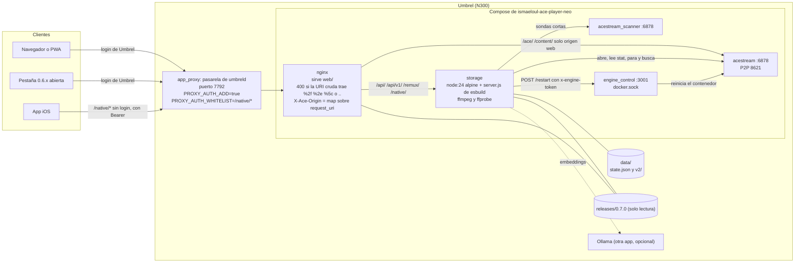
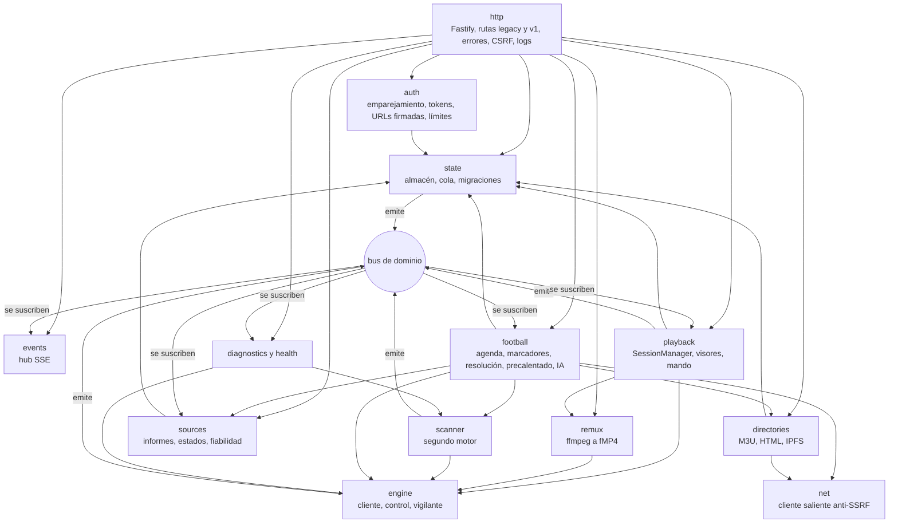
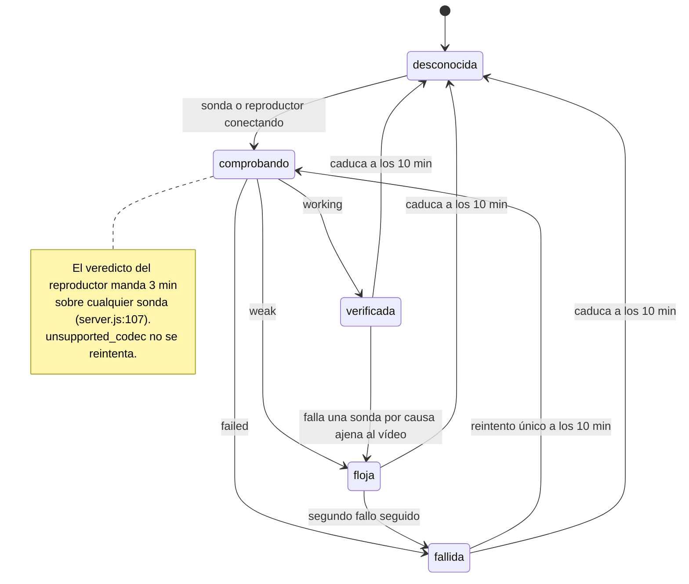
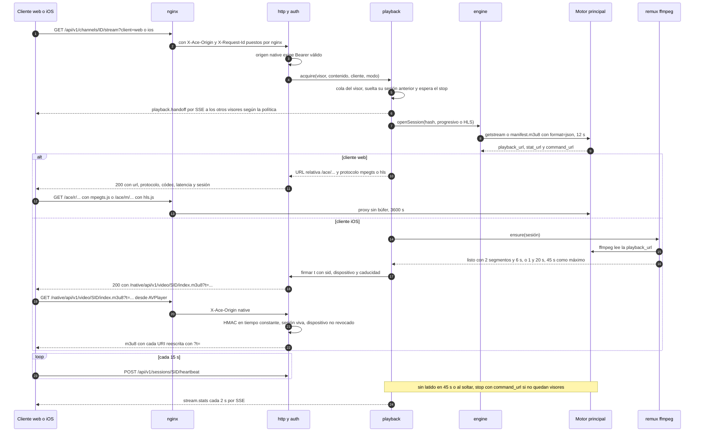
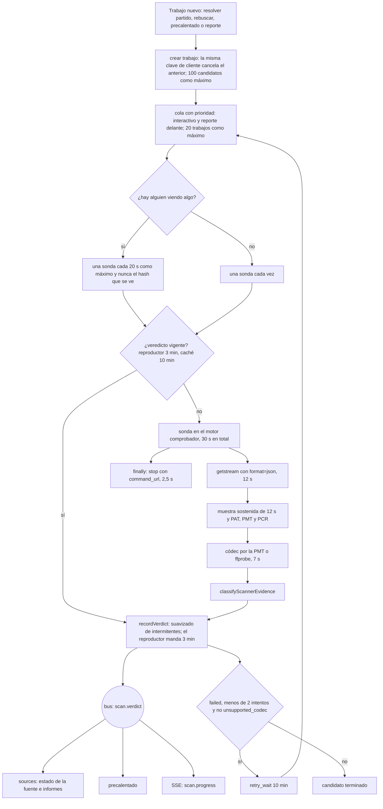
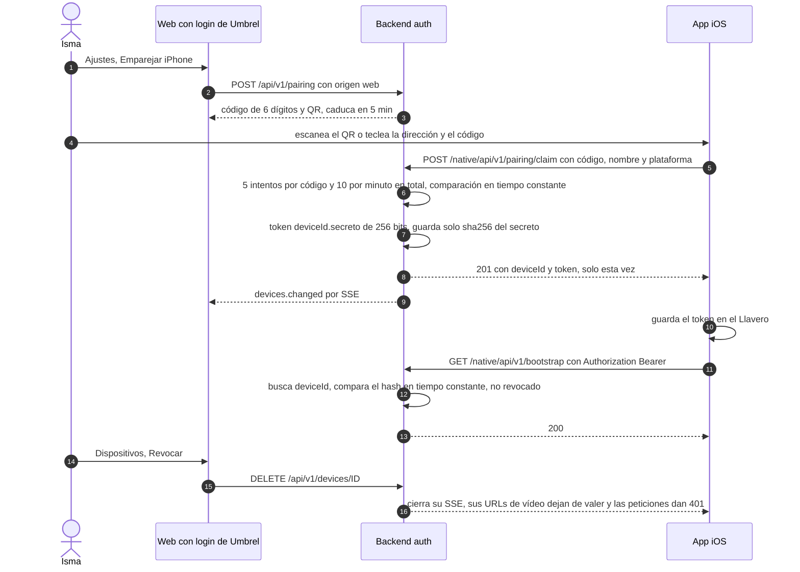
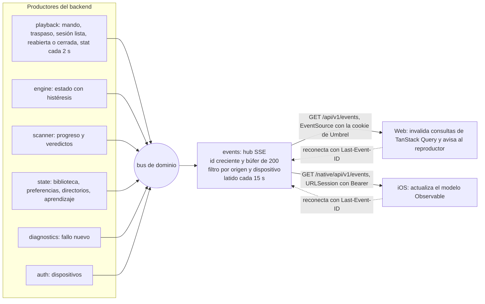

# Arquitectura de Ace Player Neo v2 (0.7.0)

> FASE 0. Documento de diseño: no hay código de producto detrás todavía.
> Escrito el 22-09-2026 sobre la rama `rewrite-v2`. El plan de trabajo está en
> [`plan.md`](./plan.md) y las decisiones ya tomadas, en
> [`decisiones.md`](./decisiones.md) (D1-D5).

## Cómo citar

Todas las rutas son relativas a la raíz del repo `umbrel-app-store/`.

| Cita corta | Fichero |
|---|---|
| `server.js:N`, `index.html:N`, `nginx.conf:N`, `engine-control.js:N`, `player-controller.js:N`, `sw.js:N` | `ismaeloul-ace-player-neo/releases/0.6.59/…` |
| `docker-compose.yml:N`, `umbrel-app.yml:N`, `pre-start:N` | `ismaeloul-ace-player-neo/…` (`pre-start` = `hooks/pre-start`) |
| `backend-modulos §N`, `reproductor §N`, `empaquetado §N`, `inventario-front §N`, `motor-real §N` | `ace-player-neo/docs/analisis/*.md` |
| `T-NNN` | ficha del test en `ace-player-neo/docs/analisis/comportamientos-tests.md` |
| `api.md §N`, `D1`…`D5` | `ace-player-neo/docs/api.md`, `ace-player-neo/docs/decisiones.md` |

Lo que es propuesta (y no hecho comprobado) va en presente de diseño ("el
backend hace…"). Lo que falta confirmar va marcado como **duda**.

---

## 0. Resumen

1. Tres clientes (web React, app iOS SwiftUI y los clientes 0.6.x que sigan
   abiertos) hablan con **un único backend** Node 24 + Fastify + TypeScript que
   se compila con esbuild a **un solo `server.js`** y se sigue ejecutando con
   la imagen oficial `node:24.19.0-alpine3.24` fijada por digest (D3).
2. El backend pasa a ser **dueño de las sesiones del motor**: ningún cliente
   vuelve a pedir `getstream`/`manifest.m3u8` al motor. Eso acaba con los 403
   cruzados y con las sesiones zombi (motor-real §3, D5).
3. Todas las rutas de la 0.6.59 siguen respondiendo igual (misma forma y mismos
   códigos). Lo nuevo va bajo `/api/v1`, con contratos zod en
   `packages/shared`, errores `{ error: { code, message, requestId } }` y
   OpenAPI generado.
4. La app iOS entra por el **mismo puerto 7792** gracias a
   `PROXY_AUTH_WHITELIST: "/native/*"`, blindado en nginx (rechazo de `%2f`,
   `%2e`, `%5c` y `..`; origen calculado sobre `$request_uri` y enviado siempre
   en `X-Ace-Origin`) y en el backend (token obligatorio si el origen es
   `native`, sea cual sea la ruta) (D4).
5. `state.json` conserva **exactamente** su forma v1 para que la 0.6.59 lo
   pueda leer tras una vuelta atrás; lo nuevo (dispositivos, ajustes v2,
   diagnóstico) va en ficheros aparte bajo `data/v2/`.
6. Tiempo real por **SSE** (`/api/v1/events`) en vez de sondeos de 5 s.
7. Política de varios dispositivos (D5): **el mismo canal se comparte por
   defecto**, porque lo pide expresamente el prompt (§2.3, "una sola sesión
   por contenido"). Con canales distintos se conserva el traspaso de la 0.6.5.
   Un ajuste (`sameChannelPolicy: "handoff"`) devuelve el comportamiento de
   la 0.6.59 sin tocar código. Es la **decisión que Isma tiene que revisar**
   (§5.6).

---

## 1. Lo que no se puede romper

| # | Invariante | Origen |
|---|---|---|
| U1-U9 | Reglas de umbreld: carpeta e id de la app, imágenes públicas por digest y sin `build:` ni `profiles:`, `app_proxy` → nginx:80, puerto 7792, solo se copian Compose/`hooks/`/manifiesto en una actualización, hook LF y ejecutable, hook con `\|\| true`, `data/` sobrevive, versión entre comillas | empaquetado §6.1 |
| T1-T9 | Lo que hoy comprueban los tests de empaquetado (versión única, protocolo de engine-control, `proxy_redirect` sin `$scheme`, 2 MiB de cuerpo…) | empaquetado §6.2, T-001, T-102, T-118, T-126 |
| I1-I7 | Nombres de contenedor coherentes, `REQUIRED_FILES` completo, `/api/health` 200 en menos de 8 s con `components.scanner.online`, permisos legibles por nginx, `VERSION` del SW nueva en cada release, `id`/`start_url` y `?vista=` del manifiesto, engine_control solo reinicia un contenedor | empaquetado §6.3 |
| R-API | Las 25 rutas (27 operaciones) de la 0.6.59 siguen respondiendo con la misma forma y los mismos códigos, incluidas las rarezas documentadas | api.md índice, api.md §6 |
| R-DATOS | Las 12 claves de primer nivel de `state.json` se conservan con sus tolerancias; en producción hay `favorites[6]`, `history[60]`, `web[261]`, `webSyncedAt`, `webSources[3]`, `activeWebSourceId`, `preferences{5}`, `channelBindings[3]`, `sourceReports[1]`, `channelFeedback[0]`, `sourceStats{2}`, `nowPlaying{5}` | backend-modulos §2.2, §2.10 |
| R-SEG | Se mantienen `mem_limit`, `pids_limit`, `read_only`, `no-new-privileges` y los digests donde ya están | `docker-compose.yml:29,41,50-52,62-63,70-71,116-117` |

Excepción explícita a R-API: solo se cambia el comportamiento de una ruta
antigua cuando hoy provoca un 500 por un fallo de programación (por ejemplo, un
cuerpo `null`, api.md §6.6) o un agujero de seguridad. Cada excepción se lista
en `docs/compat.md` (Fase 1) con su test.

---

## 2. Servicios



### 2.1 Qué cambia en cada servicio respecto a la 0.6.59

| Servicio | Imagen | Cambio en 0.7.0 | Se mantiene |
|---|---|---|---|
| `app_proxy` | (pasarela) | añade `PROXY_AUTH_WHITELIST: "/native/*"` | `APP_HOST`, `APP_PORT`, `PROXY_AUTH_ADD` (`docker-compose.yml:7-11`) |
| `acestream` | mismo digest (`:16`) | nada | comando, caché en disco, 8621, 4g |
| `acestream_scanner` | mismo digest (`:35`) | nada | 3g, sin puertos |
| `engine_control` | mismo digest (`:46`) | `command` apunta a `releases/0.7.0/engine-control.js`; el script compara con `timingSafeEqual` y falla cerrado con token vacío (empaquetado §4) | protocolo `POST /restart` + `x-engine-token`, `read_only`, `no-new-privileges`, 128m, 64 pids |
| `storage` | mismo digest (`:66`) | `command`: `timeout 60 apk add ffmpeg …; exec node /releases/0.7.0/server.js`; healthcheck a `/api/v1/health/live` (barato, sin red); variable nueva `ACE_SEED: "${APP_SEED}"` (§5.3) | `init`, `no-new-privileges`, volúmenes, 768m, 128 pids, variables actuales |
| `nginx` | mismo digest (`:120`) | copia solo `releases/0.7.0/web/` a `/www` (no la release entera, arregla empaquetado N1) y la `nginx.conf` nueva (§8) | dependencias de arranque (`:123-127`) |

- **`read_only`** sigue solo en `engine_control`. `storage` no puede serlo
  mientras instale ffmpeg al arrancar (`apk add` escribe en `/usr`,
  empaquetado §2.6). El `Dockerfile` del perfil `test` sí es `read_only` y sin
  root (§11.4): es el camino para endurecerlo cuando el paquete de GHCR sea
  público.
- **Duda**: no hay límites en `nginx` (empaquetado §2.1). Añadir
  `mem_limit: 128m` y `pids_limit: 64` parece inocuo, pero no se hace en la
  0.7.0 sin medirlo en el compose local.

---

## 3. Monorepo

`ace-player-neo/` en la raíz del repo, fuera de la carpeta de la app (D2).

```text
ace-player-neo/
├── package.json · pnpm-workspace.yaml · tsconfig.base.json · eslint.config.js
├── packages/
│   └── shared/            @ace/shared: esquemas zod, tipos, constantes, funciones puras, OpenAPI
├── apps/
│   ├── server/            @ace/server: Fastify + TS strict + zod + pino; build.mjs (esbuild)
│   │   └── Dockerfile     multi-stage, sin root, ffmpeg, healthcheck (solo CI y perfil test)
│   ├── web/               @ace/web: Vite + React + TS + TanStack Query
│   └── ios/               SwiftUI iOS 17, Swift 6, project.yml de XcodeGen (fuera del workspace pnpm)
├── deploy/                compose local, pasarela falsa, motor falso, datos de prueba sintéticos
├── scripts/               release.mjs, comprobaciones de empaquetado, contraste con la 0.6.59
└── docs/
```

- La salida de `pnpm release` es `ismaeloul-ace-player-neo/releases/0.7.0/`
  (§11.1). Es lo único del monorepo que llega al NAS.
- Versiones fijadas (ya en `package.json`): pnpm 10.18.2, TypeScript 6.0.3,
  esbuild 0.28.2, Vitest 5.0.1, Fastify 5.12.5, zod 4.6.5, pino 10.3.1. React,
  Vite, TanStack Query, hls.js y mpegts.js se fijan en la Fase 2 con
  `save-exact`.
- `apps/ios` no entra en el workspace de pnpm (`pnpm-workspace.yaml` solo
  lista `apps/server`, `apps/web` y `packages/*`).

---

## 4. `packages/shared`: los contratos

Es lo primero que se escribe en la Fase 1; todo lo demás importa de aquí.

| Carpeta | Contenido | Por qué aquí |
|---|---|---|
| `schemas/state-v1` | Esquema zod de `state.json` con las tolerancias de la 0.6.59: listas y topes (60, 500, 8, 120, 300, 600), `Item`, `WebSource`, `Preferences`, `ChannelBinding`, `SourceReport`, `ChannelFeedback`, `SourceStats`, `NowPlaying` | backend-modulos §2.2-2.3; migración y test de vuelta atrás |
| `schemas/legacy` | Respuestas de las 25 rutas actuales, tal como las documenta `api.md` | tests de paridad y de contraste (plan §3) |
| `schemas/v1` | Peticiones, respuestas y eventos de `/api/v1` | server, web e iOS |
| `schemas/errors` | Catálogo de códigos (`api.md §2.6` más los nuevos) con su HTTP y un mensaje en español por defecto | un único sitio para web e iOS (arregla P10) |
| `constants/timeouts` | Todos los plazos de §5.15 | arregla P21 (topes desalineados entre servidor, cliente y nginx) |
| `constants/playback` | Perfiles `stable`/`balanced`/`low` (`index.html:2387-2402`) y su traducción a iOS | reproductor §3 |
| `domain/` | Funciones puras: `normalizeHash`, `normalizeChannelKey`, `channelMatchScore` y sus constantes (`RESOLUTION_EXACT_SCORE` 92…), `readSeekWindow`, `resolveLiveTarget`, reglas de "Para ti" | hoy están duplicadas entre `server.js` e `index.html` (T-088, T-101) |
| `routes.ts` | Tabla de rutas v1 como datos: método, ruta, esquemas, `access: "web" \| "any"` | el servidor registra desde aquí; el OpenAPI sale de aquí |
| `fixtures/` | Ejemplos válidos de cada respuesta v1, exportados a JSON | tests de decodificación de la app iOS (§10.3) |

- **OpenAPI**: `pnpm --filter @ace/shared openapi` recorre `routes.ts` y usa
  `z.toJSONSchema()` de zod 4 para escribir `docs/openapi-v2.yaml`. CI falla si
  el fichero generado no coincide con el commiteado. `docs/openapi.yaml` sigue
  siendo la referencia escrita a mano de la 0.6.59.
- Nada de `packages/shared` toca Node ni el DOM: lo importan el servidor, la
  web y los tests.

---

## 5. Backend (`apps/server`)

### 5.1 Principios

- **Sin estado global de módulo**. Cada servicio es una clase o fábrica que
  recibe sus dependencias (reloj, cliente HTTP, cliente del motor, lanzador de
  procesos, repositorio de estado). Así los tests portados no dependen del
  orden ni del entorno (comportamientos-tests §1.4, §1.9, §5.3-5.4).
- **Bus de dominio tipado** (un `EventEmitter` con tipos) para romper los
  ciclos de hoy: el comprobador emite `scan.verdict` y `scan.jobDone`; fuentes,
  precalentado, playback y SSE se suscriben (backend-modulos §0.1).
- **Todo acceso de red lleva plazo explícito** (`AbortSignal.timeout`) y tope
  de bytes. La tabla está en §5.15 y vive en `@ace/shared`.
- **E/S asíncrona**: nada de `*Sync` en la ruta de una petición (hoy sí,
  backend-modulos §8.1.5 y §8.4.21).
- Estructura: `src/modules/<módulo>/{service.ts, routes.legacy.ts, routes.v1.ts, *.test.ts}`.
  Cada módulo registra sus rutas como plugin de Fastify; `http` solo los
  compone.

### 5.2 Mapa de módulos

Convención: `A --> B` quiere decir "A usa B". `config` y `@ace/shared` los usan
todos y no se dibujan.



| Módulo | Qué contiene (origen en la 0.6.59) | Cambios principales |
|---|---|---|
| `config` | variables de entorno y rutas (backend-modulos §1, §3.1) | esquema zod con los mismos defectos y acotaciones; `APP_VERSION` inyectada en el build (T-102); se sanean también `ACESTREAM_SCANNER_HOST` y `ENGINE_CONTROL_HOST` (backend-modulos §9.10) |
| `state` | `readState`/`writeState` y normalizadores (§3.3) | copia en memoria, cola de escrituras, fsync, recuperación, versión de esquema (§5.4) |
| `engine` | `aceRequest`, `restartAceStream`, `engine-control.js` (§3.5) | cliente con plazos y tope de cuerpo; vigilante con histéresis, backoff y cupo de reinicios (§5.5) |
| `playback` | `nowPlaying`, claim/release, lápidas (§3.15) | además, dueño de las sesiones del motor y de los visores (§5.6) |
| `remux` | `ensureRemux`, reaper, desalojo, servido con `Range` (§3.16) | lee la `playback_url` de una sesión que abrió el backend, `nice`, hilos acotados, log acotado, limpieza de huérfanos (§5.7) |
| `scanner` | sonda, análisis TS, ffprobe, clasificación, cola (§3.6) | plazo total real, ritmo lento si hay reproducción, cola acotada (§5.8) |
| `sources` | informes, cuarentenas, correcciones, fiabilidad (§3.7) | máquina de estados explícita (§5.9) |
| `football` | agenda, marcadores, canales, IA, resolución, precalentado (§3.8-3.13) | plazo global de la agenda, ids de partido estables, sin globales (§5.10) |
| `directories` + `net` | `fetchText`, SSRF, IPFS, parsers, sincronización (§3.14) | cerrojo único de sincronización, cliente saliente con DNS fijado (§5.11) |
| `auth` | (nuevo) | §5.12 |
| `events` | (nuevo) | §5.13 |
| `diagnostics`, `health` | `systemHealth`, `ollamaHealth` (§3.18) | salud desde caché, registro de fallos por causa (§5.14) |
| `http` | `handleRequest`, `isAllowedMutation`, `readBody`, errores (§3.4) | §5.15 |
| `search` | `searchAceStreams`, `parseAceSearchResults` (§3.17) | dentro de `engine`; con reproducción activa, las búsquedas de la resolución van al comprobador (§5.10) |

### 5.3 `config`

- Un `configSchema` zod lee `process.env` una vez al arrancar y congela el
  resultado. Mismos nombres, defectos y rangos de la tabla de backend-modulos
  §1; si una variable no vale, se usa el defecto y se avisa en el log (como
  hoy), salvo las de seguridad, que fallan al arrancar.
- Variables nuevas, todas con defecto seguro:

| Variable | Defecto | Para qué |
|---|---|---|
| `ACE_SEED` | `${APP_SEED}` en Compose; si falta, `ENGINE_CONTROL_TOKEN` | material para derivar claves con HKDF-SHA256 (etiquetas `ace-video-v1`, `ace-pair-v1`) |
| `ACE_SAME_CHANNEL_POLICY` | `share` | política de §5.6 si no hay ajuste guardado |
| `ACE_LOG_LEVEL` | `info` | pino |

- `NODE_ENV` se sigue definiendo en Compose pero no cambia nada
  (backend-modulos §1).

### 5.4 `state`

**Ficheros** (`DATA_DIR=/data`):

| Fichero | Qué es | Lo lee la 0.6.59 |
|---|---|---|
| `state.json` | las 12 claves v1 con su forma de siempre + `schemaVersion: 2` | sí (descarta `schemaVersion`, backend-modulos §2.2) |
| `state.json.bak` | la versión anterior completa (copia, no `rename`) | sí |
| `state.json.1`…`.3` | instantáneas rotadas, como mucho una por hora | no |
| `state.pre-0.7.0.json` | copia intocable del primer arranque de la 0.7.0 | a mano |
| `state.json.corrupt-<ISO>` | ficheros ilegibles apartados; se guardan los 5 últimos | no |
| `v2/devices.json` | dispositivos emparejados | no |
| `v2/settings.json` | ajustes v2 (política de §5.6, etc.) | no |
| `v2/sessions.json` | `command_url` de las sesiones abiertas, para pararlas si el proceso muere | no |
| `v2/diagnostics.jsonl` (+ `.1`) | registro de fallos, 1 MiB por fichero | no |
| `remux/` | temporal, se vacía al arrancar (`server.js:5134`) | — |

**Lectura**: al arrancar se carga y normaliza una vez; las peticiones leen de
memoria. Hoy cada petición relee y normaliza el fichero entero, también
`/api/playback` cada 5 s por dispositivo (backend-modulos §2.5, §8.1.5).

**Escritura** (arregla los riesgos A de backend-modulos §8.1):

1. Todas las mutaciones pasan por una **cola única** (`enqueue(mutator)`): se
   aplican en orden sobre una copia, se normaliza y se persiste **antes** de
   responder. Sustituye al truco de "leer el cuerpo antes que el estado"
   (T-108), que se sigue probando con un servidor real.
2. Persistir: `state.json.tmp` → `fsync` → copiar el `state.json` actual a
   `state.json.bak.tmp` → `fsync` → `rename` a `.bak` → `rename(tmp →
   state.json)` → `fsync` del directorio. **Nunca hay un momento sin
   `state.json`** (hoy lo hay entre los dos `rename`, `server.js:1106-1107`).
3. Rotación horaria a `.1`-`.3`.

**Recuperación al arrancar**: `state.json` → `.tmp` (si es válido y más
nuevo) → `.bak` → `.1` → `.2` → `.3`. Todo lo ilegible se aparta como
`.corrupt-*`. Solo se crea un estado vacío si **no existía ningún** fichero
(instalación nueva). Si todo está roto se arranca vacío, se registra en
diagnóstico con causa `state_unreadable` y la salud lo muestra; los ficheros
apartados se conservan (garantías de T-109). Un JSON válido que no es un objeto
cuenta como ilegible (hoy se pierde en silencio, backend-modulos §8.1.3).

**Migraciones**: `schemaVersion` ausente = 1. La migración 1 → 2 no cambia la
forma de ninguna clave v1: normaliza con las mismas tolerancias (acepta `web`
sin `webSources`, fechas raras en `syncedAt`, estadísticas con decimales, no
reescribe `Item.date`, conserva `alias`, `ih`, `fromWebSync`, `renames` y
`hidden`), escribe `schemaVersion: 2` y crea `v2/`. Es **idempotente**: si
tras una vuelta atrás la 0.6.59 quita `schemaVersion`, la 0.7.x la vuelve a
aplicar sin perder nada. Las migraciones futuras son funciones
`(n) → (n+1)` puras y probadas con fixtures.

**Pérdidas que hoy ya ocurren** (backend-modulos §2.8): se conservan tal cual
para no cambiar lo que ve la 0.6.59, salvo que la v2 **no** tira campos
desconocidos de primer nivel que no sean v1: los ignora y los deja donde
están. **Duda** para Isma: ¿se mantiene el recorte de fechas inválidas a
"ahora"?

### 5.5 `engine`

- **Cliente** (`engine/client.ts`): `getSessionMeta(hash, kind, mode)` con
  `getstream?…&format=json` (progresivo) o `manifest.m3u8?…&format=json` (HLS),
  `getStat(statUrl)`, `stop(commandUrl)`, `search(q)`, `version()`. Cada
  llamada con plazo (§5.15) y tope de 512 KiB (hoy `aceRequest` no tiene tope,
  backend-modulos §3.5). Las URL que devuelve el motor se reducen a ruta
  relativa `/ace/…` o `/content/…` (regla de `scannerEnginePath`, T-072).
- **Control**: `POST engine_control:3001/restart` con `x-engine-token`
  (T-118). engine-control compara en tiempo constante y rechaza con token vacío.
- **Vigilante** (lo que hoy hace el navegador con `motorSinRespuesta`,
  `index.html:4238-4245`, backend-modulos §6.3):
  - sondea `get_version` cada 10 s (3 s de plazo);
  - **histéresis**: pasa a `offline` tras 2 fallos seguidos con alguien viendo
    y 3 sin nadie; vuelve a `online` con 2 aciertos seguidos; publica
    `engine.status` en el bus solo al cambiar;
  - **reinicio automático** solo si hay un visor que quiere reproducir y el
    motor lleva 60 s `offline` o fallan 3 aperturas de sesión seguidas por
    causa del motor. Espera exponencial entre reinicios (1, 2, 4 min) y **como
    mucho 3 por hora**; al agotarse, aviso en salud y diagnóstico. El reinicio
    manual (`/api/restart-engine`) conserva su enfriamiento de 15 s y no gasta
    el cupo automático;
  - **esperar a que esté listo**: tras un reinicio, 2 respuestas buenas de
    `get_version` seguidas (90 s como máximo) antes de reabrir nada;
  - **recuperar el canal**: playback reabre las sesiones que los visores
    seguían queriendo y avisa por SSE (`stream.reopened` con la URL nueva).

### 5.6 `playback`: sesiones del motor, visores y mando

**Hechos comprobados contra el motor real** (motor-real §2, §3, §7):
- pedir otra sesión del mismo contenido mata la anterior (403);
- una sesión HLS la pueden leer varios clientes a la vez;
- una sesión progresiva (`/ace/r/…`, la de mpegts.js y la entrada actual del
  remux) solo admite un consumidor: con dos, el motor devuelve HTTP corrupto;
- ffmpeg puede hacer el remux leyendo el HLS del motor (motor-real §4).

**Lo que manda el prompt nuevo**: sesiones que se cierran siempre, una por
contenido compartida entre dispositivos "si es posible", cambio de canal sin
carreras.

**Lo que ya había**: el traspaso tipo Spotify Connect de la 0.6.5, en el que
el último que da al play se queda el mando y el otro se para **aunque vea el
mismo canal** (reproductor §6.2, `index.html:4159-4229`); y el "restreamer" en
Node, que Isma rechazó en julio (memoria del proyecto).

**Modelo** (común a todas las opciones):

- `EngineSession` = una sesión del motor principal:
  `{ id, hash, kind: id|infohash, mode: progressive|hls, playbackUrl, statUrl, commandUrl, openedAt, viewers }`.
  **Una por contenido**, y en la 0.7.0 **una sola a la vez** en el motor
  principal (dos canales a la vez no está probado, `dudas.md`).
- `Viewer` = una reproducción concreta: `{ viewerId, deviceId, client: web|ios|legacy, sessionId, lastBeat }`.
  - `deviceId`: persistente (localStorage en la web, dispositivo emparejado
    en iOS).
  - `viewerId`: uno por pestaña o por reproductor. Así dos pestañas del mismo
    navegador siguen siendo dos consumidores y no se pisan (hoy `DEV_ID` va en
    `sessionStorage`, `index.html:2345-2347`, P12).
- **Latido**: cada visor manda `POST /api/v1/sessions/:sid/heartbeat` cada
  15 s (también disparado por `timeupdate` para sobrevivir al estrangulado de
  temporizadores en pestañas en segundo plano). En iOS, además, cada petición
  de segmento cuenta como latido. Sin latido en **45 s** el visor se da por ido
  (D5). Sin visores, **`stop` con `command_url`** (2,5 s) y se borra de
  `v2/sessions.json`.
- **Sin carreras**: una cola por `viewerId` serializa `acquire`/`release`; al
  cambiar de canal, `release(anterior)` (con su `stop` si queda sin visores)
  se **espera** antes de `open(nueva)`. Cada operación lleva un número de
  generación y cualquier respuesta de una generación vieja se descarta (lo que
  hoy hace `S.playToken` en el cliente, reproductor §2).
- **Sin zombis**: el backend abre **siempre** con `format=json`, así que
  siempre tiene `command_url` (hoy ffmpeg abre `getstream` a pelo y nadie puede
  pararlo, backend-modulos §8.3.16, P7, P8). Al apagarse (SIGTERM) para todas
  las sesiones en paralelo con 4 s de tope; al arrancar para las que quedaran
  en `v2/sessions.json` de un proceso anterior.
- **Estadísticas**: playback lee `stat_url` cada 2 s mientras haya visores y
  las publica por SSE (`stream.stats`). La app iOS tiene por fin pares y
  velocidades (P8) y ningún cliente vuelve a sondear al motor.
- **Mando**: `nowPlaying` se sigue guardando en `state.json` y
  `/api/playback*` responde igual (T-037, T-038, T-115). Los `claim` de un
  cliente 0.6.x cuentan como un visor `legacy` sin latido (caduca a los 45 s
  si no reclama otra vez; hoy `nowPlaying` no caduca nunca, reproductor §6.3).

**Opciones para varios dispositivos**:

| Opción | Qué pasa | A favor | En contra |
|---|---|---|---|
| A. Traspaso de la 0.6.5 | El último play manda en todo; los demás reciben `playback.handoff` y se paran | Es lo que Isma aprobó y usa; nunca hay dos consumidores | Dos personas no pueden ver el mismo partido |
| B. D5 | Mismo canal: la sesión pasa a HLS y se comparte (el primer visor se reengancha con hls.js); canales distintos: traspaso | Cumple "una sesión compartida"; sin restreamer, porque el HLS lo sirve el propio motor | Cambia un comportamiento aprobado; al pasar de progresivo a HLS el primer visor sufre un corte; hls.js sobre el HLS del motor (4-6 s por segmento) añade retraso |
| C. Restreamer en Node | El backend lee el progresivo y lo reparte | Sin cortes | Rechazado por Isma en julio; carga el N300 |
| D. Siempre HLS | Todos los clientes por HLS | Nunca hay cambio de modo | Pierde el progresivo, que es lo que mejor funciona en escritorio y Android (D5.2) |

**Decisión (D5, tomada por el orquestador)**: construir el modelo entero y
una sola bandera `sameChannelPolicy: "share" | "handoff"`, con **`share` por
defecto (opción B)**:

- **Mismo canal, `share`**: el segundo dispositivo se une a la sesión. Si era
  progresiva, pasa a HLS (el primer visor recibe `stream.modeChanged` por SSE
  y se reengancha con hls.js; un corte breve). El prompt lo pide
  expresamente (§2.3), y el traspaso de la 0.6.5 era un apaño para una
  limitación del motor que la v2 resuelve.
- **`handoff` (opción A)** sigue disponible en Ajustes → Reproducción
  ("Un solo dispositivo a la vez") y en `ACE_SAME_CHANNEL_POLICY`: devuelve
  el comportamiento de la 0.6.59, pero con el aviso por SSE al momento (hoy
  tarda hasta 5 s y suenan los dos, reproductor §6.2) y parando la sesión
  vieja antes de abrir la nueva, en vez de dejar que el motor la mate con un
  403.
- **Canales distintos**: siempre traspaso, con cualquier política (dos canales
  a la vez no está probado, `dudas.md`).
- El remux de iOS lee el HLS del motor cuando hay más de un visor y el
  progresivo cuando está solo (D5.3). **Duda** a medir en la Fase 1: si
  leyendo siempre HLS no se añade retraso apreciable, conviene que lo haga
  siempre, porque así una web que se une al iPhone no provoca ningún cambio de
  modo.

> **DECISIÓN A REVISAR POR ISMA.** Si prefieres el comportamiento de siempre,
> basta con elegir "Un solo dispositivo a la vez" en Ajustes; no hay que tocar
> código.

### 5.7 `remux`

- Entrada: la `playbackUrl` de la `EngineSession` (progresiva o HLS), nunca un
  `getstream` abierto por ffmpeg por su cuenta.
- Argumentos: los de hoy (`server.js:259-318`, T-125) generados por una
  función pura `buildRemuxArgs()` que se compara en el test. Se añaden
  `-nostdin`, `-threads 2`, `-loglevel warning` y
  `-metadata ace_session=<id>` para reconocer el proceso.
- **Prioridad**: `os.setPriority(pid, 10)` tras lanzarlo (equivale a `nice
  10`, sin binario extra).
- **Límite**: `MAX_REMUX_SESSIONS = 3` (`server.js:39`) y desalojo solo de
  sesiones sin espectadores; si todas tienen, 503 `remux_busy`: **nunca se
  expulsa a un espectador activo** (`server.js:196-209`, T-112).
- **Huérfanos**: se lanzan en su propio grupo de procesos y se matan con
  `kill(-pgid)`. El reaper (cada 15 s) busca además en `/proc/*/cmdline`
  procesos ffmpeg con `ace_session=` que no estén en el registro y los mata.
- **Log**: la salida de error de ffmpeg va a un búfer circular de 64 KiB en
  memoria (hoy `ffmpeg.log` crece sin límite, backend-modulos §8.4.20). Al
  morir con error se guarda el final en diagnóstico, causa `codec` o `engine`.
- **Espera**: la de hoy (2 segmentos y 6 s, o 1 y 20 s, 45 s como máximo), sin
  `readFileSync` cada 400 ms (vigila el directorio) y **cancelada si el cliente
  cuelga** (api.md §6.16).
- **Reconexión en iPhone**: reengancharse al mismo canal reutiliza el ffmpeg
  vivo en vez de matarlo (P9).
- Servido: `/remux/<hash>/<fichero>` (compatibilidad, T-035) y
  `/api/v1/video/<sid>/<fichero>` para la app nativa (§5.12), los dos con
  `Range`, 206/416 y `no-store`.

### 5.8 `scanner`

Se porta tal cual la sonda y la clasificación (backend-modulos §6.5; T-072 a
T-075, T-103 a T-105, T-122) y se cambia:

- **Plazo real**: el presupuesto de 24 s incluye estadística final, ffprobe y
  `stop`; con los márgenes, 30 s de tope duro por sonda (backend-modulos §9.7).
- **Ritmo con reproducción**: si playback tiene algún visor, como mucho una
  sonda cada 20 s, nunca del hash que se está viendo (su veredicto lo da el
  reproductor) y el precalentado no fuerza sondas de ese partido. Arregla los
  riesgos 8 y 9 de backend-modulos §8.2 (el informe y el precalentado se
  saltaban la protección del canal visible).
- **Cola acotada**: 20 trabajos como máximo; los de clave de cliente repetida
  se cancelan como hoy (`server.js:3550-3558`) y los que no tienen cliente
  caducan antes (backend-modulos §8.5.23).
- **Fugas**: si la meta falla después de que el motor crease la sesión no hay
  `command_url` que parar (backend-modulos §8.3.14). Se cuentan en diagnóstico
  y la salud avisa si pasan de 5 por hora. **Duda**: engine_control no puede
  reiniciar el comprobador (I7); ampliarlo sería otro cambio de protocolo.
- Emite `scan.verdict`, `scan.progress` y `scan.jobDone` por el bus.

### 5.9 `sources`: la máquina de estados de una fuente



- Nombres internos: `desconocida`=`queued`, `comprobando`=`checking`,
  `verificada`=`working`, `floja`=`weak`, `fallida`=`failed`; los de la API no
  cambian (backend-modulos §7).
- Encima va la capa persistente de **informes y cuarentenas**
  (`sourceReports`: 30 min, 10 min o 30 días según el motivo) y de
  **correcciones** (`channelFeedback`), con las mismas reglas
  (backend-modulos §7.4, T-076, T-077, T-079, T-080).
- Fiabilidad aprendida (Wilson, desgaste de 14 días, `sigue` no suma): igual
  (T-089 a T-094, T-123).
- Arreglos: un informe ya no borra la caché antes de la sonda sin mirar el
  veredicto del reproductor (§8.2.8); un informe atascado en `checking` pasa a
  `reported` si su trabajo se cancela (§8.2.11); sin comprobador, el informe
  no se queda en `checking` para siempre (api.md §6.8).
- **Duda heredada** (backend-modulos §9.5): HEVC sale como `failed
  unsupported_codec` aunque el remux de iOS lo reproduce. Propuesta: el
  veredicto pasa a depender del cliente (`playableOn: { web, ios }`) y no se
  descarta para iOS. Se decide en la Fase 1 con Isma.

### 5.10 `football`

Submódulos `agenda`, `scores`, `channels` (funciones puras, en
`@ace/shared`), `ai`, `resolution` y `preheat`, con la lógica de hoy
(backend-modulos §3.8-3.13; T-006 a T-030, T-039 a T-071, T-078, T-081 a T-086,
T-095 a T-100, T-113, T-114). Cambios:

- **Plazo global de la agenda**: 60 s para la cadena futbolenlatv → EPG →
  TheSportsDB (hoy puede tardar minutos, backend-modulos §8.5.27); si vence,
  la última agenda buena con `stale: true`.
- **Ids de partido estables**: hash de fecha, hora, local y visitante en vez
  del índice (`fltv-<fecha>-<índice>`, backend-modulos §8.2.10, api.md §6.12).
  Los ids viejos guardados en informes se conservan como texto.
- `start` también en los partidos de la EPG y de TheSportsDB, para que
  marcadores y precalentado funcionen con todas las fuentes (backend-modulos
  §9.6).
- **IA opcional**: sin `OLLAMA_BASE_URL` todo sigue igual (T-022, T-028). El
  LRU de embeddings reserva sitio para los canales programados antes que para
  la biblioteca (backend-modulos §8.5.24).
- **Vinculación partido-canal**: `channelBindings` y reglas aprendidas, igual.
- **Búsquedas**: con reproducción activa, las hasta 8 búsquedas de la
  resolución van al motor comprobador en vez de al principal (backend-modulos
  §9.11); sin reproducción, al principal como hoy.
- El precalentado refresca la agenda si ha caducado (§8.2.13).

### 5.11 `directories` y `net`

- `net.fetch` sustituye a `fetchText` (backend-modulos §5): `undici` con un
  `connect.lookup` propio que resuelve, **rechaza IP privadas y fija la IP**
  para la conexión (así una respuesta DNS que cambie entre la comprobación y la
  conexión no sirve de nada); redirecciones en modo manual, comprobando **cada
  salto** (5 como máximo, con detección de bucles); `identity`, 2 MiB por
  defecto, 45 s de plazo total y 12 s de inactividad; errores con los mismos
  códigos (`private_url`, `dns_failed`, `http_NNN`…). `ALLOW_PRIVATE_SYNC_URLS`
  sigue quitando el filtro (T-004, T-005, T-116).
- IPFS sin pasarela con cada bloque del CAR comprobado contra su sha256
  (T-121) y la pasarela pública solo si IPFS falla (T-117). **Mejora
  opcional**: verificar la firma del registro IPNS (hoy no se verifica,
  backend-modulos §8.7.33).
- Parsers M3U y HTML: iguales; hoy no tienen test (comportamientos-tests §3.2)
  y en la Fase 1 se les añaden con fixtures.
- **Un solo cerrojo** para todas las sincronizaciones (periódica, de arranque,
  de la resolución y manual) y aplicación solo si la URL y el tipo no han
  cambiado mientras tanto (backend-modulos §8.2.6). Un directorio que falla
  siempre deja de relanzar la sincronización en cada resolución: espera
  exponencial (§8.2.7).

### 5.12 `auth`

**Orígenes**: `web` (pasó el login de Umbrel) y `native` (entró por
`/native/*` sin login). El backend lee `X-Ace-Origin`, que nginx pone siempre
(§8). Con `native` exige credencial en **todas** las rutas salvo
`GET /api/v1/ping` y `POST /api/v1/pairing/claim`. Las rutas antiguas `/api/*`
responden 403 a cualquier petición `native`, con o sin token: la app iOS solo
usa v1.

**Emparejamiento** (flujo en §7.3):
- Desde la web: `POST /api/v1/pairing` crea un código de **6 dígitos**
  (`crypto.randomInt`) y un QR `aceneo://pair?u=<URL base>&c=<código>`,
  válido **5 minutos**, de un solo uso. Solo hay un código vivo: uno nuevo
  anula el anterior.
- Desde iOS: `POST /native/api/v1/pairing/claim { code, name, platform }`.
  Límites que no dependen de la IP (el backend ve la de nginx, empaquetado
  N3, y no se sabe si la pasarela manda `X-Forwarded-For`): **5 intentos por
  código** (al quinto fallo el código muere) y **10 intentos por minuto en
  total**. Comparación del código en tiempo constante.
- Respuesta: `{ deviceId, token }`. Token = `<deviceId>.<secreto>` con
  secreto de **256 bits** en base64url. Se guarda **solo `sha256(secreto)`** en
  `v2/devices.json`; el token en claro solo existe en la respuesta y en el
  Llavero del iPhone.

**Uso**: `Authorization: Bearer <token>`. Se busca el dispositivo por
`deviceId`, se compara el hash con `timingSafeEqual` y se comprueba que no
está revocado. `lastSeenAt` se actualiza como mucho una vez por minuto.

**Revocación**: `DELETE /api/v1/devices/:id` (solo web). Cierra sus
conexiones SSE, suelta sus visores y hace que sus URLs de vídeo dejen de valer
al instante (la firma lleva el `deviceId`).

**URLs de vídeo firmadas** (AVPlayer no puede poner `Authorization` en cada
segmento):
- `t = base64url(payload) + "." + HMAC-SHA256(clave ace-video-v1, payload)`,
  con `payload = { sid, dev, exp }` y **`exp` a 60 s**: es el plazo para
  empezar a usarla.
- Mientras la sesión `sid` tenga ese visor vivo (latido o segmento en los
  últimos 45 s) y el dispositivo no esté revocado, la URL sigue valiendo aunque
  haya pasado `exp`. Tope absoluto de 6 h; la app pide otra antes.
- El token va **en la query**, como pide el prompt. Como las URI de los
  segmentos son relativas y no heredan la query (empaquetado §7.5), el backend
  **reescribe cada lista m3u8** que sirve, incluido `#EXT-X-MAP:URI`, y añade
  `?t=` a cada URI. Se puede porque el vídeo de iOS siempre lo sirve el
  backend (el remux), nunca el motor por nginx.
- pino redacta `authorization`, `t=`, `token` y `code` en los logs.

**Web**: sin tokens; la protege el login de Umbrel. Se mantiene la regla
anti-CSRF de `isAllowedMutation` (`server.js:1257-1274`, T-033) para el origen
`web`, incluidos los GET con efectos.

### 5.13 `events` (SSE)

- `GET /api/v1/events` (web, cookie de Umbrel) y
  `GET /native/api/v1/events` (iOS, Bearer; `URLSession` sí puede poner
  cabeceras).
- Formato SSE estándar: `id` creciente, `event`, `data` JSON validado con el
  esquema de `@ace/shared`, comentario de latido cada 15 s y `retry: 3000`.
- **Reanudación**: búfer circular de 200 eventos; con `Last-Event-ID` se
  reenvía lo que falte o, si ya no está, un `resync` para que el cliente
  recargue.
- **Filtro**: cada conexión recibe lo general y lo de su dispositivo; los
  eventos de administración (`devices.changed`) solo van al origen `web`.
- **Contrapresión**: si el búfer de escritura de una conexión pasa de 256 KiB
  se cierra y el cliente reconecta.
- Si el SSE no conecta en 10 s, la web vuelve al sondeo de `/api/playback`
  cada 5 s (hoy, `index.html:4229`).

| Evento | Productor | Consumidor |
|---|---|---|
| `playback.nowPlaying`, `playback.handoff` | playback | web, iOS |
| `playback.sessions` («Dónde se está reproduciendo», 0.7.1: la lista entera de sesiones con su canal y sus visores cada vez que cambia; no por cada latido) | playback | web, iOS |
| `stream.ready`, `stream.reopened`, `stream.modeChanged`, `stream.closed` | playback | el visor afectado |
| `stream.stats` (pares, bajada, subida, estado; cada 2 s) | playback | el visor afectado |
| `engine.status` (con histéresis) | engine | todos |
| `scan.progress`, `scan.verdict` | scanner | quien vea ese trabajo |
| `state.changed` (biblioteca, preferencias, directorios, aprendizaje) | state | todos |
| `diagnostics.new` | diagnostics | panel de salud abierto |
| `devices.changed` | auth | solo web |
| `resync` | events | quien reconecta tarde |

### 5.14 `diagnostics` y `health`

- **Registro de fallos** con causa: `engine` (motor caído, apertura fallida,
  reinicio), `source` (sin pares, entrada insuficiente, fuente caída), `network`
  (plazos, DNS, 5xx de terceros), `codec` (`unsupported_codec`, audio que no
  decodifica, ffmpeg que muere por códec) y `client` (errores del reproductor
  que manda el propio cliente, autoplay bloqueado, latido perdido).
  Cada entrada: `{ id, at, cause, code, message, hash?, channel?, deviceId?, sessionId?, requestId? }`.
- Guardado en memoria (500 entradas) y en `v2/diagnostics.jsonl` rotado a
  1 MiB. Los clientes informan con `POST /api/v1/diagnostics` (con límite).
- Lo consulta el panel de salud: `GET /api/v1/diagnostics?cause=&since=`
  (últimos fallos y recuento por causa en 24 h).
- Métricas del reproductor que hoy no existen (reproductor §10): tiempo hasta
  la primera imagen, arranque del remux, número y duración de los rellenos,
  reconexiones y retraso respecto al directo, agregadas por fuente.
- **Salud**: `/api/health` conserva su forma (I3, lo usa el vigilante del NAS,
  `monitoring/ace-player-neo-healthcheck:55-67`), pero responde desde la caché
  del vigilante del motor y del comprobador en vez de hacer 3 peticiones de red
  cada 15 s (backend-modulos §8.7.37). `/api/v1/health/live` (sin red) es el
  healthcheck de Docker y `/api/v1/health` el del panel.

### 5.15 `http`

- **Fastify** en `0.0.0.0:3000`, `bodyLimit` de 2 MiB con `413
  {error:"body_too_large"}` (T-032), sin servir estáticos (lo hace nginx).
- **Validación**: zod en la entrada y en la salida de las rutas v1. Adaptador
  propio (unas 100 líneas) o `fastify-type-provider-zod` si admite zod 4.6; se
  decide en la Fase 1 con una prueba.
- **Rutas antiguas**: adaptadores finos sobre los mismos servicios que las v1,
  con su forma exacta, su enrutado exacto (`/api/state?x=1` da 404 hoy,
  backend-modulos §0) y su formato de error `{ "error": "<código>" }` con los
  mismos HTTP, incluidas las rarezas (errores de terceros como 400, api.md §6.4).
- **Rutas v1**: errores `{ error: { code, message, requestId } }` con HTTP
  correcto (502/504 para fallos del motor o de terceros).
- **500**: `internal_error`, traza en el log con `reqId`; en v1 el `requestId`
  va también en el cuerpo. En las dos, cabecera `X-Request-Id`.
- **Id de petición**: nginx genera `$request_id` y lo manda en `X-Request-Id`
  **sobrescribiendo** el del cliente; Fastify lo usa como `req.id`
  (`requestIdHeader`). El mismo id sale en el log de nginx y en el de Node.
- **Logs**: pino a stdout, JSON, sin transports (empaquetado §7.2), con
  redacción de secretos (§5.12).

**Plazos** (en `@ace/shared/constants/timeouts`):

| Llamada | Plazo | Hoy |
|---|---|---|
| Meta de sesión del motor | 12 s | cliente 12 s (`index.html:4604`) |
| `stat_url` | 3 s | cliente 4,5 s |
| `stop` | 2,5 s | comprobador 2,5 s |
| `get_version` (vigilante) | 3 s | 3 s y 5 s |
| `/search` del motor | 12 s | 12 s de inactividad |
| engine_control | 8 s | 8 s |
| Arranque del remux | 45 s (servidor) · 55 s (cliente) · 60 s (nginx) | igual, sin constante común (P21) |
| Sonda del comprobador | 30 s en total | 24 s nominales, ~30 s reales |
| Directorios | 45 s en total, 12 s de inactividad | igual |
| Agenda completa | 60 s | sin tope |
| ESPN | 6 s | 6 s |
| Ollama | 12 s (salud 3,5 s) | igual |
| Latido de visor | cada 15 s, caduca a los 45 s | no existe |
| Código de emparejamiento | 5 min | no existe |
| URL de vídeo firmada | 60 s para empezar, tope 6 h | no existe |

### 5.16 Arranque y apagado

1. Carga `config` (falla si algo de seguridad es inválido).
2. `state`: recuperación y migración; copia `state.pre-0.7.0.json` si no
   existe.
3. Vacía `remux/`; para las sesiones de `v2/sessions.json`.
4. Arranca vigilante del motor, comprobador, sincronización (si
   `AUTO_SYNC`), precalentado y reaper.
5. `listen`. El healthcheck de Docker da sano en cuanto escucha.

SIGTERM/SIGINT: deja de aceptar, cierra los SSE, para sesiones (4 s), mata
ffmpeg y ffprobe y sale; salida forzada a los 5 s (hoy, `server.js:5165-5176`,
T-111). Los manejadores se registran una sola vez (backend-modulos §8.6.29).

---

## 6. API

### 6.1 Rutas actuales

Las 25 rutas de `api.md` siguen existiendo con el mismo contrato. Las usan:
las pestañas 0.6.x que sigan abiertas tras la actualización, el healthcheck
(`/api/health`) y el vigilante del NAS. La web nueva no las usa. Cada ruta
antigua anota su uso en una métrica; si en la 0.7.x no las llama nadie más que
el healthcheck, se pueden retirar en la 0.8 (decisión de Isma). `PUT
/api/state` (clientes 0.6.8) se mantiene (T-034).

### 6.2 Rutas nuevas bajo `/api/v1`

Cada ruta antigua tiene su gemela v1 con el mismo comportamiento y contratos
zod. Las nuevas:

| Método y ruta | Acceso | Para qué |
|---|---|---|
| `GET /api/v1/ping` | cualquiera, sin token | vivo y versión, sin datos (lo puede usar el vigilante del NAS a través de la pasarela sin login) |
| `GET /api/v1/bootstrap` | web, native | versión, preferencias, biblioteca, directorios, mando, estado del motor y ajustes en una sola llamada |
| `GET /api/v1/channels/:id/stream` | web, native | §6.3 |
| `POST /api/v1/sessions/:sid/heartbeat` | web, native | latido del visor; 410 `session_expired` si caducó |
| `POST /api/v1/sessions/:sid/release` | web, native | soltar (también con `sendBeacon` al cerrar la página) |
| `GET /api/v1/video/:sid/:file` | native (con `t`) | lista y segmentos del remux para AVPlayer |
| `GET /api/v1/events` | web, native | SSE |
| `POST /api/v1/pairing` | web | crear código y QR |
| `POST /api/v1/pairing/claim` | cualquiera, sin token | canjear código |
| `GET /api/v1/devices`, `DELETE /api/v1/devices/:id` | web | listar y revocar |
| `GET/PUT /api/v1/settings` | web (lectura también native) | ajustes v2 (§5.6) |
| `GET/POST /api/v1/diagnostics` | web, native | registro de fallos |
| `GET /api/v1/health`, `GET /api/v1/health/live` | web · interno | panel de salud · healthcheck |

### 6.3 `GET /api/v1/channels/:id/stream`

- `:id`: 40 hex. Query: `client=web|ios` (obligatorio), `kind=id|infohash|auto`
  (defecto `auto`: si el hash vino del buscador del motor es `infohash`; con
  `auto` el servidor prueba `id` y, si el motor no abre, una vez `infohash`;
  arregla P6), `mode=stable|balanced|low` (defecto `balanced`), `viewer=<id>`.
- Espera a que la URL sea reproducible (la sesión abierta o, en iOS, el remux
  listo) con el plazo de §5.15; si el cliente cuelga, se cancela.
- Respuesta 200:

```json
{
  "session": { "id": "s_…", "heartbeatMs": 15000, "expiresAfterMs": 45000 },
  "url": "/ace/r/<infohash>/<sesión>",
  "protocol": "mpegts",
  "remux": false,
  "codec": { "video": "h264", "audio": "aac", "source": "scanner" },
  "latency": { "mode": "balanced", "initialBufferS": 6, "rebuildS": 8,
               "liveSync": { "targetS": 6, "maxS": 14, "rate": 1.03 } },
  "stats": { "via": "sse" }
}
```

- `protocol`: `mpegts` (progresivo, web), `hls` (HLS del motor, web con
  hls.js) o `hls-fmp4` (remux, iOS). `url` es relativa: en iOS,
  `/native/api/v1/video/<sid>/index.m3u8?t=…`.
- `codec`: del veredicto del comprobador o del reproductor si lo hay; en el
  remux, de ffprobe sobre el `init.mp4` local (se puede leer sin robar la
  sesión); si no, `"unknown"`. Nunca se lee el progresivo para averiguarlo:
  solo admite un consumidor.
- `latency`: los perfiles de `@ace/shared` para `mpegts`/`hls`; para iOS,
  `preferredForwardBufferDuration` y el margen del borde del directo por modo
  (hoy los modos casi no afectan a iOS y encima reconectan, P11).
- Errores tipados: `engine_unavailable` (503), `engine_timeout` (504),
  `source_no_peers` (504), `remux_busy` (503), `remux_timeout` (504),
  `remux_died` (502), `ffmpeg_missing` (501), `handoff_denied` (409, reservado).

### 6.4 Errores

| Rutas | Forma | Códigos |
|---|---|---|
| Antiguas `/api/*`, `/remux/*` | `{ "error": "<código>" }` | los de api.md §2.6, con los mismos HTTP |
| Nuevas `/api/v1/*` | `{ "error": { "code", "message", "requestId" } }` | catálogo de `@ace/shared/schemas/errors`; `message` en español, pensado para enseñarse |

---

## 7. Flujos

### 7.1 Reproducción



### 7.2 Comprobador



### 7.3 Emparejamiento y autenticación del cliente iOS



### 7.4 SSE



---

## 8. nginx y la ruta nativa

### 8.1 Lo que hace la pasarela (hecho comprobado en umbreld)

- `PROXY_AUTH_WHITELIST` en el entorno de `app_proxy` deja pasar sin login
  las rutas que casan con el patrón (`"/native/*"`).
- Decide con `new URL(req.url).pathname`, que resuelve `..` y `%2e%2e` pero
  **no** `%2f`, y reenvía la URL **cruda**.
- Consecuencia: `/native/..%2fapi/state` pasa sin login; nginx decodifica
  `%2f`, normaliza y la manda a `location /api/`. Sin blindaje, la app entera
  quedaría abierta en la LAN.

### 8.2 Blindaje

```nginx
# conf.d/default.conf va dentro de http{}: aquí se pueden declarar map.
# Origen: sobre la URI CRUDA, nunca por location.
map $request_uri $ace_origin {
  "~^/native(/|\?|$)"  native;
  default              web;
}
# Solo la parte de la ruta: una búsqueda "A/B" lleva %2F en la query y es legítima.
map $request_uri $ace_bad_uri {
  "~*^[^?]*%(2f|2e|5c)"  1;
  "~^[^?]*(\.\.|\\)"     1;
  default                0;
}

server {
  listen 80;
  server_tokens off;
  client_max_body_size 2m;
  if ($ace_bad_uri) { return 400; }

  # Nativo: todo a Node, quitando el prefijo; Node exige token.
  location /native/ {
    proxy_pass http://ismaeloul-ace-player-neo_storage_1:3000/;
    proxy_set_header X-Ace-Origin native;
    proxy_set_header X-Request-Id $request_id;
    proxy_http_version 1.1; proxy_set_header Connection "";
    proxy_buffering off; gzip off; proxy_read_timeout 3600s;
  }

  location = /api/v1/events { … proxy_set_header X-Ace-Origin $ace_origin; buffering off; gzip off; 3600s … }
  location /api/     { if ($ace_origin = native) { return 403; } proxy_set_header X-Ace-Origin $ace_origin; … lo de hoy }
  location /remux/   { if ($ace_origin = native) { return 403; } proxy_set_header X-Ace-Origin $ace_origin; … }
  location /ace/     { if ($ace_origin = native) { return 403; } … lo de hoy (proxy_redirect y sub_filter) }
  location /content/ { if ($ace_origin = native) { return 403; } … }
  location /assets/  { if ($ace_origin = native) { return 403; } … immutable, gzip_static }
  location /         { if ($ace_origin = native) { return 403; } … try_files $uri /index.html; no-cache; CSP }
}
```

Tres capas, cada una suficiente contra el ataque conocido:

1. **Rechazo**: cualquier `%2f`, `%2e`, `%5c`, `..` o `\` en la ruta cruda da
   400 antes de elegir `location`. Ninguna URL legítima de la app los lleva.
2. **Origen por URI cruda**: `$ace_origin` no depende de la normalización de
   nginx; toda `location` que llega a Node pone `X-Ace-Origin`, así que la
   cabecera del cliente se pisa siempre.
3. **Backend**: con `native` exige token **sea cual sea la ruta** y rechaza
   las rutas antiguas. Aunque una URI nativa acabara en otra `location`, Node
   no la atendería sin token.

Además: el resto de `location` responden 403 a `native` (defensa en
profundidad), y la app nativa nunca habla con el motor por `/ace/`: su vídeo
sale del backend (§5.7).

### 8.3 Casos que hay que probar contra el nginx real (Fase 1)

Con una **pasarela falsa** en el compose local que replica la regla (`new
URL(req.url, base).pathname` casa con `/native/*` → sin login; si no, 401) y
reenvía la URL cruda, más peticiones crudas con `--path-as-is`:

| Petición cruda | Esperado |
|---|---|
| `/native/..%2fapi/state` · `/native/..%2Fapi/state` | 400 (nginx) |
| `/native/%2e%2e/api/state` | la pasarela la resuelve a `/api/state` → login |
| `/native/..%5capi/state` · `/native/..\api/state` | 400 |
| `/native/../api/state` | la pasarela la resuelve → login; si llega cruda, 400 |
| `//native/api/v1/bootstrap` | la pasarela la toma como otro host → login |
| `/native/api/v1/bootstrap` sin token | 401 |
| `/native/api/v1/bootstrap` con token | 200 |
| `/native/api/state` con token | 403 (ruta antigua con origen nativo) |
| `/native/api/v1/bootstrap` con `X-Ace-Origin: web` del cliente | 401 (nginx la pisa) |
| `/api/v1/search?q=A%2FB` con login | 200 (la query no cuenta) |
| `/native/api/v1/video/SID/index.m3u8?t=<caducado sin visor>` | 401 |

El test de Compose comprueba además que **toda** `location` con `proxy_pass` a
`storage` pone `X-Ace-Origin` y `X-Request-Id` (empaquetado §7.10).

### 8.4 Alternativa: publicar un puerto aparte

| | `/native/*` por el 7792 (elegida) | Puerto aparte (p. ej. 7793 publicado por nginx) |
|---|---|---|
| Exposición | la misma puerta que ya existe | otra puerta en la LAN sin la pasarela delante |
| HTTPS y Tailscale | los mismos que ya usa Isma para el 7792 | habría que montarlos otra vez para ese puerto |
| Choques | ninguno | puerto que ningún registro de Umbrel reserva; puede chocar con otra app |
| Riesgo propio | confusión de rutas en la pasarela (§8.1), neutralizada por las tres capas y probada | ninguno de rutas, pero todo el control de acceso queda en nuestro código |
| Visibilidad | umbreld sabe de él | umbreld no sabe que existe |
| Dependencia | de cómo decide la pasarela la lista blanca | de nada de umbreld |

**Elección**: la lista blanca, porque reutiliza el puerto, el HTTPS y la ruta
de Tailscale y no abre nada nuevo; el único riesgo conocido está neutralizado
por tres capas independientes con tests. **Plan B**: si en la prueba en un
Umbrel (plan §8.3) la pasarela se comporta distinto (por ejemplo, si quita
`Authorization` o cambia la regla), se pasa al puerto aparte; el backend no
cambia, porque solo mira `X-Ace-Origin`.

**Duda**: no se sabe si la pasarela añade `X-Forwarded-For`. Los límites de
§5.12 no dependen de ello.

---

## 9. Web (`apps/web`)

- **Vite + React + TS**. Estructura por funcionalidad: `app/` (las dos
  pantallas, `inicio` y `viendo`, y `?vista=` del manifiesto),
  `features/{agenda, preferences, match-center, sources, player, library,
  directories, settings, health, pairing, notices}`, `api/`, `player/`.
- **Datos**: TanStack Query para todo lo que viene de `/api/v1`, con los
  esquemas de `@ace/shared` para validar. El cliente SSE invalida o actualiza
  las consultas (`state.changed` → biblioteca, `scan.progress` → trabajo…). El
  estado local de la interfaz, en un almacén mínimo con
  `useSyncExternalStore`, sin otra librería.
- **Reproductor**: una máquina de estados explícita por sesión con los estados
  de reproductor §2.2 (`REPOSO`, `ESPERANDO_FUENTE`, `CONECTANDO`,
  `CARGA_INICIAL`, `REPRODUCIENDO`, `RELLENANDO`, `RECONECTANDO`, `FALLIDO`,
  `TRASPASADO`) y el controlador `NeoPlayerController` portado a TS con sus 7
  tests (T-127 a T-133). Se resuelven P1 a P23 (intención única, directo real
  medido, intento por fuente elegida, reconexión con presupuesto y espera
  exponencial, `playing` real como arranque, Media Session con acciones…).
- **Carga diferida**: hls.js y mpegts.js se cargan con `import()` **solo al
  abrir el reproductor**; la agenda y la biblioteca no los descargan. Mismo
  trato para el lector de QR y la demo. Presupuesto: < 200 KiB gzip de JS
  inicial.
- **Motores**: mpegts.js para `protocol: "mpegts"` y hls.js para `"hls"`. El
  HLS nativo solo queda para Safari de macOS sin MSE (hoy casi muerto, P20).
- **Compatibilidad funcional**: el inventario de `inventario-front.md` (§0 a
  §29) es la lista de aceptación: toasts (2 como máximo y nunca sobre el
  vídeo), línea de estado, carruseles que no se recolocan, deshacer de 6 s,
  segundo toque, atajos, "Para ti", marcadores tapados, demo…
- **PWA**: `sw.js` generado con la lista de precarga del build, `VERSION =
  "aceneo-0.7.0"` (T-102), documento primero a la red y solo si `ok`, nunca
  cachea `^/(api|ace|content|remux|native)(/|$)`; mismo `id`, `start_url`,
  iconos y accesos `?vista=` (I6).
- **Sin datos en el navegador** salvo comodidades por visor (modo de
  reproducción, `deviceId`), siempre con `try/catch` (inventario-front §25).

---

## 10. iOS (`apps/ios`)

### 10.1 Estructura

- **SwiftUI, iOS 17+, Swift 6** con concurrencia estricta, `@Observable` y
  `@MainActor` en los modelos de pantalla. Sin dependencias externas en la
  primera versión.
- `project.yml` de **XcodeGen**; el `.xcodeproj` no se sube (ya en
  `.gitignore`).
- Módulos: `Core/Networking` (cliente `URLSession` con `async/await`, errores
  del catálogo común, cliente SSE con `URLSession.bytes`), `Core/Auth`
  (emparejamiento, Llavero, URL del servidor), `Core/Models` (Codable),
  `Features/{Agenda, Library, Player, Sources, Settings, Health}`.
- **Reproductor**: `AVPlayer` con un controlador equivalente a
  `NeoPlayerController` (intención del usuario, retenciones, directo con
  colchón de seguridad por `resolveLiveTarget`), `preferredForwardBufferDuration`
  según el modo, PiP (`AVPictureInPictureController`), audio en segundo plano
  (`UIBackgroundModes: audio`), `MPNowPlayingInfoCenter` y
  `MPRemoteCommandCenter` (P19). Pide `GET /api/v1/channels/:id/stream?client=ios`
  y reproduce la URL firmada; latido cada 15 s; `stream.reopened` cambia el
  `AVPlayerItem` sin intervención.

### 10.2 Requisitos de la plataforma

- `NSLocalNetworkUsageDescription` (acceso a la LAN) y ATS con
  `NSAllowsLocalNetworking` para `http://` a `.local` e IP. **Duda**: con
  Tailscale por nombre `*.ts.net` sin HTTPS haría falta una excepción de
  dominio.
- `NSCameraUsageDescription` para leer el QR.
- Por HTTP en la LAN el token viaja en claro: riesgo aceptado en LAN y cifrado
  por Tailscale fuera de casa. Se documenta en la app.

### 10.3 Contrato con el backend

- Modelos Codable escritos a mano y pequeños. Los tests de XCTest decodifican
  los `fixtures/` que exporta `@ace/shared`: si un contrato cambia sin tocar
  Swift, CI falla. Alternativa descartada por ahora: `swift-openapi-generator`
  (plugin de SwiftPM, más piezas en un proyecto que solo compila en CI).
- Solo se compila en CI (runner de macOS; el repo es público, así que los
  minutos de macOS no cuestan). Se genera también un `.ipa` sin firmar que
  Isma puede firmar e instalar con su IPA Station (**duda**: confirmar con él).

---

## 11. Empaquetado y despliegue (D3)

### 11.1 `releases/0.7.0/`

```text
releases/0.7.0/
├── SHA256SUMS          sha256 de cada fichero (menos él), rutas relativas, LF
├── RELEASE.json        {"version":"0.7.0","commit":"<sha>"}
├── server.js           backend de esbuild: un fichero, dependencias dentro, CommonJS
├── engine-control.js   mismo protocolo (timingSafeEqual y token vacío = rechazo)
├── nginx.conf          §8.2, con los nombres de contenedor de producción
└── web/                lo único que nginx copia a /www
    ├── index.html · sw.js · manifest.webmanifest · iconos
    └── assets/         salida de Vite con hash (+ .gz)
```

- **`server.js` en CommonJS** (`format=cjs`, `platform=node`,
  `target=node24`, sin minificar): se llama `server.js` como pide D3 y como
  espera el comando de Compose de siempre, y en CommonJS no hace falta el
  parche de `createRequire` para los `require` dinámicos (empaquetado §7.2
  proponía `server.mjs` en ESM). El código fuente no usa `import.meta`.
- `scripts/release.mjs` compila, monta la carpeta desde cero, genera `sw.js`,
  escribe `SHA256SUMS` y pone la versión en manifiesto, Compose, servidor y SW.
  CI comprueba que lo commiteado es exactamente lo que sale del código.
- El hook de la 0.7.0: `REQUIRED_FILES` nuevo, `-f` además de `-s`,
  verificación con `sha256sum --check`, restauración atómica, `chmod` y aviso
  sin abortar si manifiesto y Compose no coinciden (empaquetado §7.4).
- `nginx.conf` sale de una plantilla del monorepo con los nombres de
  contenedor como parámetro. En producción van los de siempre; una variante
  con otros nombres sirve para la app de pruebas (plan §8.3). **No** se usa
  `envsubst` en tiempo de arranque: una pieza menos que pueda fallar en
  producción.

### 11.2 Compose de la 0.7.0

Lo que cambia respecto a `docker-compose.yml` está en §2.1 y en empaquetado
§7.3. No se añaden servicios, `build:` ni `profiles:` al Compose de Umbrel
(U3: umbreld descarga todas las imágenes, también las de perfiles).

### 11.3 Actualización y vuelta atrás

Se sigue empaquetado §7.7 (0.6.59 → 0.7.0) y §7.8 (vuelta atrás "avanzando" a
una 0.7.1 con el contenido de la 0.6.59, preparada **antes** de publicar). Lo
que la hace posible en esta arquitectura:

- `state.json` sigue en forma v1 (§5.4) y hay un test que carga el
  `readState` de `releases/0.6.59/server.js` sobre un estado migrado.
- Lo nuevo vive en `data/v2/`, que la 0.6.59 no mira.
- Tras volver a la 0.6.59 la app iOS deja de funcionar (no hay `/native/`);
  la web vieja sí.

### 11.4 Dockerfile y perfil `test`

- `apps/server/Dockerfile` multi-etapa: `deps` (pnpm con la caché del
  lockfile) → `build` (esbuild y `pnpm --filter @ace/web build`) → `runtime`
  sobre el mismo `node:24.19.0-alpine3.24@sha256:d32cdf61…`, con `ffmpeg`
  instalado en la imagen, usuario `node` (no root), `HEALTHCHECK` a
  `/api/v1/health/live`, pensado para `read_only` con `tmpfs` en `/tmp`.
- Se construye en CI (sin publicar) y en el perfil `test` del compose local
  (`ace-player-neo/deploy/compose.local.yml`), **nunca** en el de Umbrel.
- Cuando Isma haga público el paquete de GHCR, pasar a la imagen es cambiar
  `image:` y `command:` de `storage` en el Compose (plan §8.5).

---

## 12. Catálogo de decisiones

| # | Decisión | Alternativas | Por qué |
|---|---|---|---|
| A1 | Monorepo en `ace-player-neo/`, fuera de la carpeta de la app | dentro de `ismaeloul-ace-player-neo/` | D2: umbreld hace `rsync` de la carpeta entera al instalar |
| A2 | Imagen oficial de Node + `server.js` de esbuild en `releases/` | imagen propia en GHCR | D3: un paquete nuevo de GHCR nace privado y umbreld aborta si no puede hacer pull (U3) |
| A3 | `/native/*` por el 7792 con tres capas | puerto aparte | §8.4 |
| A4 | El backend es dueño de las sesiones del motor; política `share` por defecto y `handoff` en Ajustes | `handoff` por defecto; restreamer; siempre HLS | §5.6. **A revisar** |
| A5 | `state.json` en forma v1 + ficheros v2 aparte | SQLite (`node:sqlite`); `state.json` v2 con otra forma | la vuelta atrás a la 0.6.59 necesita leer `state.json`; SQLite no aporta nada a este tamaño (unos cientos de KiB) |
| A6 | Estado en memoria y cola de escrituras con fsync | releer el fichero en cada petición (hoy) | rendimiento en el N300 y fin de la ventana de pérdida (backend-modulos §8.1) |
| A7 | Rutas antiguas como adaptadores sobre los mismos servicios | mantener un `server.js` viejo aparte; retirarlas | paridad demostrable con los tests portados y sin doble lógica |
| A8 | Dos formatos de error: el viejo en `/api/*` y el nuevo en `/api/v1/*` | un único formato nuevo en todo | "todas las rutas actuales siguen funcionando igual"; los clientes viejos traducen `error` como texto (`inventario-front §14.1`) |
| A9 | SSE | WebSocket; sondeo | unidireccional basta; pasa por proxies HTTP; `EventSource` reconecta solo; la app iOS lo lee con `URLSession` |
| A10 | Token de vídeo en la query + reescritura de las listas | token en la ruta (empaquetado §7.5); cabeceras con `AVAssetResourceLoaderDelegate`; cookie | el prompt lo pide en la query; el backend ya sirve las listas del remux, así que reescribirlas es trivial; el cargador de recursos complica mucho el directo |
| A11 | Bus de dominio para romper ciclos | inyección cruzada; seguir en un fichero | backend-modulos §0.1 |
| A12 | Claves derivadas de `APP_SEED` con HKDF y etiquetas distintas | usar `APP_SEED` tal cual; clave aleatoria en `data/` | no reutiliza el valor de `ENGINE_CONTROL_TOKEN` (empaquetado §7.3) y sobrevive a una restauración de `data/` |
| A13 | nginx sigue sirviendo la web y haciendo de proxy al motor | proxy del motor en Fastify | el progresivo necesita un proxy sin búfer que nginx ya hace bien (`proxy_redirect`, `sub_filter`, T-126); moverlo cargaría Node |
| A14 | TanStack Query + SSE en la web | Redux u otra librería de estado | casi todo el estado es del servidor; la invalidación por eventos encaja |
| A15 | hls.js y mpegts.js con `import()` al abrir el reproductor | en el paquete inicial | la portada no reproduce nada y el N300 sirve menos bytes |
| A16 | Modelos Swift a mano + fixtures | generador de OpenAPI para Swift | menos piezas en un proyecto que solo compila en CI |
| A17 | Vigilante del motor en el backend | en cada cliente (hoy) | una sola histéresis para todos y reinicios coordinados |
| A18 | Diagnóstico en JSONL rotado | dentro de `state.json` | no infla `state.json` y la 0.6.59 no lo ve |
| A19 | `undici` con `lookup` propio para lo saliente | `fetch` global | el `fetch` global no deja fijar la IP resuelta |
| A20 | Nombres de contenedor en la plantilla de nginx y en variables | escritos a mano (hoy) | permite una app de pruebas con otro id sin tocar el código |
| A21 | `server.js` en CommonJS | `server.mjs` en ESM (empaquetado §7.2) | D3 y el comando de Compose dicen `server.js`; menos parches de empaquetado |
| A22 | Nada de `envsubst` en el arranque de nginx en la 0.7.0 | cabecera secreta nginx → Node calculada al arrancar | menos piezas en producción; la cabecera secreta (empaquetado R11) queda como mejora de la 0.7.x |

---

## 13. Contradicciones entre documentos y cómo se resuelven

| Tema | Documento A | Documento B | Aquí |
|---|---|---|---|
| Cabecera de origen | `X-Ace-Origin` (prompt, D4) | `X-Ace-Origen` con valor `nativo` (empaquetado §7.5) | `X-Ace-Origin: native \| web` |
| Nombre del bundle | `server.js` (prompt, D3) | `server.mjs` (empaquetado §7.2) | `server.js` en CommonJS (A21) |
| Token de vídeo | en la query (prompt) | en la ruta, porque las URI relativas no heredan la query (empaquetado §7.5) | en la query, con las listas reescritas por el backend (A10) |
| Mismo canal en dos dispositivos | se comparte (D5) | el que pierde se para (CHANGELOG 0.6.5, reproductor §6.2) | mecanismo de D5, compartir por defecto y traspaso en Ajustes (A4, a revisar) |
| Perfil `test` | "perfil test de docker compose" (prompt) | umbreld descarga las imágenes de todos los perfiles (U3) | el perfil vive en `deploy/compose.local.yml`, nunca en el Compose de Umbrel |
| `read_only` | se mantiene (prompt) | `storage` no puede serlo con `apk add` (empaquetado §2.6) | se mantiene donde ya está; `storage` solo en la imagen del perfil `test` |
| Histéresis del motor | en el backend (prompt) | hoy solo en el navegador (backend-modulos §9.1) | en el backend (A17) |
| `engine_control` "exige token" | prompt | con token vacío acepta todo (`engine-control.js:56-59`) | falla cerrado en la 0.7.0 |

---

## 14. Lo que tiene que decidir Isma

1. **A4**: la 0.7.0 sale con `share` (D5, lo pide el prompt). Si prefieres el traspaso de siempre, se elige "Un solo dispositivo a la vez" en Ajustes.
2. ¿HEVC cuenta como fallida para iOS (hoy sí) o se marca reproducible solo en
   iOS (§5.9)?
3. ¿Se retiran las rutas antiguas en la 0.8 si solo las usa el healthcheck
   (§6.1)?
4. ¿Distribución de la app iOS con IPA Station (`.ipa` sin firmar de CI)?
5. ¿Las búsquedas de la resolución van al comprobador mientras se ve algo
   (§5.10)?
6. ¿Se instala una app de pruebas en el Umbrel con otro id y puerto (plan
   §8.3), o las pruebas se quedan en el compose local?
7. ¿Se hace público el paquete de GHCR más adelante para pasar a la imagen
   propia (§11.4)?
