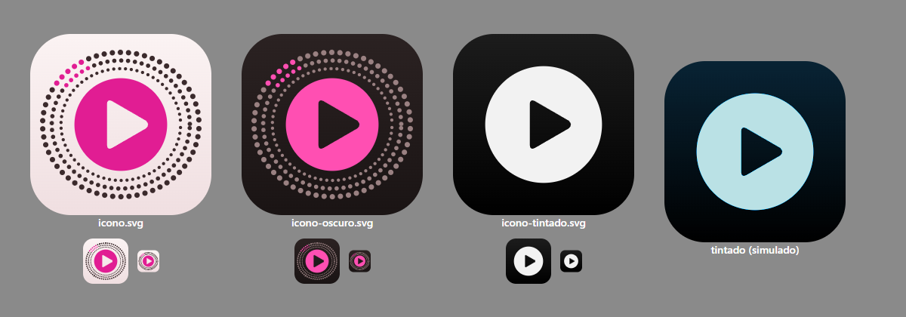

# Opción C · «Grada»

> Territorio 3 de `../referencias.md` (§8.3), llevado a maqueta el 23-sep-2026.
> **La idea en una frase:** la app es una grada vista desde dentro. El color lo
> ponen los equipos, como un tifo de cartulinas, y la marca solo tiene una
> bengala fucsia que se enciende cuando algo pasa **ahora**.

Ficheros:

| Fichero | Qué es |
|---|---|
| `agenda.html` | Agenda del día: cartel de tu partido, lista por competición, filtro y días |
| `partido.html` | Centro de partido: vídeo, marcador, fuentes, acciones y datos técnicos |
| `biblioteca.html` | Favoritos, recientes y listas, con buscador, ficha de canal y mini-reproductor. **`biblioteca.html#listas` enseña el estado vacío** |
| `tokens.css` | Tokens (color, tipo, formas, muelles) y los componentes compartidos |
| `icono.svg`, `icono-oscuro.svg`, `icono-tintado.svg` | Icono en sus tres apariencias |
| `capturas/` | Las 12 capturas pedidas, 4 extra del estado vacío (`biblioteca-vacio-*`) e `icono-variantes.png` |

Cómo verlas: abrir los `.html` en el navegador (claro u oscuro según el sistema).
Microinteracciones: días y filtro (la píldora se vuelve *squircle*), elegir
fuente, pausa, **pulsar el marcador del partido** (animación de gol), tecla
**S** (datos técnicos) y **/** (buscador).

---

## 1. Moodboard (en palabras, sin copiar marcas)

| Referencia | Qué se toma | Dónde se ve |
|---|---|---|
| Tifos de cartulinas (cada punto es una persona que levanta su cartón) | La **trama de puntos** sobre los colores de los equipos, partidos en diagonal | Cartel de la agenda, marco del reproductor, cabecera móvil del partido, mini-reproductor |
| Camisetas de los 90 (rayas, bandas, franjas, mitades) | El dibujo de la camiseta dentro de cada **chapa** de equipo, en lugar del escudo | Todas las filas y marcadores |
| Chapas de solapa y tapones corona | Chapa redonda con aro para cada equipo; el botón de reproducir tiene la **forma de corona** (9 festones) | Filas, marcadores, reproductor |
| Bengalas en el fondo sur | El único color de marca, **fucsia**, que respira solo cuando algo está en directo | Etiqueta «En directo», minuto, «Sonando», «En pantalla» |
| Dorsales | El canal se identifica con su **dorsal**: su número o su inicial, gigante y recortada | Biblioteca |
| Marcadores de estadio y *scorebugs* | Cifras comprimidas y negras, tabulares | Marcador, minutos, horas, número de fuente |
| Material 3 Expressive · Apple Sports · Netflix *color feeding* | Formas que cambian al elegirlas; el color del equipo como luz del escenario | Chips, cápsulas de fuente, marco de tifo |

## 2. Paleta (OKLCH, con hex)

Hormigón cálido de noche y cal rosada de día, las dos con tono 15. **Sin ámbar
de marca, sin dorado, sin violeta y sin degradados morados.** El fucsia está en
el tono 350 (el violeta ronda el 300).

| Token | Oscuro «hormigón de noche» | Claro «cal» | Uso |
|---|---|---|---|
| `--bg` | `oklch(0.225 0.012 15)` `#211a1a` | `oklch(0.965 0.01 15)` `#faf1f1` | Fondo |
| `--bg-deep` | `oklch(0.195 0.011 15)` `#1a1313` | `oklch(0.94 0.013 15)` `#f4e8e8` | Carril lateral y panel de fuentes |
| `--surface` | `oklch(0.275 0.014 15)` `#2e2525` | `oklch(0.995 0.003 15)` `#fffdfd` | Listas, cartel, fichas |
| `--surface-2` | `oklch(0.315 0.016 15)` `#392e2f` | `oklch(0.935 0.012 15)` `#f1e6e7` | Chips, conmutadores, botones discretos |
| `--line` | `oklch(0.36 0.016 15)` `#453a3a` | `oklch(0.87 0.012 15)` `#dcd1d2` | Separadores (decorativos) |
| `--line-strong` | `oklch(0.58 0.018 15)` `#857677` (3,5:1 sobre superficie) | `oklch(0.60 0.016 15)` `#8a7d7d` (3,9:1 sobre superficie) | Bordes de controles (buscador, teclas) |
| `--ink` | `oklch(0.97 0.008 15)` `#faf3f3` (15,7:1) | `oklch(0.22 0.014 15)` `#211818` (15,6:1) | Texto |
| `--ink-2` | `oklch(0.78 0.014 15)` `#c0b4b4` (8,5:1) | `oklch(0.47 0.016 15)` `#645758` (6,2:1) | Texto secundario |
| `--ink-3` | `oklch(0.70 0.014 15)` `#a79b9b` (6,4:1) | `oklch(0.51 0.016 15)` `#6f6363` (5,2:1) | Texto terciario |
| `--accent` (relleno) | `oklch(0.70 0.23 350)` `#ff4fb2` | `oklch(0.57 0.23 350)` `#d0138a` | Acción principal, «En directo», foco |
| `--on-accent` | `oklch(0.2 0.02 350)` `#1d1217` (6,1:1) | blanco `#ffffff` (5,1:1) | Texto sobre el fucsia |
| `--accent-ink` | `oklch(0.78 0.17 350)` `#ff85c7` (7,7:1) | `oklch(0.53 0.21 350)` `#bb167c` (5,4:1) | Minuto en directo, «Sonando» |

Contrastes medidos sobre `--bg`; sobre `--surface` y `--surface-2` todos los
textos siguen por encima de 4,5:1 (el más justo: `--ink-3` claro sobre
`--surface-2`, 4,8:1).

**Estados de señal** (base común de los tres territorios, sin tocar; contraste sobre `--surface`):

| Estado | Forma + palabra | Oscuro | Claro (punto / texto) |
|---|---|---|---|
| Verificada | ● «Verificada», «2 verificadas» | `#49de78` (8,6:1) | `#139948` (3,6:1) / `#006e30` (6,3:1) |
| Floja | ▲ «Floja», «Señal floja» | `#ffbd34` (8,9:1) | `#c4780b` (3,4:1) / `#8f520d` (6,1:1) |
| Fallida | ✕ «Sin señal» + cuándo reintenta | `#ff6056` (5,0:1) | `#d02c2a` (5,1:1) / `#b7191c` (6,5:1) |
| Comprobando | anillo hueco **que late** + «Comprobando 4 de 9» | `--ink-2` | `--ink-2` |
| Pendiente | anillo discontinuo + «Pendiente» | `--ink-3` | `--ink-3` |

Regla: los puntos de estado van sobre fondo o superficie, nunca sobre
`--surface-2` (el ámbar claro bajaría a 2,9:1). Y ningún estado se lee solo por
el color.

**Fucsia contra rojo de «fallida»** (37° de tono, el riesgo que señalaba la
investigación): se separan por forma y por palabra. El directo es una píldora
rellena con punto y la palabra «En directo», o un minuto con apóstrofo y pulso;
la fallida es siempre una ✕ con «Sin señal». Nunca aparecen con la misma forma.

**Colores de equipo**: se normalizan a mano en OKLCH (en la app, con
`oklch(from …)` sobre el `color`/`alternateColor` de ESPN). Viven solo en
superficies grandes (tifo, chapas); los estados que caen encima van sobre una
placa neutra. Los equipos blancos (Real Madrid, Sevilla, Rayo, Marsella) llevan
el aro de su segundo color para verse en claro.

**Tonos de canal** (dorsales): `oklch(0.5 0.12 h)` en claro y
`oklch(0.42 0.1 h)` en oscuro, con el tono sacado del hash y **fuera** de
280-320 (violeta), de 140-160 (verde de estado) y de 15-40 (rojo de estado).

## 3. Tipografía

| Familia | Papel | Ajustes |
|---|---|---|
| **Anybody** (variable, wdth 50-150, wght 100-900, OFL) | La voz de la grada: titulares enormes y ensanchados («Hoy», «Biblioteca») y cifras comprimidas | Titular: wdth 150, wght 900. Marcador, minuto, horas, nº de fuente: wdth 55, wght 900, `tabular-nums`. Rótulos de sección: wdth 125, wght 800 |
| **Onest** (variable, wght 400-800) | Todo lo que se lee: equipos, canales, estados, botones | 16 px en filas, 14 px secundario, 12 px terciario |
| **Spline Sans Mono** | Solo el panel de datos técnicos (pares, bitrate, códec, hash) | 12 px |

Escala (Bringhurst): 11 · 12 · 14 · 16 · 18 · 21 · 24 · 36 · 48 · 72, más 96-120
para el marcador del cartel y los titulares de escritorio. **Nada baja de
11 px** (comprobado con un script sobre el DOM). Sin rótulos en mayúsculas: el
contraste lo da la anchura de Anybody, no las versales.

En la app las tres irán autoalojadas en WOFF2 con subconjunto latino (la app
corre en la LAN); en la maqueta vienen de Google Fonts.

## 4. Componentes

- **Chapa de equipo** (`.chapa`): círculo con el dibujo de la camiseta (`rayas`,
  `liso`, `mitad`, `banda`, `franja`) y aro. Monograma de 3 letras solo desde
  48 px; por debajo, el nombre va al lado. Sustituye al escudo: sin marcas de
  terceros y con información (se reconoce el club por su camiseta).
- **Tifo** (`.tifo`): dos bloques con los colores de los equipos partidos en
  diagonal y la trama de cartulinas encima. Estático (sin vídeo, sin
  *shader*). Solo uno o dos por pantalla: cartel de la agenda, marco del
  reproductor, mini-reproductor.
- **Cartel de tu partido** (agenda): el partido destacado en grande, con chapas
  enormes, marcador sobre placa y «Ver ahora» como única acción fucsia. En
  escritorio queda fijo a la izquierda mientras la lista corre a la derecha.
- **Fila de partido**: hora o minuto a la izquierda en cifras comprimidas;
  equipos con chapa y marcador tabular; debajo, **primero la señal** y luego el
  canal. El directo lleva una barra fucsia al borde; tu equipo, una barra con
  su camiseta y una estrella (resaltado **sin reordenar**); los terminados
  bajan a gris y desaturan las chapas, sin perder contraste.
- **Marcador** (`.marcador`, `.marcador-btn`): el mismo componente a tres
  tamaños (cartel, cabecera del partido, mini-reproductor).
- **Cápsula de fuente**: número grande, proveedor en una palabra, estado con
  forma + palabra y barras de señal. La que suena pasa a *squircle* con borde
  fucsia y la marca «Sonando». En móvil se deslizan en horizontal; en
  escritorio son un listado vertical en el panel.
- **Cápsula de acciones**: favorito, copiar hash, pegar hash, rebuscar, «es el
  canal correcto», abrir en… y reportar, agrupadas en una sola cápsula
  (patrón YouTube). En escritorio solo iconos con nombre accesible.
- **Datos técnicos** (panel nerd): plegado en móvil, abierto en escritorio,
  tecla S. Línea de pares de los últimos 60 s y tabla en monoespaciada.
- **Línea de estado** bajo el vídeo, en lenguaje humano («Señal buena en la
  fuente 1. Estás en directo, 3 s por detrás de la tele»).
- **Navegación**: barra inferior de 4 destinos en móvil (casi opaca, 94 %),
  carril de 88 px en escritorio con Pegar hash, Salud y el estado del motor
  abajo. El destino activo es una píldora de tinta que se vuelve *squircle*.
- **Estado del motor**: un punto y «Motor listo», pequeño, arriba a la derecha
  en móvil y al pie del carril en escritorio.
- **Dorsal del canal** (`.azulejo`): el número del canal o la inicial de su
  palabra distintiva (M+ **L**aLiga, DAZN LaLiga **2**), gigante y recortada
  por el borde, sobre el tono del canal.
- **Emitiendo ahora** (biblioteca): los canales de tu biblioteca que están dando
  un partido suben arriba, con el marcador y el minuto; el que suena lleva «En
  pantalla» con ondas.
- **Mini-reproductor «Sonando»**: píldora de vidrio con un tifo en miniatura de
  los dos equipos, canal, marcador, pausa y detener. En móvil flota sobre la
  barra inferior; en escritorio, al pie de la columna derecha.
- **Estado vacío «la grada vacía»**: filas de asientos sin nadie y un solo
  punto fucsia con el triángulo de reproducir; texto que dice qué hacer y un
  botón «Añadir una lista».

### Pantallas

| | Móvil (390 × 844) | Escritorio (1440 × 900) |
|---|---|---|
| Agenda | Marca y motor · «Hoy» gigante con el filtro · días · cartel · lista por competición · barra inferior | Carril · «Hoy» y filtro · días · cartel fijo a la izquierda (560 px) y lista a la derecha |
| Partido | Vídeo fijo arriba · línea de estado · cabecera con tifo, marcador y progreso · fuentes deslizables · acciones · datos técnicos plegados | Carril · agenda compacta (320 px) · escenario con **marco de tifo** alrededor del vídeo, línea de estado y bento (progreso y goles, dónde se emite) · panel de fuentes, acciones y datos técnicos (352 px) |
| Biblioteca | Título · buscador · pestañas · «Emitiendo ahora» · favoritos · mini-reproductor sobre la barra | Carril · lista (buscador y pestañas en una fila, «Emitiendo ahora» a dos columnas) · ficha del canal elegido (400 px) con el mini-reproductor debajo |

## 5. Movimiento

Una sola tabla de muelles, la misma que SwiftUI (duración + rebote), escrita en
CSS con `linear()` (`--spring-fast`, `--spring-std`, `--spring-hero`):

| Muelle | SwiftUI | CSS | Uso |
|---|---|---|---|
| Rápido | `.spring(duration: 0.25, bounce: 0)` | 340 ms | Pulsar (escala 0,96), conmutadores |
| Estándar | `.spring(duration: 0.4, bounce: 0.15)` | 510 ms | Píldora → *squircle*, titular que se «aprieta» al cambiar de día |
| Héroe | `.spring(duration: 0.55, bounce: 0.3)` | 800 ms | Solo en momentos |

Momentos:
- **Entrada de la agenda**: las dos mitades del tifo entran desde sus lados y el
  marcador se **estampa** (escala 1,3 → 1 con rebote). Es la única animación
  que no pide el usuario.
- **Gol**: la camiseta del que marca inunda el tifo durante 1,4 s y su cifra se
  estampa (en la maqueta, al pulsar el marcador).
- **Late solo lo que pasa ahora**: la bengala de «En directo» respira (2,4 s),
  el punto del minuto y el anillo de «Comprobando» se expanden. Nada más.

Solo se animan `transform` y `opacity`, salvo el radio de las píldoras al
elegirlas (repinta un chip, no la página). Con **movimiento reducido** todo
queda en fundidos de 120 ms y sin pulsos (el indicador se queda fijo). Con
**transparencia reducida** (y sin `backdrop-filter`) la barra inferior, el
mini-reproductor y los controles del vídeo pasan a opacos; comprobado emulando
`prefers-reduced-transparency: reduce`.

## 6. Traducción a iOS nativo

- **Liquid Glass del sistema, no imitado**: `TabView` con sus cuatro pestañas;
  el mini-reproductor es el `tabViewBottomAccessory` (el «accesorio» de iOS 26
  encima de la barra). Controles del vídeo con `.glassEffect(.clear)` dentro de
  un `GlassEffectContainer`; tinte fucsia **solo** en la acción principal
  (`.glassEffect(.regular.tint(.bengala))` en «Ver ahora»). Reducir
  transparencia y el modo «Tintado» los respeta el sistema.
- **Tifo**: dos `Path` recortados en diagonal con el dibujo de la camiseta y la
  trama pintada en un `Canvas` estático (`.drawingGroup()`). Nada de vídeo.
- **Chapa**: `Circle()` con el dibujo como `ImagePaint` o capas de `Rectangle`;
  el mismo componente que en la web.
- **Tipografía**: Anybody embebida (OFL) como fuente variable, con el eje
  `wdth` fijado por `UIFontDescriptor` (`kCTFontVariationAttribute`); Onest con
  `Font.custom(_:size:relativeTo:)` para Dynamic Type; cifras con
  `.monospacedDigit()`. Si Anybody pesara demasiado, el plan B es SF Pro
  Expanded/Compressed, que es la misma idea de anchura.
- **Muelles**: la tabla de arriba es literalmente la API de SwiftUI.
- **Live Activity y widgets**: el marcador con las dos chapas y el minuto en
  fucsia; en la Isla Dinámica, chapa · cifras · chapa.
- **Icono**: tres capas en Icon Composer (fondo; grada de puntos; disco con el
  triángulo como capa de cristal). El símbolo sin la grada es la versión
  monocroma para «Tintado» y la PWA.

## 7. Icono

Un disco fucsia (la bengala, y también el círculo central) con el triángulo de
reproducir recortado, dentro de una **grada ovalada de puntos** vista desde
arriba; arriba a la izquierda, una peña con bengalas. Claro: disco fucsia sobre
cal. Oscuro: disco rosa sobre hormigón. Tintado: solo el disco con el
triángulo, en una tinta. Desviación de `referencias.md`: la primera versión con
la grada «abierta» hacia el triángulo se leía como una C o como un icono de
carga, así que la grada rodea el campo entero.

## 8. Por qué encaja con lo que pide Isma

- **Jerarquía primero**: qué partidos hay (cartel y lista), cuáles en directo
  (fucsia que respira, minuto grande) y si hay señal (forma + palabra, antes
  que el canal). Lo técnico, en el panel de datos técnicos.
- **No se parece a nada que haya rechazado**: ni casi negro con ámbar, ni
  dorado, ni violeta; ni Outfit, Inter o JetBrains Mono; ni rejilla de tarjetas
  iguales (listas con ritmo y un solo cartel grande).
- **Personalidad propia**: casi todas las apps de marcadores son azul oscuro y
  las de *streaming*, negras. Esta es la única que huele a estadio, y el color
  fuerte cambia con cada partido porque lo ponen los equipos.
- **Suelo de calidad**: AA medido, nada por debajo de 11 px, objetivos de 44 px
  (comprobados con un script), claro y oscuro con valores propios, movimiento y
  transparencia reducidos, vidrio solo en lo que flota y nunca sobre listas.

## 9. Riesgos y cómo se controlan

- **Cansar**: el tifo solo aparece en una o dos zonas por pantalla; el resto es
  hormigón o cal lisos.
- **Colores de club que chocan con estados** (Betis verde, Atleti rojo): viven
  en superficies grandes y los estados van sobre placa neutra con forma y
  palabra.
- **Rendimiento en móvil**: sin desenfoque sobre listas (la barra inferior es
  casi opaca), tifo y trama estáticos, animaciones continuas solo en elementos
  de 8-30 px.

## 10. Notas sobre los datos de la maqueta

Todo inventado. Para enseñar las dos competiciones a la vez, el mismo día hay
LaLiga (jornada 6) y Champions, cosa que en la realidad no coincide. Los
proveedores de fuente (Elcano, Faro, Norte, Kaiser, Tempo, Zenit) y los hashes
son ficticios. Los clubes aparecen solo con sus colores y un monograma, sin
escudos.
