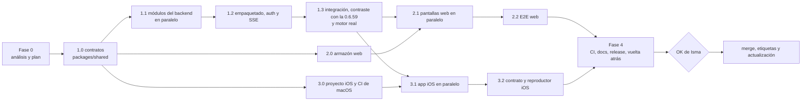

# Plan de la v2 de Ace Player Neo (0.7.0)

> FASE 0. Cómo se construye lo que describe [`arquitectura.md`](./arquitectura.md)
> (citado como `arq §N`). Escrito el 22-09-2026 sobre la rama `rewrite-v2`.
> Las citas siguen la convención de `arq`, "Cómo citar".

## 0. Punto de partida

- **Hecho en la Fase 0**: análisis del backend, del reproductor, del
  empaquetado, del front, de los 133 tests y del CHANGELOG
  (`docs/analisis/*.md`); API actual y su OpenAPI (`api.md`, `openapi.yaml`);
  pruebas contra el motor real (`motor-real.md`); decisiones D1-D5
  (`decisiones.md`); esqueleto del monorepo (commit `9e74d5f`); este plan y la
  arquitectura.
- **Fases** (las mismas de `PROGRESO.md`): 1 backend, 2 web, 3 iOS, 4 CI,
  documentación y entrega.
- **Lo que no se toca hasta la Fase 4**: `ismaeloul-ace-player-neo/`
  (Compose, hook, manifiesto y `releases/0.6.59/`), la rama `main` y el Umbrel.

---

## 1. Reglas de trabajo

1. **Contratos primero**: nada se implementa en servidor, web o iOS sin su
   esquema en `packages/shared` (arq §4). Si un agente necesita cambiar un
   contrato, lo pide al orquestador; no lo cambia por su cuenta.
2. **Paridad antes que mejora**: cada módulo porta primero sus tests de la
   0.6.59 (fichas `T-NNN` de `comportamientos-tests.md`) y solo después cambia
   comportamiento, y siempre con el cambio anotado en `docs/compat.md`.
3. **Un agente, un worktree**: cada agente trabaja en
   `../wt-<agente>` sobre la rama `v2/<agente>`, sale de `rewrite-v2` y el
   orquestador integra cuando pasan `typecheck`, `lint` y `test`. Commits
   pequeños y a menudo, con la atribución de la sesión.
4. **Como mucho 4 agentes a la vez**, cada uno con una tarea cerrada y con su
   resultado escrito en disco. Isma se queda sin cuota con tandas grandes
   (memoria del proyecto) y la sesión se puede cortar: `PROGRESO.md` se
   actualiza al terminar cada paso, con qué worktrees siguen vivos.
5. **Nada se publica sin el OK de Isma**: ni etiquetas, ni merge a `main`, ni
   paquetes de GHCR, ni instalaciones en el Umbrel.
6. **Español de España** en código de producto visible (textos, errores) y en
   la documentación; identificadores en inglés salvo los heredados que ya
   están en los tests (se aceptan alias, T-063).

---

## 2. Orden global

- La Fase 2 puede empezar su armazón (2.0) en cuanto estén los contratos, con
  la API simulada; las pantallas (2.1) necesitan el backend integrado (1.3)
  para las pruebas de extremo a extremo.
- El 3.0 (proyecto iOS y su CI) se adelanta todo lo posible: compilar solo en
  CI es el riesgo más lento de descubrir (§7, R4).

---

## 3. Fase 1: backend

### 3.1 Objetivo

`apps/server` sustituye a `server.js` con **todas** las rutas actuales
iguales, las rutas `/api/v1` nuevas, el dueño de sesiones del motor, la
autenticación de la app nativa, SSE y diagnóstico, y se empaqueta en
`releases/0.7.0/` como pide D3.

### 3.2 Entregables

| # | Entregable | Aceptación |
|---|---|---|
| E1.1 | `@ace/shared`: esquemas `state-v1`, `legacy`, `v1`, `errors`; constantes de plazos y perfiles; funciones puras (`normalizeHash`, `normalizeChannelKey`, `channelMatchScore`, `readSeekWindow`, `resolveLiveTarget`, "Para ti"); `routes.ts`; `fixtures/`; generador de OpenAPI | tests puros portados (T-017, T-045 a T-049, T-059 a T-062, T-101, T-131, T-132) y la matriz 16×16 de T-088 congelada en JSON con los valores de la 0.6.59; `docs/openapi-v2.yaml` generado |
| E1.2 | Módulos de arq §5.3 a §5.16 | los 126 tests de `server.test.js` portados a Vitest según su ficha, sin depender del orden ni del entorno (comportamientos-tests §5.3-5.4) |
| E1.3 | Rutas antiguas (25) como adaptadores | test de paridad por ruta con los esquemas `legacy` |
| E1.4 | **Contraste con la 0.6.59** (`scripts/contraste.mjs`) | arranca `releases/0.6.59/server.js` (no tiene dependencias) y el servidor nuevo sobre dos copias del mismo `DATA_DIR` de prueba, lanza la misma secuencia de lecturas y mutaciones a las rutas antiguas y compara las respuestas normalizadas; cualquier diferencia que no esté en `docs/compat.md` falla |
| E1.5 | `state`: recuperación, cola, fsync, migración 1 → 2 | T-109 y T-110 portados; test de corte en cada paso de la escritura; test de idempotencia; **test de vuelta atrás**: el `readState` de `releases/0.6.59/server.js` lee el estado migrado sin perder nada; fixture sintético con los mismos recuentos que producción (arq §1, R-DATOS) |
| E1.6 | `playback` + `remux` + `engine` | tests del SessionManager con motor falso: una sesión por contenido, `stop` siempre, latido de 45 s, cambio de canal sin carreras, `handoff` y `share`, reinicio con cupo y recuperación del canal; T-035, T-037, T-038, T-112, T-115, T-118, T-125 |
| E1.7 | `auth` + `events` + `diagnostics` | emparejamiento (código, caducidad, 5 intentos, límite global), token hasheado, revocación, URL firmada con listas reescritas, SSE con `Last-Event-ID` y filtro por origen; registro de fallos por causa |
| E1.8 | `engine-control.js` 0.7.0 | T-118 más token vacío = 401 y comparación en tiempo constante |
| E1.9 | `nginx.conf` 0.7.0 (plantilla) | tests de texto (sin `$scheme`, `map`, `return 400`, `X-Ace-Origin` y `X-Request-Id` en cada `proxy_pass` a `storage`) y la matriz de arq §8.3 contra el nginx real en Docker |
| E1.10 | `scripts/release.mjs`, `apps/server/build.mjs`, hook 0.7.0, `Dockerfile`, `deploy/compose.local.yml`, pasarela falsa y motor falso | release reproducible; prueba de humo del `server.js` empaquetado; tests del hook en bash (completa, marcador huérfano, truncado, carpeta en vez de fichero, sin red, manifiesto distinto, poda) y `shellcheck` |
| E1.11 | Pruebas contra el motor real | §8.2: informe añadido a `docs/analisis/motor-real.md` |
| E1.12 | **El front 0.6.59 funciona contra el backend nuevo** | en el compose local, con el `index.html` de la 0.6.59 servido por nginx: agenda, biblioteca, reproducción en escritorio, remux de iPhone (simulado con Safari o con `/api/remux`), traspaso y directorios. Es la prueba de que una pestaña vieja abierta durante la actualización sigue funcionando |

### 3.3 Orden y reparto

| Paso | Agente | Worktree y rama | Escribe en | Depende de | Tests que porta |
|---|---|---|---|---|---|
| 1.0 | **A0 contratos** (solo) | `wt-a0` · `v2/contratos` | `packages/shared`, `apps/server/src/{app.ts, http/}` (esqueleto de plugins, mapa de errores, `config`), arnés de Vitest (reloj falso, motor falso, repositorio en memoria) | — | los de E1.1 |
| 1.1 | **A1 estado** | `wt-a1` · `v2/estado` | `modules/state`, rutas de biblioteca y preferencias | 1.0 | T-025, T-031, T-034, T-036, T-108, T-109 |
| 1.1 | **A2 directorios** | `wt-a2` · `v2/directorios` | `modules/net`, `modules/directories` (IPFS incluido) | 1.0 | T-004, T-005, T-116, T-117, T-119, T-121 y tests nuevos de `parseM3u`/`parseHtml` |
| 1.1 | **A3 fútbol** | `wt-a3` · `v2/futbol` | `modules/football` | 1.0 | T-006 a T-030, T-039 a T-071, T-078, T-081 a T-086, T-095 a T-100, T-113, T-114 |
| 1.1 | **A4 comprobador** | `wt-a4` · `v2/comprobador` | `modules/scanner`, `modules/sources` | 1.0 | T-072 a T-077, T-079, T-080, T-089 a T-094, T-103 a T-105, T-122, T-123 |
| 1.1 | **A5 reproducción** (empieza el primero: es el más largo) | `wt-a5` · `v2/reproduccion` | `modules/engine`, `modules/playback`, `modules/remux`, `engine-control` | 1.0 | T-003, T-035, T-037, T-038, T-112, T-115, T-118, T-125 |
| 1.2 | **A6 acceso** | `wt-a6` · `v2/acceso` | `modules/auth`, `modules/events`, `modules/diagnostics`, `modules/health`, endurecimiento de `http` | 1.1 (A5) | T-032, T-033, T-110, T-111 |
| 1.2 | **A7 empaquetado** | `wt-a7` · `v2/empaquetado` | `apps/server/build.mjs`, `Dockerfile`, `scripts/`, `deploy/`, plantilla de nginx, hook 0.7.0 (en el monorepo; se copia a la app en la Fase 4) | 1.0 | T-001, T-102, T-126 y los de empaquetado §7.10 |
| 1.3 | **Orquestador** + 1 agente | `rewrite-v2` | integración, E1.4, E1.11, E1.12 | 1.2 | — |

Cuatro a la vez como máximo: en 1.1, A5 arranca con A1, A2 y A3; A4 entra
cuando termine el primero. A7 puede solaparse con 1.1 porque no toca módulos.

### 3.4 Criterios de salida

- `pnpm -r typecheck lint test` en verde; cobertura de líneas ≥ 80 % en
  `state`, `playback`, `auth` y `scanner`.
- E1.4 sin diferencias fuera de `docs/compat.md`.
- E1.11 y E1.12 hechos en el compose local con el motor real y resultados
  escritos.
- `PROGRESO.md` con el registro de la fase y los worktrees borrados.

---

## 4. Fase 2: web

### 4.1 Objetivo

`apps/web` sustituye a `index.html` con **toda** la funcionalidad del
inventario (`inventario-front.md` §0 a §29) sobre `/api/v1` y SSE, con aspecto
nuevo, y se compila dentro de `releases/0.7.0/web/`.

### 4.2 Entregables

| # | Entregable | Aceptación |
|---|---|---|
| E2.1 | Armazón: Vite, React, TS, las dos pantallas (`inicio`/`viendo`), `?vista=`, tokens de diseño, cliente de API con TanStack Query, cliente SSE con respaldo de sondeo, sistema de avisos (2 toasts como máximo, nunca sobre el vídeo, línea de estado), demo con fixtures | T-107 portado; `?vista=agenda` y `?vista=biblioteca` abren lo que dicen |
| E2.2 | Agenda, preferencias y marcadores | reglas de "Para ti" (T-101) desde `@ace/shared`; insignias con la hora de Madrid; marcador tapado del partido que se ve |
| E2.3 | Biblioteca, directorios, ajustes, búsqueda y pegar hash | deshacer de 6 s, segundo toque, estados vacíos con botón, errores de directorio traducidos (inventario-front §14.1) |
| E2.4 | Reproductor | máquina de estados explícita, `NeoPlayerController` en TS con T-127 a T-133, hls.js y mpegts.js cargados al abrir el reproductor, controles NEO en escritorio y nativos en táctil, directo con colchón, retroceso de 30 s, PiP, pantalla completa, Media Session con acciones, vigilante con presupuesto de reconexiones y espera exponencial, latido y `stream.reopened` |
| E2.5 | Fuentes, centro de partido y resolución | selector con estados y colores, arranque por verificadas, rebuscar, reportar, "es el canal correcto", vincular a mano (T-083, T-106, T-124) |
| E2.6 | Salud, diagnóstico, emparejamiento y dispositivos | panel por servicio + registro de fallos por causa; QR y código; revocar |
| E2.7 | PWA | `sw.js` generado (T-102), manifiesto con el mismo `id`, `start_url` y accesos (I6) |
| E2.8 | E2E | Playwright con proyectos de escritorio y móvil contra la API simulada; humo contra el compose local con el motor real; carruseles (T-120); T-002 reescrito contra el comportamiento |

### 4.3 Orden y reparto

| Paso | Agente | Escribe en | Depende de |
|---|---|---|---|
| 2.0 | **B0 armazón** (solo) | `apps/web/src/{app, api, notices, demo}`, Vitest + Testing Library + MSW + Playwright | 1.0 |
| 2.1 | **B1 agenda** | `features/{agenda, preferences}` | 2.0 |
| 2.1 | **B2 biblioteca** | `features/{library, directories, settings}` | 2.0 |
| 2.1 | **B3 reproductor** (el más largo) | `player/`, `features/player` | 2.0, 1.3 |
| 2.1 | **B4 fuentes** | `features/{sources, match-center}` y los modales de resolución, pegar hash y reportar | 2.0, B3 (interfaz del reproductor) |
| 2.2 | **B5 salud y PWA** | `features/{health, pairing}`, `sw` | 2.0 |
| 2.2 | **Orquestador** + 1 agente | E2.8, presupuesto de tamaño (< 200 KiB gzip de JS inicial), accesibilidad (trampa de foco, `aria-live`, roles) | 2.1 |

### 4.4 Criterios de salida

- Cada punto de `inventario-front.md` §26 ("detalles que hay que conservar")
  tiene un test o una nota de decisión en `docs/compat.md`.
- Los problemas P1 a P23 de `reproductor.md` §11 están resueltos o anotados.
- E2E en verde en escritorio y móvil.

---

## 5. Fase 3: iOS

### 5.1 Objetivo

App SwiftUI (iOS 17+, Swift 6) que se empareja con el backend y reproduce por
`/native/` (arq §10).

### 5.2 Entregables

| # | Entregable | Aceptación |
|---|---|---|
| E3.1 | `project.yml` de XcodeGen y workflow de CI en macOS | CI genera el proyecto, compila y pasa XCTest en simulador; sube un `.ipa` sin firmar como artefacto |
| E3.2 | Núcleo: cliente de API, errores comunes, SSE con `URLSession.bytes`, Llavero, emparejamiento por QR o código, URL del servidor editable | decodifica **todos** los `fixtures/` de `@ace/shared` |
| E3.3 | Reproductor: `AVPlayer`, controlador equivalente a `NeoPlayerController`, directo con colchón, modos por `preferredForwardBufferDuration`, PiP, audio en segundo plano, `MPNowPlayingInfoCenter` y `MPRemoteCommandCenter`, latido y `stream.reopened` | tests equivalentes a T-127, T-128, T-129, T-131, T-132 y T-133 (T-130, bloqueo de autoplay, no aplica en nativo) |
| E3.4 | Pantallas: agenda, biblioteca, fuentes, ajustes y salud | navegación completa con los fixtures en modo de previsualización |
| E3.5 | Prueba en un iPhone real | la hace Isma con el `.ipa` (IPA Station, si lo confirma) contra el compose local o la app de pruebas |

### 5.3 Orden y reparto

| Paso | Agente | Escribe en | Depende de |
|---|---|---|---|
| 3.0 | **C0 proyecto** (solo) | `apps/ios/project.yml`, esqueleto, `.github/workflows/ace-player-neo-ios.yml`, tests de fixtures | 1.0 |
| 3.1 | **C1 núcleo** | `Core/` | 3.0, contratos v1 de 1.3 |
| 3.1 | **C2 reproductor** | `Features/Player` | 3.0 |
| 3.1 | **C3 pantallas** | `Features/{Agenda, Library, Sources, Settings, Health}` | 3.0, C1 (interfaz) |

Cada cambio de Swift se sube en un commit pequeño y se espera a CI antes del
siguiente: sin Mac, el compilador de CI es el único que hay.

### 5.4 Criterios de salida

- CI de iOS en verde de forma estable (3 ejecuciones seguidas).
- Emparejar, ver la agenda, reproducir un canal, PiP y revocar funcionan en el
  simulador contra el motor falso, y en un iPhone real si Isma lo prueba.

---

## 6. Fase 4: CI, documentación y entrega

| # | Entregable | Detalle |
|---|---|---|
| E4.1 | CI (`.github/workflows/ace-player-neo.yml`) | se lanza también con `ace-player-neo/**`; trabajos: monorepo (`pnpm install --frozen-lockfile`, typecheck, lint, test, build); release reproducible (`release.mjs` + `git diff --exit-code`); humo del `server.js`; contraste con la 0.6.59 (E1.4); OpenAPI al día; tests de empaquetado y del hook con `shellcheck`; `docker manifest inspect` de cada digest del Compose; `docker build` del `Dockerfile` sin publicar; matriz de nginx (arq §8.3) con `docker compose --profile test`; iOS en macOS |
| E4.2 | `releases/0.7.0/` | generada por `release.mjs`, commiteada con `-text` en `.gitattributes` (CRLF) |
| E4.3 | Paquete de Umbrel | `umbrel-app.yml` 0.7.0 con `releaseNotes`, Compose 0.7.0 (arq §2.1), hook 0.7.0; `CHANGELOG.md` con las notas de la 0.6.59 |
| E4.4 | Vuelta atrás preparada | rama `rollback/0.7.1` con el contenido de la 0.6.59 (empaquetado §7.8), con sus tests en verde |
| E4.5 | Simulación de la actualización | §8.4 hecho en local, con resultados |
| E4.6 | Documentación | `README.md` del monorepo; `docs/compat.md`; `docs/openapi-v2.yaml`; guías cortas: actualizar, volver atrás, emparejar un iPhone, leer el diagnóstico, probar en local; `decisiones.md`, `dudas.md` y `PROGRESO.md` al día |
| E4.7 | Limpieza del repo (con OK) | crear las 26 etiquetas que faltan y retirar `releases/0.6.1` a `0.6.58` de `main`, dejando la 0.6.59 (empaquetado §7.9) |
| E4.8 | PR a `main` | abierto y con CI en verde; **no** se hace merge sin el OK de Isma |

Reparto: **D1 CI** (E4.1), **D2 documentación** (E4.6) y **D3 release**
(E4.2 a E4.5) en paralelo; el orquestador revisa todo y prepara E4.7 y E4.8.

La Fase 4 termina con el PR listo, la vuelta atrás preparada y una lista de
lo que necesita el OK de Isma (§9). Publicar es un paso aparte.

---

## 7. Riesgos

Probabilidad e impacto: **A** alto, **M** medio, **B** bajo.

| # | Riesgo | P | I | Mitigación |
|---|---|---|---|---|
| R1 | **Paridad con las 5300 líneas de `server.js`**: se pierde una regla que nadie recordaba | A | A | 133 tests portados según sus fichas; contraste automático con `releases/0.6.59/server.js` sobre los mismos datos (E1.4); el front 0.6.59 contra el backend nuevo (E1.12); toda diferencia, en `docs/compat.md` |
| R2 | **Migración de `state.json`**: se pierden favoritos, recientes, listas o aprendizaje, o la 0.6.59 no puede leer lo que deja la 0.7.0 | M | A | forma v1 intacta y lo nuevo en `data/v2/` (arq §5.4); copia `state.pre-0.7.0.json`; migración idempotente; test con el `readState` de la 0.6.59; fixture con los recuentos de producción; test local opcional con la copia real, que nunca entra en el repo ni en CI |
| R3 | **La actualización de Umbrel** deja la app caída (el hook va con `\|\| true`) | M | A | hook con tests en bash y `shellcheck`, restauración atómica y verificación por sha256; simulación completa en local (§8.4); digests sin cambios (no se descarga nada nuevo); `rollback/0.7.1` lista antes de publicar; etiquetas creadas antes de retirar releases |
| R4 | **App iOS compilada solo en CI**, sin Mac: los errores se descubren tarde y despacio | A | M | CI de iOS lo primero de la Fase 3 (3.0); commits pequeños; XCTest en simulador; contrato por fixtures; si Actions se bloquea (pasó del 30-07 al 22-09) la web y el backend siguen sin depender de iOS |
| R5 | **Motor real no disponible** (Docker Desktop apagado, como tras el reinicio del 22-09) | M | A | motor falso en Node con la semántica medida (otra sesión del mismo contenido → 403 a la anterior; progresivo de un solo consumidor; HLS compartible; tras `stop`, la lista da 500) para CI y desarrollo; las pruebas marcadas `@motor-real` solo corren en local con Docker; resultados volcados en `motor-real.md` |
| R6 | **Rendimiento en el N300**: CPU y RAM con motor, comprobador, ffmpeg y Node a la vez | B | M | estado en memoria, SSE en vez de sondeos, ffmpeg con prioridad baja y 2 hilos, comprobador lento con reproducción, JS inicial < 200 KiB; medición con `docker stats` en el compose local con los mismos límites (768m y 128 pids en `storage`) |
| R7 | **La pasarela de umbreld no se comporta como se analizó** (quita `Authorization`, mete búfer en SSE, cambia la regla de la lista blanca) | M | A | pasarela falsa en local; prueba en una app de pruebas del Umbrel si Isma da el OK (§8.3); plan B: puerto aparte (arq §8.4), sin cambios en el backend; SSE con respaldo de sondeo |
| R8 | **Salto de `/native/` a `/api/`** por confusión de rutas | B | A | tres capas (arq §8.2) y la matriz de arq §8.3 en CI contra el nginx real |
| R9 | **Cambio de comportamiento con varios dispositivos** que Isma no quería | M | M | `share` por defecto (lo pide el prompt) y `handoff` a un toque en Ajustes (arq §5.6, decisión a revisar) |
| R10 | **El `server.js` de esbuild falla en ejecución** y los tests unitarios no lo ven | M | A | CommonJS, pino sin transports, prueba de humo del bundle en CI y en el compose local |
| R11 | **CRLF** en este PC (`core.autocrlf=true`) rompe hashes y scripts | A | M | `-text` en `releases/**` y `eol=lf` en scripts (`.gitattributes`); la release también se genera en CI y se compara |
| R12 | **Sesión cortada o sin cuota** a mitad de fase | A | M | `PROGRESO.md` después de cada paso, worktrees y ramas por agente, commits pequeños, 4 agentes como máximo |
| R13 | **Paridad del front** con las 6200 líneas de `index.html` | A | A | el inventario como lista de aceptación; E2E en escritorio y móvil; demo con fixtures |
| R14 | **Service worker viejo** sirve el armazón antiguo | M | M | `VERSION` nueva, documento primero a la red y solo si `ok` (empaquetado R7) |
| R15 | **Dos canales a la vez** en el motor | M | M | una sola sesión principal a la vez, como hoy; prueba pendiente con dos canales verificados (§8.2) |
| R16 | **ffmpeg no se instala** sin red | B | M | `timeout 60 apk add` y `apk-cache`; error `ffmpeg_missing` claro en iOS |
| R17 | **Dependencias nuevas** con fallos | B | B | pocas, con versión exacta y `pnpm audit` en CI |
| R18 | **Token de emparejamiento interceptado** por HTTP en la LAN | B | M | riesgo aceptado (Tailscale cifra fuera de casa); revocación inmediata |

---

## 8. Migrar sin romper nada

### 8.1 Convivencia con la 0.6.59 durante el desarrollo

- La 0.6.59 sigue en producción sin cambios. Todo el trabajo va en
  `ace-player-neo/` y en la rama `rewrite-v2`; `releases/0.6.59/` no se toca.
- Las rutas antiguas se mantienen en la 0.7.0 (arq §6.1): una pestaña 0.6.x
  abierta durante la actualización sigue funcionando (E1.12), y también el
  healthcheck y el vigilante del NAS.
- `state.json` no cambia de forma (arq §5.4), así que en cualquier momento se
  puede volver a la 0.6.59.

### 8.2 Probar contra el motor real sin tocar producción: compose local

Lo que ya se hizo con la 0.6.59 el 22-09 (`motor-real.md`) pasa a ser un
entorno fijo en `ace-player-neo/deploy/`:

- `compose.local.yml` (proyecto `aceneo-local`) con los **mismos digests** del
  motor, Node y nginx que producción, sin `app_proxy`:
  - nginx en `127.0.0.1:17792`;
  - perfil `gateway`: pasarela falsa en `127.0.0.1:17793` que replica la regla
    de la lista blanca (arq §8.3);
  - perfil `test`: `storage` construido con el `Dockerfile` (sin root,
    `read_only`) en vez de la imagen de Node con la release montada;
  - perfil `old`: la 0.6.59 tal cual, para comparar.
- El P2P del motor no se publica en el PC: con conexiones salientes basta.
- **Datos**: `deploy/reset-data.mjs` copia la copia del `state.json` de
  producción (que vive **fuera** del repo) a `ace-player-neo/.data/local/`
  (ignorado por git) antes de cada prueba. Nunca se monta la copia original.
  `APP_SEED` sale de un `.env` local ignorado.
- Los nombres de contenedor son los de producción (nginx los usa), así que no
  pueden correr a la vez dos pilas: el script para la otra antes de arrancar.
- **Qué se prueba** (`pnpm test:motor-real`, informe en `motor-real.md`):
  1. abrir, ver 2 min y parar: tras el `stop` la lista del motor da 500 y no
     queda descarga (ni sesiones zombi);
  2. cambio de canal rápido 10 veces: nunca dos sesiones abiertas;
  3. `handoff` y `share` con dos navegadores y con un navegador y el remux;
  4. latido perdido: la sesión se para a los 45-60 s;
  5. reinicio del motor con alguien viendo: espera, reabre y el cliente sigue;
  6. remux de iOS desde progresivo y desde HLS: tiempo hasta la primera lista
     y retraso respecto al directo (decide la duda de arq §5.6);
  7. dos canales verificados a la vez (duda de `dudas.md`);
  8. el comprobador con alguien viendo: ritmo lento y sin tocar el canal
     visible;
  9. la matriz de `/native/` a través de la pasarela falsa;
  10. el front 0.6.59 contra el backend nuevo (E1.12).

### 8.3 App de pruebas en el Umbrel (opcional, con OK de Isma)

Solo si Isma quiere probar la pasarela real (R7) antes de publicar:

- id `ismaeloul-ace-player-neo-beta`, otro puerto libre (el 7795 ya es de IPA
  Station; hay que elegir uno con Isma), contenedores con `-beta`, sus propios
  datos y **sin comprobador** para ahorrar RAM.
- `release.mjs --variant beta` genera la `nginx.conf` con los nombres de
  contenedor de la beta (arq §11.1).
- **Duda**: cómo instalarla sin que aparezca a todos los que tienen la tienda
  añadida (carpeta en `main` marcada como beta, otra rama o instalación a mano
  por SSH). Cualquiera de las tres es publicar algo: lo decide Isma.

### 8.4 Simulación de la actualización 0.6.59 → 0.7.0 (en local)

1. Levantar la 0.6.59 con un `APP_DATA_DIR` falso y la copia de datos.
2. Hacer lo que hace umbreld (empaquetado §1.3): copiar Compose, `hooks/` y
   manifiesto de la 0.7.0, ejecutar el hook **sin** la release en
   `APP_DATA_DIR` y con el checkout de la tienda como origen.
3. `docker compose up`: comprobar que arranca, que `state.pre-0.7.0.json`
   existe, que los 12 grupos de datos siguen ahí con sus recuentos y que el
   front nuevo los enseña.
4. Repetir con `rollback/0.7.1` encima: la 0.6.59 lee el estado que dejó la
   0.7.0 sin perder nada.
5. Repetir el paso 2 sin red y sin checkout de la tienda (el hook debe fallar
   de forma visible y la app recuperarse sola cuando aparezca la release, U7).

### 8.5 Publicación (solo con OK de Isma)

Orden (empaquetado §7.7 y §7.9):

1. Crear y subir las 26 etiquetas que faltan; comprobar cada tarball.
2. Merge del PR y subida de `ace-player-neo-v0.7.0` a la vez.
3. Isma actualiza desde la interfaz de Umbrel. Los digests no cambian, así que
   no se descarga ninguna imagen.
4. Comprobar: `/api/health`, la web nueva, una reproducción, el vigilante del
   NAS y, si ya está, emparejar el iPhone.

**Paso futuro a la imagen propia**: cuando Isma haga público el paquete de
GHCR, `storage` pasa a `image: ghcr.io/…@sha256:…` sin `apk add` y con
`read_only`, en una versión aparte (nunca a la vez que un cambio de código).

### 8.6 Vuelta atrás

- **Aviso**: Umbrel no ofrece bajar de versión; se vuelve atrás **avanzando**
  a la 0.7.1, que es la 0.6.59 con otro número (empaquetado §7.8).
- Datos: la 0.6.59 lee el `state.json` que deja la 0.7.0 (test de E1.5). Si
  algo saliera mal, `data/state.pre-0.7.0.json` se restaura a mano y solo se
  pierde lo cambiado en la 0.7.0.
- La app iOS deja de funcionar tras volver atrás (no hay `/native/`); la web
  vieja funciona. El siguiente intento sería la 0.7.2.

---

## 9. Lo que necesita a Isma

| Cuándo | Qué | Por qué |
|---|---|---|
| Antes o durante la Fase 1 | Las decisiones de arq §14, sobre todo `handoff` o `share` | cambia lo que ve al usar dos dispositivos |
| Fase 1 (opcional) | Si se instala la app de pruebas en el Umbrel y en qué puerto (§8.3) | es publicar algo |
| Fase 3 | Probar el `.ipa` en su iPhone (¿con IPA Station?) | no hay Mac ni otra forma de instalarla |
| Fase 4 | OK para crear las 26 etiquetas y retirar las releases viejas de `main` | es publicar en su repo |
| Fase 4 | OK para el merge del PR, la etiqueta 0.7.0 y la actualización | pasa a producción |
| Después | Si hace público el paquete de GHCR | paso a la imagen propia |
